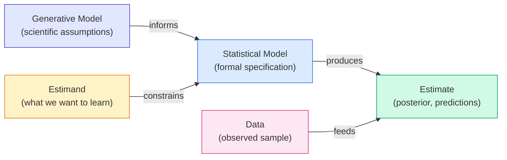

# Lecture A01: Introduction to Bayesian Workflow

## Core Bayesian Workflow



The workflow has four components connected in a cycle, not a pipeline:

1. **Generative model**: the scientific assumptions about how the world produces data (DAG + process model)
2. **Estimand**: the quantity we want to learn; defines what "success" means before we touch data
3. **Statistical model**: formal specification derived from the generative model, designed to extract the estimand
4. **Estimate**: the result; a posterior distribution, a prediction, or a causal quantity, produced by combining the statistical model with data

The **Generative model** and the **Estimand** both flow into the **Statistical model** (they jointly determine its form). The **Statistical model** and **Data** both flow into the **Estimate**.

The workflow is iterative. You check that your estimate actually answers the estimand, and that your statistical model is justified by the generative model. Statistical models alone cannot be evaluated without the scientific model that motivates them.

### Extended workflow

The extended workflow adds validation loops: simulate from the generative model, test the statistical model on simulated data, and check that it recovers known parameters before applying it to real data.

> **Revisit note:** This is exactly the workflow you use with PyMC. Prior predictive checks, fake-data simulation, posterior predictive checks. The diagram is the skeleton; every PyMC project you run fills it in.

---

## What is Causal Inference

Causal inference has three distinct meanings:

- **Prediction of intervention consequences** (interventionist view): what happens if we *do* X?
- **Imputation of counterfactual outcomes** (counterfactual view): what *would have happened* without X?
- **Explanation of the past**: *why* did Y happen?

Causal inference is not a mechanism. Knowing the mechanism is helpful but not required.

Randomized experiments tell us causes *because we intervene in known ways*. The randomization breaks confounding paths in the DAG.

Causal imputation is distinct: if we know a cause, we can reconstruct what would have happened under a different treatment.

> **Applied example (real estate / Causaris):** In your OTP Bank real estate work, all three views appear:
> - **Intervention**: What happens to Ljubljana apartment prices if mortgage rates increase by 1pp? (DiD, SCM)
> - **Counterfactual**: What *would* Maribor prices have been without the new highway? (Synthetic control)
> - **Explanation**: Why did satellite municipalities diverge from Ljubljana after 2020? (Causal explanation via DAG + mediation analysis)

> **Applied example (digital forensics):** Audio authenticity analysis maps directly:
> - **Intervention**: If a recording were spliced at timestamp T, what spectral discontinuities would we observe? (Generative model of splicing artifacts)
> - **Counterfactual**: Given the observed ENF (electrical network frequency) pattern, is this recording consistent with the claimed time and location, or would an unaltered recording show a different signature?
> - **Explanation**: Why does the formant structure shift at 2:34? Compression artifact, environment change, or evidence of editing?

> **Applied example (policy analysis):** When advising heads of government:
> - **Intervention**: If Slovenia introduces a 2% property tax on second homes, what happens to housing supply in coastal municipalities? (DiD with Croatian coastal municipalities as controls)
> - **Counterfactual**: What would Croatian GDP growth have been without EU accession in 2013? (Synthetic control using comparable non-EU Balkan economies)
> - **Explanation**: Why did youth unemployment in Slovenia fall faster than the EU average between 2021 and 2024? (Mediation analysis: was it the digital skills subsidy, the wage floor change, or both?)

---

## Bayesian Inference is Practical

Bayesian models are **generative**: they simulate the data-generating process. This means:

- We can estimate **measurement error** (observations are noisy; model the noise)
- We can handle **missing data** (treat missing values as parameters to estimate)
- We can include **latent variables** (unobserved quantities that influence observed ones)
- We can apply **regularization** naturally (priors shrink estimates toward sensible defaults)

> **Revisit note:** You already know this from PyMC. The key insight worth re-anchoring: every prior is a regularizer. Weakly informative priors are L2-like; spike-and-slab priors are L1-like. The Bayesian framing makes the regularization explicit and auditable.

> **Applied example (digital forensics):** Forensic audio has all four properties in play:
> - **Measurement error**: microphone noise, compression artifacts, room reverberation. Model the noise process explicitly rather than pretending the spectrogram is ground truth.
> - **Missing data**: a recording may have gaps, corrupted segments, or redacted sections. Bayesian imputation fills these coherently with the generative model.
> - **Latent variables**: the speaker's true fundamental frequency is not directly observed; it is inferred from noisy harmonics. The number of speakers in a recording is a latent discrete variable.
> - **Regularization**: priors on formant frequencies constrain estimates to physiologically plausible ranges (e.g., F1 for adult male: 300-800 Hz).

> **Applied example (policy analysis):** All four properties matter at the government advisory level:
> - **Measurement error**: GDP, unemployment, and housing transaction data are measured with lag and revision. A Bayesian model can propagate that uncertainty into policy recommendations rather than treating the first release as truth.
> - **Missing data**: smaller municipalities report irregularly. Rather than dropping them (biasing toward urban centers), model the missingness.
> - **Latent variables**: "institutional quality" is not directly measured but influences outcomes. Bayesian hierarchical models can estimate it from observable proxies.
> - **Regularization**: when estimating municipality-level effects from sparse data (e.g., 50 transactions/year in Hrastnik), partial pooling via hierarchical priors prevents overfitting to noise.

---

## Bayesian Wars are Over

The frequentist-Bayesian debate is no longer the bottleneck. Practitioners need tools that work. McElreath positions Bayesian methods as a principled engineering framework for inference, not a philosophical stance.

The real battle is **scientific modeling**: choosing the right DAG, the right generative process, the right estimand. No amount of statistical sophistication saves a bad scientific model.

Historical context: the previous generation fought epistemological wars about whether priors were "subjective" and therefore dangerous. Fisher vs. Jeffreys, Neyman-Pearson vs. Bayesian decision theory. These debates shaped 20th-century statistics but are largely settled in practice.

---

## Sub-Workflows: "How to Draw an Owl"

The "draw an owl" meme (from Reddit, ~2010):
- Step 1: Draw some circles
- Step 2: Draw the rest of the owl

McElreath's point: statistics is taught the same way. The course exists to fill in the sub-workflows between "write down a model" and "publish results."

Artists use **scaffolding**: rough sketches, refined outlines, then detail. Scientific models work the same way. Start simpler than you need. Add one thing at a time. Discard what fails. Keep what works.

A complex statistical model needs its own incremental workflow. If you add one component at a time, it is easier to diagnose what works and what breaks.

**Documenting work reduces errors.** The statistical model alone does not record *why* you made the choices you made. Without documentation of the full workflow (estimand, scientific model, statistical model, validation), the reasoning is not reproducible.

> **Revisit note:** This is the argument for your PyMC notebooks having markdown cells that explain the DAG, the estimand, and the scientific justification *before* the code. The code reproduces numbers; the documentation reproduces reasoning.

---

## Example: Sampling to Determine the Proportion of Water on Earth

Sampling with an inflatable globe. Each toss: check where the right index finger lands. Record W (water) or L (land).

**Sample:** W L W W W L W L W W

Three questions:
1. How should we use this sample to produce an estimate?
2. How to represent uncertainty?
3. How to produce a summary?

---

### Generative Model

**Estimand:** proportion of water on the globe (call it *p*)

**Assumptions:**
- Each toss is independent of all others
- The probability of W on any toss equals *p*, the true proportion of water

The generative model must have explicit assumptions. Without them, you cannot simulate, and without simulation, you cannot validate.

#### Simulator code

```python
import numpy as np
from typing import Literal

def sim_globe(p: float = 0.7, n: int = 9, seed: int = 42) -> list[str]:
    """Simulate globe tossing.
    
    Args:
        p: True proportion of water on the globe.
        n: Number of tosses.
        seed: Random seed for reproducibility.
    
    Returns:
        List of 'W' (water) and 'L' (land) outcomes.
    """
    rng = np.random.default_rng(seed)
    tosses = rng.random(n)
    return ["W" if t < p else "L" for t in tosses]
```

#### Testing extreme settings

```python
# All water: every toss must return W
assert all(x == "W" for x in sim_globe(p=1.0, n=11))

# All land: every toss must return L
assert all(x == "L" for x in sim_globe(p=0.0, n=11))

# Asymptotic test: with many tosses, proportion should converge to p
large_sample = sim_globe(p=0.7, n=10_000, seed=123)
observed_p = sum(1 for x in large_sample if x == "W") / len(large_sample)
print(f"Expected p=0.7, observed p={observed_p:.3f}")
# Should be close to 0.7 by law of large numbers
```

> **Applied example (real estate):** Replace globe tossing with transaction sampling. You observe whether a property sold above or below the municipal median. Each observation is "Above" or "Below." The generative model: each transaction is independent, and the probability of selling above median is *p* (which varies by municipality). Same structure, different domain.

```python
def sim_transactions(p_above_median: float = 0.5, n: int = 100, seed: int = 42) -> list[str]:
    """Simulate property transactions relative to municipal median.
    
    Args:
        p_above_median: True probability of selling above median in this municipality.
        n: Number of transactions observed.
        seed: Random seed.
    """
    rng = np.random.default_rng(seed)
    return ["Above" if rng.random() < p_above_median else "Below" for _ in range(n)]
```

> **Applied example (digital forensics):** Replace globe tossing with audio frame classification. You examine 10-ms frames of a recording and classify each as "authentic" or "anomalous" (based on ENF deviation, spectral discontinuity, or compression signature). The estimand: proportion of anomalous frames *p*. A genuinely unedited recording should have p near 0 (only noise-driven false positives). A spliced recording will have elevated p clustered around the edit point. Same binomial structure, forensically meaningful.

```python
def sim_audio_frames(
    p_anomalous: float = 0.02,
    n_frames: int = 500,
    seed: int = 42,
) -> list[str]:
    """Simulate audio frame authenticity classification.
    
    Args:
        p_anomalous: True proportion of anomalous frames (0.02 = normal noise floor).
        n_frames: Number of 10-ms frames examined.
        seed: Random seed.
    """
    rng = np.random.default_rng(seed)
    return ["Anomalous" if rng.random() < p_anomalous else "Authentic" for _ in range(n_frames)]
```

> **Applied example (policy analysis):** Replace globe with voter survey sampling. Before advising on a proposed policy (e.g., property tax reform), you sample citizens and record "Support" or "Oppose." The estimand: true proportion of support *p*. The generative model: each response is independent (conditional on demographic stratum), probability of support equals *p*. The same Bayesian machinery gives you not just a point estimate but a full posterior, so you can tell the PM: "Support is between 52% and 61% with 89% probability" rather than "56% support, margin of error 3%."

```python
def sim_policy_survey(
    p_support: float = 0.56,
    n_respondents: int = 400,
    seed: int = 42,
) -> list[str]:
    """Simulate policy support survey responses.
    
    Args:
        p_support: True proportion of population supporting the policy.
        n_respondents: Number of survey respondents.
        seed: Random seed.
    """
    rng = np.random.default_rng(seed)
    return ["Support" if rng.random() < p_support else "Oppose" for _ in range(n_respondents)]
```

---

### Statistical Model: Bayesian Estimator

The logic:

1. For each possible explanation of the sample, count all the ways the sample could happen
2. Explanations with more ways to produce the sample are more plausible

In context: for each possible proportion *p*, count all the ways the observed sequence could have occurred. Proportions with more ways are more plausible.

---

### Garden of Forking Data

Simplify the globe to a **d4** (four-sided die). Each side is either water or land. Five possible compositions:

| Composition | Water sides | p    |
|-------------|-------------|------|
| LLLL        | 0           | 0.00 |
| WLLL        | 1           | 0.25 |
| WWLL        | 2           | 0.50 |
| WWWL        | 3           | 0.75 |
| WWWW        | 4           | 1.00 |

#### Counting example

Suppose we observe: **W, L, W**

For each composition, count the ways to produce this sequence:

**p = 0.00 (0 water sides):**
- W: 0 ways. Stop. Total = 0.

**p = 0.25 (1 water side):**
- W: 1 way, L: 3 ways, W: 1 way. Total = 1 x 3 x 1 = **3**

**p = 0.50 (2 water sides):**
- W: 2 ways, L: 2 ways, W: 2 ways. Total = 2 x 2 x 2 = **8**

**p = 0.75 (3 water sides):**
- W: 3 ways, L: 1 way, W: 3 ways. Total = 3 x 1 x 3 = **9**

**p = 1.00 (4 water sides):**
- L: 0 ways. Stop. Total = 0.

The posterior plausibility is proportional to these counts. Normalize by dividing each by the sum (0 + 3 + 8 + 9 + 0 = 20):

| p    | Ways | Posterior |
|------|------|-----------|
| 0.00 | 0    | 0.00      |
| 0.25 | 3    | 0.15      |
| 0.50 | 8    | 0.40      |
| 0.75 | 9    | 0.45      |
| 1.00 | 0    | 0.00      |

```python
import numpy as np

def garden_of_forking_data(
    observations: list[str],
    n_sides: int = 4,
) -> dict[float, float]:
    """Count ways each d4 composition could produce the observed sequence.
    
    Args:
        observations: List of 'W' and 'L' observations.
        n_sides: Number of sides on the simplified globe.
    
    Returns:
        Dictionary mapping p values to posterior probabilities.
    """
    ways = {}
    for n_water in range(n_sides + 1):
        p = n_water / n_sides
        count = 1
        for obs in observations:
            if obs == "W":
                count *= n_water
            else:
                count *= (n_sides - n_water)
        ways[p] = count
    
    total = sum(ways.values())
    posterior = {p: w / total if total > 0 else 0 for p, w in ways.items()}
    return posterior

# Example: W, L, W
result = garden_of_forking_data(["W", "L", "W"])
for p, prob in result.items():
    print(f"p={p:.2f}: posterior={prob:.2f}")
```

---

### From Counting to the Posterior Distribution

The number of ways for a composition with *w* water sides (out of 4) to produce W water observations and L land observations:

$$\text{ways}(w) = w^W \times (4 - w)^L$$

Substituting $p = w/4$ (so $w = 4p$):

$$\text{ways}(p) = (4p)^W \times (4 - 4p)^L$$

With a flat prior (all compositions equally plausible before data):

$$\text{Posterior}(p) = \frac{(4p)^W \times (4 - 4p)^L}{\sum_{p'} (4p')^W \times (4 - 4p')^L}$$

As the number of sides goes to infinity (d4 becomes a continuous globe), this converges to:

$$\text{Posterior}(p) \propto p^W \times (1 - p)^L \times \text{Prior}(p)$$

The term $p^W (1-p)^L$ is the kernel of the **binomial distribution**:

$$\text{Binomial}(W \mid N, p) = \binom{N}{W} p^W (1-p)^L$$

The combinatorial coefficient $\binom{N}{W}$ is constant with respect to *p*, so it drops out of the posterior. The counting method and the binomial model give the same posterior shape. Bayesian inference *is* counting possibilities; standard probability distributions emerge naturally from that counting.

```python
import numpy as np
import matplotlib.pyplot as plt
from scipy import stats

def plot_posterior(
    n_water: int,
    n_total: int,
    prior_a: float = 1.0,
    prior_b: float = 1.0,
    resolution: int = 200,
) -> None:
    """Plot the posterior distribution for the globe tossing model.
    
    Uses the Beta-Binomial conjugacy:
    Prior: Beta(a, b)
    Likelihood: Binomial(W | N, p)
    Posterior: Beta(a + W, b + L)
    
    Args:
        n_water: Number of W observations.
        n_total: Total number of observations.
        prior_a: Beta prior alpha parameter (default: flat prior).
        prior_b: Beta prior beta parameter (default: flat prior).
        resolution: Number of points for plotting.
    """
    n_land = n_total - n_water
    p_grid = np.linspace(0, 1, resolution)
    
    # Posterior is Beta(a + W, b + L)
    post_a = prior_a + n_water
    post_b = prior_b + n_land
    posterior = stats.beta.pdf(p_grid, post_a, post_b)
    prior = stats.beta.pdf(p_grid, prior_a, prior_b)
    
    fig, ax = plt.subplots(figsize=(8, 4), facecolor="white")
    ax.plot(p_grid, prior, "--", color="gray", label="Prior", linewidth=1)
    ax.plot(p_grid, posterior, color="#2563eb", label="Posterior", linewidth=2)
    ax.set_xlabel("p (proportion of water)")
    ax.set_ylabel("Density")
    ax.set_title(f"Posterior after {n_water}W, {n_land}L (Beta({post_a}, {post_b}))")
    ax.legend()
    ax.set_xlim(0, 1)
    plt.tight_layout()
    plt.savefig("posterior_globe.png", dpi=150, facecolor="white")
    plt.show()

# Sample: W L W W W L W L W W -> 7W, 3L
plot_posterior(n_water=7, n_total=10)
```

---

### Bayesian Updating

Key insight: you do not recount from scratch when new data arrives. The posterior after the first batch of data becomes the prior for the next batch.

$$\text{Posterior}_{\text{new}} \propto \text{Likelihood}_{\text{new data}} \times \text{Posterior}_{\text{old}}$$

Processing data sequentially, one observation at a time, gives **exactly the same result** as processing all data at once. This is not an approximation; it is a mathematical identity.

```python
import numpy as np
import matplotlib.pyplot as plt
from scipy import stats

def sequential_update(
    observations: list[str],
    prior_a: float = 1.0,
    prior_b: float = 1.0,
) -> None:
    """Demonstrate sequential Bayesian updating, one observation at a time.
    
    Args:
        observations: List of 'W' and 'L' observations.
        prior_a: Initial Beta prior alpha.
        prior_b: Initial Beta prior beta.
    """
    p_grid = np.linspace(0, 1, 200)
    a, b = prior_a, prior_b
    
    fig, axes = plt.subplots(2, 5, figsize=(16, 6), facecolor="white")
    axes = axes.flatten()
    
    for i, obs in enumerate(observations):
        # Update: W increments a, L increments b
        if obs == "W":
            a += 1
        else:
            b += 1
        
        posterior = stats.beta.pdf(p_grid, a, b)
        axes[i].fill_between(p_grid, posterior, alpha=0.3, color="#2563eb")
        axes[i].plot(p_grid, posterior, color="#2563eb", linewidth=1.5)
        axes[i].set_title(f"After {i+1}: {obs} (a={a:.0f}, b={b:.0f})")
        axes[i].set_xlim(0, 1)
        axes[i].set_ylim(0, None)
        if i >= 5:
            axes[i].set_xlabel("p")
    
    plt.suptitle("Sequential Bayesian Updating: Globe Tossing", fontsize=14)
    plt.tight_layout()
    plt.savefig("sequential_update.png", dpi=150, facecolor="white")
    plt.show()

# The observed sample
sequential_update(["W", "L", "W", "W", "W", "L", "W", "L", "W", "W"])
```

> **Applied example (real estate):** You receive monthly transaction data for a municipality. Each month's posterior becomes the prior for the next. This is how a Bayesian price index works: January's estimate of the price trend feeds forward into February. You never "start over." This is directly relevant to the OTP Bank CRR3-compliant index work, where sequential updating means the index can be refreshed monthly without full recomputation.

> **Applied example (digital forensics):** You analyze a recording in segments. The first 30 seconds establish a baseline posterior for the speaker's fundamental frequency and room acoustics. As you move through the recording, the posterior sharpens. If the posterior suddenly shifts at a specific timestamp (the "prior" from earlier segments is incompatible with the new frames), that discontinuity is itself evidence of a splice or environment change. Sequential updating turns temporal structure into a forensic signal.

> **Applied example (policy analysis):** A government tracks the effect of a new housing subsidy program quarter by quarter. Q1 data produces a posterior for the treatment effect. Q2 data updates it. By Q4, the posterior has narrowed enough to decide whether to expand, modify, or sunset the program. Sequential updating means the PM does not need to wait for a full-year evaluation; each quarter refines the estimate. This is particularly valuable in coalition politics where policy windows are short.

---

## Key Takeaways for Revisiting

1. **The workflow is the product.** Generative model, estimand, statistical model, estimate, validation. Not just the code, not just the posterior. Document the reasoning. This applies whether you are building a price index, authenticating a recording, or evaluating a policy intervention.

2. **Counting is the foundation.** Before you think "MCMC" or "variational inference," remember that Bayesian inference is counting consistent possibilities. The machinery (PyMC, Stan) automates the counting for complex models, but the logic is the same.

3. **Sequential updating is exact, not approximate.** Practical implications across all three domains:
   - *Real estate*: monthly index refresh without full recomputation
   - *Digital forensics*: baseline estimation that sharpens as more of the recording is processed, with discontinuities as forensic evidence
   - *Policy analysis*: quarterly program evaluation that lets governments act before the full evaluation cycle completes

4. **Priors are regularizers with a name.** Every prior encodes an assumption. Making it explicit is better than pretending you have no assumptions (which is what a flat prior does, poorly). In policy work, this is where domain expertise enters: a prior on housing price elasticity should reflect decades of economic research, not ignorance.

5. **Start simpler than you need.** The incremental workflow (add one thing, check, add another) is how you debug scientific models, not just statistical ones. Examples:
   - *Real estate*: start with one municipality, then add the hierarchical structure across 217
   - *Forensics*: start with a single spectral feature (ENF), then layer in formant analysis, compression artifacts
   - *Policy*: start with a simple pre/post comparison, then add the synthetic control, then add covariates

6. **The generative model is your portable asset.** The same binomial/Beta structure from globe tossing appears in transaction classification, audio frame analysis, and survey estimation. Recognizing the structural similarity across domains is how you transfer knowledge rapidly.

7. **"It's a miracle that we're alive at all and it's really nice when the mathematical framework provides accidental benefits."** (McElreath) The binomial distribution emerging from simple counting is one such accidental benefit.
