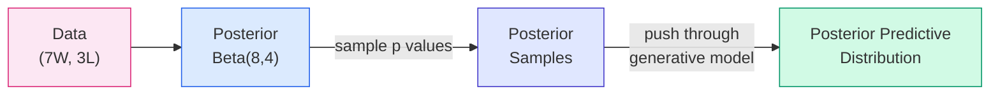

# Lecture A02: From Counting to Continuous Posteriors

> **Prerequisite:** [Lecture A01: Introduction to Bayesian Workflow](Lecture%20A01%20-%20Introduction%20to%20Bayesian%20Workflow_revised.md). This lecture picks up where A01 ended: we had a d4 globe, a counting method, and the binomial likelihood. Now we scale to continuous parameters and learn how to use the posterior for prediction.

---

## From Finite Dice to the Continuous Globe

In [[Lecture A01 - Introduction to Bayesian Workflow_revised|Lecture A01]], we simplified the globe to a four-sided die (d4), where *p* could only take values {0, 0.25, 0.50, 0.75, 1.0}. The posterior was a table of five numbers. Now we increase the resolution.

### d4: Four possibilities

```
p = [0.00, 0.25, 0.50, 0.75, 1.00]
```

Five candidate values. The posterior is a bar chart with five bars.

### d10: Ten possibilities

```
p = [0.0, 0.1, 0.2, 0.3, 0.4, 0.5, 0.6, 0.7, 0.8, 0.9, 1.0]
```

Eleven candidate values. The posterior is a bar chart with eleven bars. Already smoother.

### d20: Twenty possibilities

```
p = [0.00, 0.05, 0.10, ..., 0.95, 1.00]
```

Twenty-one candidate values. The bars narrow. The shape of the posterior becomes visible as a curve.

### Infinite sides: the continuous globe

The globe is a polyhedron with an infinite number of sides. Every value of *p* between 0 and 1 is a candidate. The posterior is no longer a bar chart; it is a smooth curve.

The posterior probability of any specific value *p* is proportional to:

$$p^W (1-p)^L$$

where *W* = number of water observations and *L* = number of land observations. This is exactly the counting logic from [[Lecture A01 - Introduction to Bayesian Workflow_revised|A01]], taken to the limit. The multiplication structure is preserved: each observation multiplies the ways.

```python
import numpy as np
import matplotlib.pyplot as plt
from scipy import stats

def plot_discrete_to_continuous(
    n_water: int = 7,
    n_land: int = 3,
    seed: int = 42,
) -> None:
    """Show the progression from d4 to d10 to d20 to continuous posterior.
    
    Demonstrates how the counting method from A01 converges to the Beta
    distribution as the number of sides increases.
    
    Args:
        n_water: Number of water observations.
        n_land: Number of land observations.
    """
    fig, axes = plt.subplots(1, 4, figsize=(16, 4), facecolor="white")
    
    sides_list = [4, 10, 20, 200]  # 200 approximates continuous
    titles = ["d4 (5 values)", "d10 (11 values)", "d20 (21 values)", "Continuous (Beta)"]
    
    for ax, n_sides, title in zip(axes, sides_list, titles):
        # Candidate p values for this die
        p_vals = np.linspace(0, 1, n_sides + 1)
        
        # Unnormalized posterior: p^W * (1-p)^L (flat prior)
        unnorm = p_vals**n_water * (1 - p_vals)**n_land
        
        # Normalize
        if unnorm.sum() > 0:
            posterior = unnorm / unnorm.sum()
        else:
            posterior = unnorm
        
        if n_sides < 200:
            ax.bar(p_vals, posterior, width=1 / (n_sides + 1) * 0.8,
                   color="#2563eb", alpha=0.7, edgecolor="white")
        else:
            # Scale to match Beta density for visual comparison
            beta_dist = stats.beta(n_water + 1, n_land + 1)
            p_fine = np.linspace(0, 1, 200)
            ax.fill_between(p_fine, beta_dist.pdf(p_fine),
                           alpha=0.3, color="#2563eb")
            ax.plot(p_fine, beta_dist.pdf(p_fine),
                   color="#2563eb", linewidth=2)
        
        ax.set_title(title, fontsize=11)
        ax.set_xlabel("p")
        ax.set_xlim(-0.05, 1.05)
    
    axes[0].set_ylabel("Posterior probability / density")
    plt.suptitle(f"From counting to continuous: {n_water}W, {n_land}L",
                fontsize=13)
    plt.tight_layout()
    plt.savefig("d4_to_continuous.png", dpi=150, facecolor="white")
    plt.show()

# 7 water, 3 land from our globe tossing sample
plot_discrete_to_continuous(n_water=7, n_land=3)
```

**Where does the shape come from?** Multiplication. Each observation multiplies the posterior by a factor: *p* for water, *(1-p)* for land. Seven water observations give $p^7$, which pushes mass toward high *p*. Three land observations give $(1-p)^3$, which pulls mass away from *p* = 1. The product $p^7(1-p)^3$ peaks near *p* = 0.7, exactly where you would expect given 7W out of 10 tosses.

---

## The Beta Distribution

### Deriving it from counting

The only trick in going from the discrete case to the continuous case is normalization. In the discrete case, we summed over the candidates. In the continuous case, we integrate. After a little calculus:

$$\text{Posterior}(p) = \frac{(W+L+1)!}{W! \cdot L!} \cdot p^W (1-p)^L$$

The fraction $\frac{(W+L+1)!}{W! \cdot L!}$ is the normalizing constant. It ensures the posterior integrates to 1. You never need to compute it by hand; it falls out of the Beta distribution.

This is the **Beta distribution**:

$$\text{Beta}(p \mid \alpha, \beta) = \frac{\Gamma(\alpha + \beta)}{\Gamma(\alpha)\Gamma(\beta)} \cdot p^{\alpha - 1}(1-p)^{\beta - 1}$$

where $\alpha = W + 1$ and $\beta = L + 1$ (with a flat prior). The Gamma function $\Gamma(n) = (n-1)!$ for positive integers, so for our case:

$$\text{Beta}(p \mid W+1, L+1) = \frac{(W+L+1)!}{W! \cdot L!} \cdot p^W (1-p)^L$$

> **Revisit note:** You already use `scipy.stats.beta` and `pm.Beta` in PyMC. The connection worth re-anchoring: the Beta distribution is not an arbitrary choice. It is the *result* of the counting logic from [[Lecture A01 - Introduction to Bayesian Workflow_revised|A01]] taken to the continuous limit. When you write `pm.Beta("p", alpha=8, beta=4)` in a model, you are encoding "I have information equivalent to 7 water and 3 land observations" as a prior.

```python
from scipy import stats
import numpy as np

# After 7W, 3L with flat prior: Beta(8, 4)
posterior = stats.beta(a=7 + 1, b=3 + 1)

# Key summaries
print(f"Posterior mean:   {posterior.mean():.3f}")
print(f"Posterior mode:   {(7) / (7 + 3):.3f}")   # (alpha-1)/(alpha+beta-2)
print(f"Posterior std:    {posterior.std():.3f}")
print(f"89% interval:    {posterior.interval(0.89)}")
```

---

## What is Probability Density?

The y-axis on a continuous posterior plot is **probability density**, not probability. This is a common source of confusion.

**Key distinction:**
- **Discrete case** (d4): the y-axis is probability. P(p=0.75) = 0.45 means there is a 45% chance that *p* is 0.75.
- **Continuous case**: the probability of *p* being any *exact* value is zero. P(p = 0.7000000...) = 0. Instead, density tells you the *relative plausibility* of values in a neighborhood.

**How to interpret density:**
- Higher density = more plausible region
- The probability that *p* falls in an interval [a, b] is the **area under the curve** between a and b
- Density can exceed 1.0 (unlike probability). A Beta(20, 6) distribution peaks above 3.0. That is fine; it just means the mass is concentrated in a narrow region.

```python
import numpy as np
import matplotlib.pyplot as plt
from scipy import stats

def explain_density() -> None:
    """Demonstrate that density is about area, not height.
    
    Shows two posteriors: one broad (few observations), one narrow (many).
    The narrow one has higher density but the same total area (1.0).
    """
    fig, axes = plt.subplots(1, 2, figsize=(12, 4), facecolor="white")
    p = np.linspace(0, 1, 300)
    
    # Few observations: Beta(3, 2) -- broad, low density
    dist_few = stats.beta(3, 2)
    axes[0].fill_between(p, dist_few.pdf(p), alpha=0.3, color="#2563eb")
    axes[0].plot(p, dist_few.pdf(p), color="#2563eb", linewidth=2)
    axes[0].set_title("2W, 1L: broad posterior (max density ~1.9)")
    axes[0].set_ylabel("Density")
    axes[0].set_xlabel("p")
    
    # Many observations: Beta(21, 10) -- narrow, high density
    dist_many = stats.beta(21, 10)
    axes[1].fill_between(p, dist_many.pdf(p), alpha=0.3, color="#059669")
    axes[1].plot(p, dist_many.pdf(p), color="#059669", linewidth=2)
    axes[1].set_title("20W, 9L: narrow posterior (max density ~4.5)")
    axes[1].set_ylabel("Density")
    axes[1].set_xlabel("p")
    
    for ax in axes:
        ax.set_xlim(0, 1)
    
    plt.suptitle("Both curves have total area = 1.0", fontsize=12)
    plt.tight_layout()
    plt.savefig("density_explanation.png", dpi=150, facecolor="white")
    plt.show()
    
    # Verify areas
    print(f"Area under Beta(3,2):   {dist_few.cdf(1) - dist_few.cdf(0):.4f}")
    print(f"Area under Beta(21,10): {dist_many.cdf(1) - dist_many.cdf(0):.4f}")

explain_density()
```

**Analogy from real estate:** Think of density like population density. Ljubljana has ~2,000 people/km2; Kočevje has ~15 people/km2. Neither number is a count of people. You need to multiply by the area to get a count. Similarly, density times interval width gives probability.

---

## Four Properties of the Bayesian Posterior

### 1. There is no minimum sample size

You can compute a posterior from a single observation. Even with W=1, L=0, the posterior Beta(2,1) is well-defined and informative: it says *p* = 0 is ruled out, and higher values of *p* are more plausible. There is no "you need at least 30 observations" rule.

The posterior honestly represents what the data say, even if the data say very little. A wide posterior from a small sample is not a failure; it is an accurate representation of ignorance.

> **Applied example (real estate):** Some municipalities have fewer than 20 transactions per year. Frequentist methods break down or refuse to produce estimates. The Bayesian posterior from 20 observations is perfectly valid. It will be wide, reflecting genuine uncertainty, and partial pooling via hierarchical priors (coming in later lectures) will borrow strength from neighboring municipalities. This is the core of the OTP Bank CRR3 index strategy for small-market municipalities.

### 2. Shape embodies the sample size

The shape of the posterior tells you the effective sample size. A narrow, peaked posterior means lots of data (or strong prior). A broad, flat posterior means little data. You do not need a separate sample-size statistic; the posterior encodes it.

Compare:
- Beta(2, 1): 1W, 0L. Broad. We know almost nothing.
- Beta(8, 4): 7W, 3L. Moderate. Peak near 0.7, some spread.
- Beta(71, 31): 70W, 30L. Narrow. Concentrated near 0.7.

All three have the same posterior mean (roughly 0.7), but the shape tells the story that the mean alone cannot.

### 3. No point estimate; the estimate IS the distribution

The posterior distribution is the estimate. A point estimate (mean, median, mode) is a summary for communication. It discards information.

When someone asks "what is your estimate of *p*?" the correct answer is the full posterior. If they insist on a number, give the mean or mode, but always accompany it with the interval. The posterior is the thing. Point estimates are lossy compression.

### 4. No one true interval

There is no single correct credible interval. Common choices:
- **89% interval**: McElreath's default. Avoids false precision of 95%. The number 89 is prime, which signals "this is a convention, not a law."
- **95% interval**: conventional, but carries baggage from frequentist hypothesis testing.
- **50% interval**: useful for showing where the bulk of mass sits.

Intervals communicate the shape of the posterior. Report them alongside the full distribution whenever possible.

```python
from scipy import stats

posterior = stats.beta(8, 4)  # 7W, 3L

# Different interval widths, same posterior
for pct in [0.50, 0.89, 0.95]:
    lo, hi = posterior.interval(pct)
    print(f"{pct*100:.0f}% interval: [{lo:.3f}, {hi:.3f}]")

# HPDI (Highest Posterior Density Interval) via PyMC/ArviZ
# The equal-tailed interval from scipy is not always the narrowest.
# For skewed posteriors, use ArviZ:
#   import arviz as az
#   samples = posterior.rvs(10_000)
#   az.hdi(samples, hdi_prob=0.89)
```

> **Applied example (policy analysis):** When briefing a PM on housing price trends, "prices rose 4.2%" is less useful than "prices rose between 2.8% and 5.7% with 89% probability." The interval width tells the PM how much to trust the number. In municipalities with sparse data, the interval is wide; the PM should hedge. In Ljubljana, the interval is narrow; the PM can act with confidence.

---

## From Posterior to Predictions: The Posterior Predictive Distribution

This is the central technique of applied Bayesian statistics. It connects the posterior (what we learned about *p*) to predictions (what we expect to observe next). The logic has three steps.

### The problem

We have a posterior distribution over *p*. We want to predict: if we toss the globe 9 more times, how many times will we see water?

If we knew *p* exactly (say *p* = 0.7), the answer is straightforward: simulate 9 tosses from Binomial(9, 0.7). But we do not know *p* exactly. The posterior says *p* could be 0.6 or 0.8 or 0.55, each with different plausibility. We need to **average predictions over all possible values of *p***, weighted by how plausible each value is.

This requires integration. And most integrals cannot be solved analytically. But we can use **sampling** to do it numerically, and this works for any model, no matter how complex.

### Step 1: Sample from the posterior

Draw random values of *p* from the posterior distribution. These samples are drawn proportionally to the posterior density: values near the peak are drawn more often, values in the tails less often.

```python
from scipy import stats
import numpy as np

# Posterior: Beta(8, 4) from 7W, 3L
posterior = stats.beta(8, 4)

# Draw 10,000 samples from the posterior
rng = np.random.default_rng(42)
p_samples = posterior.rvs(size=10_000, random_state=rng)

# Verify: the sample distribution approximates the analytical posterior
print(f"Analytical mean: {posterior.mean():.4f}")
print(f"Sample mean:     {p_samples.mean():.4f}")
print(f"Analytical std:  {posterior.std():.4f}")
print(f"Sample std:      {p_samples.std():.4f}")
```

### Step 2: For each sample, simulate new data

Take each sampled *p* value and push it back through the generative model. For each *p*, simulate 9 tosses from Binomial(9, *p*). This gives a predictive distribution *conditional on that specific p*.

- For a low *p* sample (say 0.4): the predictive distribution shifts left (fewer waters expected), but high counts are still possible, just rare.
- For a high *p* sample (say 0.85): the distribution shifts right (many waters expected), but zero waters is still possible, just very unlikely.

### Step 3: Accumulate across all samples

Collect all the simulated counts. The resulting distribution is the **posterior predictive distribution**. It contains all the uncertainty: both the sampling variability (even if we knew *p*, we would get different counts each time) and the parameter uncertainty (we do not know *p* precisely).

```python
import numpy as np
import matplotlib.pyplot as plt
from scipy import stats

def posterior_predictive_distribution(
    n_water: int = 7,
    n_land: int = 3,
    n_new_tosses: int = 9,
    n_samples: int = 10_000,
    seed: int = 42,
) -> np.ndarray:
    """Generate the posterior predictive distribution.
    
    This is the three-step process:
    1. Sample p from posterior Beta(W+1, L+1)
    2. For each p, simulate n_new_tosses from Binomial(n_new_tosses, p)
    3. Collect all simulated counts
    
    Args:
        n_water: Observed water count.
        n_land: Observed land count.
        n_new_tosses: Number of new tosses to predict.
        n_samples: Number of posterior samples.
        seed: Random seed.
    
    Returns:
        Array of predicted water counts (length = n_samples).
    """
    rng = np.random.default_rng(seed)
    
    # Step 1: sample p values from posterior
    posterior = stats.beta(n_water + 1, n_land + 1)
    p_samples = posterior.rvs(size=n_samples, random_state=rng)
    
    # Step 2 + 3: for each p, simulate new data and collect
    # This is one line because numpy vectorizes over the p_samples array
    predicted_water = rng.binomial(n=n_new_tosses, p=p_samples)
    
    return predicted_water

# Generate posterior predictive distribution
predictions = posterior_predictive_distribution()

# Plot it
fig, ax = plt.subplots(figsize=(8, 4), facecolor="white")
counts = np.bincount(predictions, minlength=10)
probs = counts / counts.sum()
ax.bar(range(10), probs, color="#2563eb", alpha=0.7, edgecolor="white")
ax.set_xlabel("Number of water in 9 new tosses")
ax.set_ylabel("Probability")
ax.set_title("Posterior Predictive Distribution (7W, 3L observed)")
ax.set_xticks(range(10))
plt.tight_layout()
plt.savefig("posterior_predictive.png", dpi=150, facecolor="white")
plt.show()

# Summary
print(f"Expected water in 9 tosses: {predictions.mean():.1f}")
print(f"90% prediction interval: [{np.percentile(predictions, 5):.0f}, "
      f"{np.percentile(predictions, 95):.0f}]")
```

### Why this works: sampling replaces integration

The formal way to compute the posterior predictive is an integral:

$$P(W_{\text{new}} = w) = \int_0^1 \text{Binomial}(w \mid n, p) \cdot \text{Beta}(p \mid \alpha, \beta) \, dp$$

Most integrals like this cannot be solved analytically (the Beta-Binomial is a rare exception). But sampling makes it trivial:

1. Draw *p* values from the posterior (proportional to density)
2. Simulate data for each *p* value
3. Collect the results

The random draws handle the weighting automatically. Values of *p* with higher posterior density are drawn more often, so they contribute more to the predictive distribution. No calculus required. This technique generalizes to any model: hierarchical models, mixture models, time series, neural network posteriors. If you have posterior samples, you can make predictions.

> **Revisit note:** This is exactly what `pm.sample_posterior_predictive()` does in PyMC. It takes MCMC samples (posterior draws of all parameters), feeds each draw through the generative model, and collects simulated data. The code above is the manual version of what PyMC automates.

### Applied example: real estate posterior predictive

```python
import numpy as np
from scipy import stats

def predict_above_median_transactions(
    observed_above: int = 35,
    observed_below: int = 15,
    n_next_quarter: int = 50,
    n_samples: int = 10_000,
    seed: int = 42,
) -> None:
    """Predict how many transactions next quarter will be above the municipal median.
    
    Context: you observed 35 out of 50 transactions above the municipal median
    price last quarter. What should you expect next quarter?
    
    This uses the same posterior predictive logic as globe tossing:
    the estimand (proportion above median) has the same binomial structure.
    
    Args:
        observed_above: Transactions above median last quarter.
        observed_below: Transactions below median last quarter.
        n_next_quarter: Expected transactions next quarter.
        n_samples: Number of posterior samples.
        seed: Random seed.
    """
    rng = np.random.default_rng(seed)
    
    # Posterior for proportion above median
    posterior = stats.beta(observed_above + 1, observed_below + 1)
    p_samples = posterior.rvs(size=n_samples, random_state=rng)
    
    # Posterior predictive: simulate next quarter
    predicted_above = rng.binomial(n=n_next_quarter, p=p_samples)
    
    print(f"Observed: {observed_above}/{observed_above + observed_below} above median")
    print(f"Posterior mean for p: {posterior.mean():.3f}")
    print(f"Predicted above median next quarter (out of {n_next_quarter}):")
    print(f"  Mean: {predicted_above.mean():.1f}")
    print(f"  89% interval: [{np.percentile(predicted_above, 5.5):.0f}, "
          f"{np.percentile(predicted_above, 94.5):.0f}]")
    print(f"  P(more than 40 above): {(predicted_above > 40).mean():.3f}")

predict_above_median_transactions()
```

> **Applied example (forensic audio):** Same structure. You examined 500 audio frames and found 12 anomalous. What should you expect in the next 500 frames if the recording is from the same source? The posterior predictive tells you. If the next 500 frames show 45 anomalies when the predictive distribution says you should expect 5-20, that is evidence of a different process (e.g., a splice from a different recording environment).

---

## Why You Must Use the Full Posterior (Not a Point Estimate)

This is the most common mistake in applied Bayesian work, and McElreath emphasizes it repeatedly. The heuristic: **summarize last.**

### The mistake

The posterior mean for our globe example is *p* = 0.667 (from Beta(8, 4)). It is tempting to plug this single value into the generative model: simulate 9 tosses from Binomial(9, 0.667). This produces the **point-estimate predictive distribution**.

The problem: this distribution is too narrow. It captures sampling variability (randomness in 9 tosses) but throws away parameter uncertainty (we do not know *p* precisely). The result is **overconfident predictions**.

### Comparison

```python
import numpy as np
import matplotlib.pyplot as plt
from scipy import stats

def compare_point_vs_full_posterior(
    n_water: int = 7,
    n_land: int = 3,
    n_new_tosses: int = 9,
    n_samples: int = 10_000,
    seed: int = 42,
) -> None:
    """Compare predictions from point estimate vs full posterior.
    
    The full posterior predictive (blue) is wider than the point estimate
    predictive (black) because it includes parameter uncertainty.
    
    Args:
        n_water: Observed water count.
        n_land: Observed land count.
        n_new_tosses: Number of new tosses to predict.
        n_samples: Number of posterior samples.
        seed: Random seed.
    """
    rng = np.random.default_rng(seed)
    posterior = stats.beta(n_water + 1, n_land + 1)
    
    # Full posterior predictive
    p_samples = posterior.rvs(size=n_samples, random_state=rng)
    full_pred = rng.binomial(n=n_new_tosses, p=p_samples)
    
    # Point estimate predictive (using posterior mean only)
    p_mean = posterior.mean()
    point_pred = rng.binomial(n=n_new_tosses, p=p_mean, size=n_samples)
    
    # Plot comparison
    fig, ax = plt.subplots(figsize=(8, 4), facecolor="white")
    bins = np.arange(-0.5, n_new_tosses + 1.5, 1)
    
    ax.hist(point_pred, bins=bins, density=True, alpha=0.5,
            color="black", label=f"Point estimate (p={p_mean:.3f})", edgecolor="white")
    ax.hist(full_pred, bins=bins, density=True, alpha=0.5,
            color="#2563eb", label="Full posterior", edgecolor="white")
    
    ax.set_xlabel("Number of water in 9 new tosses")
    ax.set_ylabel("Probability")
    ax.set_title("Point estimate is overconfident (black) vs full posterior (blue)")
    ax.legend()
    plt.tight_layout()
    plt.savefig("point_vs_full_posterior.png", dpi=150, facecolor="white")
    plt.show()
    
    # Quantify the difference
    print(f"Point estimate std: {point_pred.std():.2f}")
    print(f"Full posterior std: {full_pred.std():.2f}")
    print(f"Full posterior is {full_pred.std() / point_pred.std():.1f}x wider")

compare_point_vs_full_posterior()
```

### The "summarize last" heuristic

> Do all calculations with the full distribution. Summary (mean, median, interval) is always the last step. If you find yourself tempted to take a mean, ask: do I have more calculations to do? If yes, stop. Do not plug a mean into a function. The mean summarizes results that have already been through functions.

McElreath's warning: "I tell my PhD students they will make this mistake. They say 'no way.' Then they make this mistake. I have made this mistake. Past me is you."

> **Applied example (real estate):** When computing a price index from a hierarchical model, the posterior gives you a distribution over each municipality's price trend. If you take the mean trend for each municipality and then compute the national average, you underestimate uncertainty. Instead: take each posterior draw (a full set of municipality trends), compute the national average for that draw, and then summarize the resulting distribution of national averages. This preserves the correlation structure between municipalities.

> **Applied example (Causaris risk modeling):** When computing Value at Risk for a real estate portfolio, using point estimates of price trends produces artificially narrow risk bands. The full posterior predictive gives wider, more honest risk estimates. CRR3 compliance requires demonstrating that risk estimates are not overconfident; the full posterior predictive is the correct tool.

---

## Sampling from the Posterior: The Practical Engine

In the globe tossing example, we had an analytical posterior (Beta distribution), so we could sample from it directly using `scipy.stats.beta.rvs()`. For complex models, analytical posteriors do not exist. That is where MCMC (Markov Chain Monte Carlo) comes in: it generates samples from posterior distributions that cannot be written in closed form.

The key insight: **once you have samples, all downstream computations are the same**, regardless of whether the samples came from an analytical distribution or from MCMC. This is why the sampling approach is universal.

```python
import numpy as np
import matplotlib.pyplot as plt
from scipy import stats

def demonstrate_sampling_approximation(
    n_water: int = 7,
    n_land: int = 3,
    sample_sizes: list[int] = [100, 1_000, 10_000],
    seed: int = 42,
) -> None:
    """Show that samples approximate the analytical posterior.
    
    As we draw more samples, the empirical distribution converges
    to the true posterior. This is why MCMC works: enough samples
    give an arbitrarily good approximation.
    
    Args:
        n_water: Observed water count.
        n_land: Observed land count.
        sample_sizes: List of sample sizes to demonstrate convergence.
        seed: Random seed.
    """
    posterior = stats.beta(n_water + 1, n_land + 1)
    p_grid = np.linspace(0, 1, 200)
    rng = np.random.default_rng(seed)
    
    fig, axes = plt.subplots(1, len(sample_sizes), figsize=(14, 4),
                             facecolor="white")
    
    for ax, n in zip(axes, sample_sizes):
        samples = posterior.rvs(size=n, random_state=rng)
        
        # Analytical posterior
        ax.plot(p_grid, posterior.pdf(p_grid), "k-", linewidth=2,
               label="Analytical (Beta)")
        
        # Sample-based density estimate
        ax.hist(samples, bins=30, density=True, alpha=0.4,
               color="#dc2626", edgecolor="white", label=f"{n:,} samples")
        
        ax.set_title(f"n = {n:,}")
        ax.set_xlabel("p")
        ax.set_xlim(0, 1)
        ax.legend(fontsize=9)
    
    axes[0].set_ylabel("Density")
    plt.suptitle("Samples approximate the analytical posterior", fontsize=12)
    plt.tight_layout()
    plt.savefig("sampling_approximation.png", dpi=150, facecolor="white")
    plt.show()

demonstrate_sampling_approximation()
```

> **Revisit note:** In practice, you rarely see `stats.beta.rvs()` in real Bayesian work. You see `pm.sample()`, which returns MCMC samples from potentially complex, high-dimensional posteriors. But the downstream workflow is identical: take the samples, push them through the generative model, collect predictions. The globe example teaches the workflow; PyMC handles the sampling for models where the analytical form is unknown.

---

## The Complete Workflow: From Uncertainty to Prediction

Combining everything from [[Lecture A01 - Introduction to Bayesian Workflow_revised|A01]] and A02, the applied Bayesian workflow for prediction is:



1. **Data** produces the **posterior** (what we learned about parameters)
2. **Sample** from the posterior (random draws, proportional to density)
3. **Push samples through the generative model** to get predictions
4. **Collect** the predictions as the **posterior predictive distribution**

This workflow applies to:
- Effect sizes: sample causal effect parameters from posterior, compute effect size for each draw
- Forecasts: sample model parameters, simulate future observations
- Model checks: compare posterior predictive to observed data; if they disagree, the model is wrong
- Interventions: sample parameters, simulate what happens under a different treatment
- Model comparison: compare posterior predictive distributions from competing models

The code is always the same pattern:
```python
# Pseudocode for ANY Bayesian model
posterior_samples = sample_posterior(model, data)        # MCMC or analytical
predictions = [generative_model(s) for s in posterior_samples]  # simulate
summary = summarize(predictions)                        # last step
```

---

## Prior Predictive Simulation (Preview of Lecture A03)

McElreath closes by noting that the same workflow applies *before* seeing data. A prior is a posterior that has not seen data yet. You can sample from the prior, push those samples through the generative model, and see what the model predicts before any data arrives. This is **prior predictive simulation**.

Why is this useful? It reveals whether your priors are sensible. If a prior says "the globe could be 99% water or 1% water with equal probability," the prior predictive distribution of 9 tosses will be bimodal (either ~0 or ~9 waters). That is a bad prior for this problem. Prior predictive checks catch these problems before you waste time on fitting.

```python
import numpy as np
import matplotlib.pyplot as plt
from scipy import stats

def prior_predictive_check(
    prior_a: float = 1.0,
    prior_b: float = 1.0,
    n_tosses: int = 9,
    n_samples: int = 10_000,
    seed: int = 42,
) -> None:
    """Simulate what the model predicts before seeing any data.
    
    Flat prior Beta(1,1) says every p is equally likely.
    The prior predictive is uniform over possible water counts:
    a sign that the prior is uninformative (which is the point).
    
    Args:
        prior_a: Beta prior alpha.
        prior_b: Beta prior beta.
        n_tosses: Number of tosses to simulate.
        n_samples: Number of prior samples.
        seed: Random seed.
    """
    rng = np.random.default_rng(seed)
    
    # Sample p from prior
    p_samples = stats.beta(prior_a, prior_b).rvs(size=n_samples,
                                                   random_state=rng)
    
    # Push through generative model
    predicted_water = rng.binomial(n=n_tosses, p=p_samples)
    
    fig, ax = plt.subplots(figsize=(8, 4), facecolor="white")
    counts = np.bincount(predicted_water, minlength=n_tosses + 1)
    probs = counts / counts.sum()
    ax.bar(range(n_tosses + 1), probs, color="#d97706", alpha=0.7,
           edgecolor="white")
    ax.set_xlabel("Number of water in 9 tosses")
    ax.set_ylabel("Probability")
    ax.set_title(f"Prior Predictive: Beta({prior_a}, {prior_b}) prior")
    ax.set_xticks(range(n_tosses + 1))
    plt.tight_layout()
    plt.savefig("prior_predictive.png", dpi=150, facecolor="white")
    plt.show()

# Flat prior: every outcome equally likely (uninformative)
prior_predictive_check(prior_a=1.0, prior_b=1.0)
```

> **Applied example (Causaris):** Before fitting a hierarchical price model to OTP Bank data, simulate from the priors. If the prior predictive says "20% quarterly price drops are as likely as 2% increases," the priors are too wide for the Slovenian market. Tighten them using domain knowledge (historical Slovenian price volatility is ~1-3% quarterly). This is how you encode the expertise from 175,000 transactions into the prior.

---

## Key Takeaways for Revisiting

1. **The Beta distribution is counting taken to the limit.** It is not a convenient mathematical trick; it is the exact result of the A01 counting logic on a continuous globe. $\text{Beta}(\alpha, \beta)$ encodes information equivalent to $\alpha - 1$ water and $\beta - 1$ land observations.

2. **Density is not probability.** Density can exceed 1. The probability of an interval is the area under the curve, not the height. This matters when interpreting PyMC trace plots and when communicating results to non-technical stakeholders.

3. **The posterior predictive distribution is the central tool.** Sample from posterior, push through generative model, collect predictions. Three steps. Works for any model. This is what `pm.sample_posterior_predictive()` automates. Understanding the manual version helps you debug when the automated version gives unexpected results.

4. **Summarize last.** Never plug a point estimate into a downstream calculation. Process the full distribution through all transformations, then summarize at the end. Violation of this rule produces overconfident predictions. McElreath's heuristic: "If you are about to take a mean, ask if you have more calculations to do. If yes, stop."

5. **Sampling replaces integration.** You get all the power of calculus without doing integrals. This is why MCMC is practical: it gives you samples, and samples are all you need for predictions, effect sizes, model checks, and comparisons. The code pattern is always the same.

6. **Priors are posteriors that have not seen data.** Prior predictive simulation uses the exact same workflow. It reveals whether your model assumptions are reasonable before you fit data. This is the bridge to Lecture A03.

7. **No minimum sample size.** The Bayesian posterior is valid for any sample size. Small samples produce wide posteriors; that is correct behavior, not a failure. This is directly relevant to sparse-data settings: small municipalities, rare forensic events, niche market segments.
