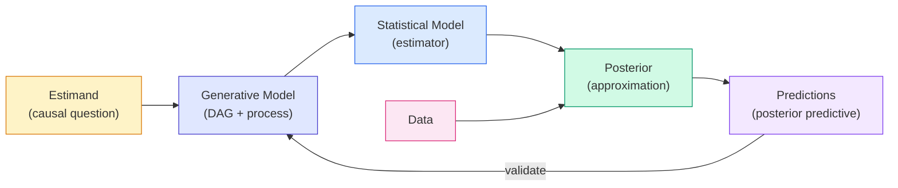
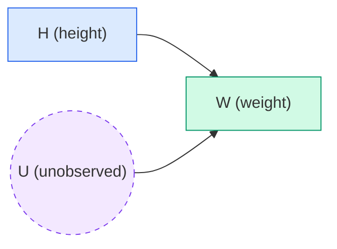

# Lecture A03: Geocentric Models

> **Prerequisite:** [[Lecture A02_revised|Lecture A02: From Counting to Continuous Posteriors]]. This lecture picks up where A02 ended: we had a posterior, a posterior predictive distribution, and a prior predictive preview. Now we build the first real statistical model: linear regression. The counting logic from [[Lecture A01 - Introduction to Bayesian Workflow_revised|A01]] and the sampling machinery from A02 carry forward unchanged.

---

## The Geocentric Metaphor

Ptolemy's geocentric model was wrong about mechanism (the sun does not orbit Earth) but useful for prediction (it tracked planetary positions well enough for navigation). Linear regression has the same character:

- **Geocentric**: describes associations, makes predictions, mechanistically wrong
- **Gaussian**: abstracts away the generative error process, replaces it with a normal distribution, mechanistically silent
- **Useful when handled with care**

The name is deliberate. When McElreath calls these models "geocentric," he means: do not confuse predictive accuracy with causal understanding. A regression that predicts weight from height tells you nothing about *why* taller people weigh more. It just draws a line through the data. The scientific model (DAG + process) provides the "why." The statistical model provides the "how much."

Special cases of linear regression that you may have encountered under different names: ANOVA, ANCOVA, t-test. All are linear regressions with different predictor configurations.

### Mars Retrograde Motion

The geocentric metaphor has a physical origin worth understanding. Mars periodically appears to reverse direction in the night sky, tracing a loop before resuming its normal eastward drift against the stars. In the geocentric system, Ptolemy explained this with epicycles: Mars moves on a small circle (epicycle) whose center moves on a large circle (deferent) around Earth. When Mars is on the inner part of its epicycle, its backward motion on the small circle exceeds its forward motion on the large circle, producing apparent retrograde motion.

The actual explanation is simpler. Earth and Mars both orbit the Sun, but Earth orbits faster (1 year vs. 1.88 years). When Earth overtakes Mars on the inside track, Mars appears to move backward against the distant stars, the same way a slower car on the highway appears to drift backward as you pass it. The retrograde loop is a projection artifact of two bodies at different orbital speeds viewed from one of them.

Ptolemy's epicycles predicted the retrograde loops with reasonable accuracy. They were wrong about the mechanism but captured the apparent motion well enough for centuries of practical astronomy. Linear regression does the same thing: captures patterns in data without explaining the mechanism that generates them.

---

## Skill Development Goals

This lecture develops three skills:

1. **Language for representing models**: the notation system for writing down statistical models (variables, distributions, deterministic relationships)
2. **Calculating posterior distributions with multiple unknowns**: extending the single-parameter posterior from [[Lecture A02_revised|A02]] to three parameters ($\alpha$, $\beta$, $\sigma$)
3. **Constructing and understanding linear models**: building a regression from scientific knowledge, choosing priors, and interpreting what the model "thinks" before seeing data

---

## The Bayesian Workflow Revisited



The workflow is the same as in [[Lecture A01 - Introduction to Bayesian Workflow_revised|A01]], now applied to a model with multiple parameters. Each component:

1. **Estimand**: How does height influence weight?
2. **Generative model**: DAG + simulation code
3. **Statistical model**: linear regression with priors
4. **Posterior approximation**: quadratic approximation (new in this lecture)
5. **Predictions**: prior and posterior predictive distributions

---

## Estimand and DAG

**Estimand:** How does height influence weight?

The causal direction matters. Height influences weight (taller people tend to be heavier because there is more body to fill). Weight does not influence height (gaining weight does not make you taller). The DAG encodes this:



$$H \rightarrow W \leftarrow U$$

$$W = f(H, U)$$

Weight is a function of height and unobserved causes $U$. The dashed circle around $U$ is the convention for unobserved (latent) variables.

> **Applied example (real estate / Causaris):** The same DAG structure appears in property valuation. Replace $H$ with floor area (m$^2$), $W$ with transaction price, and $U$ with unobserved property characteristics (condition, view, renovation status). The estimand: how does floor area influence transaction price? Floor area causes price variation (more space = higher price). Price does not cause floor area. The DAG is $\text{Area} \rightarrow \text{Price} \leftarrow U$.

> **Applied example (forensic audio):** Replace $H$ with recording duration, $W$ with number of detected anomalous frames, and $U$ with unobserved recording conditions (microphone type, compression codec, background noise). The estimand: does recording duration influence anomaly count? If genuinely unedited, anomaly count should scale linearly with duration (constant rate). A splice introduces a step change in the rate, breaking the linear relationship. The DAG is $\text{Duration} \rightarrow \text{Anomalies} \leftarrow U$.

---

## Generative Models

Using the Howell1 dataset (height and weight measurements from Kalahari foragers), we build a generative model relating height to weight.

### Two generative options

**1. Dynamic model:** Growth is an incremental process. Both height and mass derive from the same growth pattern over time. Gaussian variation results from summed fluctuations across developmental stages.

**2. Static model:** Changes in height result in changes in weight, but no growth mechanism is modeled. Gaussian variation results from growth history and unobserved factors.

We use the static model here. For adults, weight is approximately proportional to height, plus the influence of unobserved causes:

$$W = \beta H + U$$

### Simulation code

```python
import numpy as np
import matplotlib.pyplot as plt

def sim_weight(
    h: np.ndarray,
    beta: float = 0.5,
    sd: float = 5.0,
    seed: int = 42,
) -> np.ndarray:
    """Simulate weights from heights using a linear generative model.

    Args:
        h: Array of heights (cm).
        beta: Proportionality constant (kg per cm).
        sd: Standard deviation of unobserved causes.
        seed: Random seed for reproducibility.

    Returns:
        Array of simulated weights (kg).
    """
    rng = np.random.default_rng(seed)
    u = rng.normal(0, sd, size=len(h))
    w = beta * h + u
    return w


# Generate synthetic population
rng = np.random.default_rng(42)
n = 200
h = rng.uniform(130, 170, size=n)
w = sim_weight(h, beta=0.5, sd=5.0)

# Visualize
fig, ax = plt.subplots(figsize=(8, 5), facecolor="white")
ax.scatter(h, w, alpha=0.4, s=20, color="#2563eb")
ax.set_xlabel("Height (cm)")
ax.set_ylabel("Weight (kg)")
ax.set_title("Simulated height-weight data (generative model)")
plt.tight_layout()
plt.savefig("sim_height_weight.png", dpi=150, facecolor="white")
plt.show()
```

> **Revisit note:** The generative model is a *simulation*, not a fit. We choose $\beta$ and $\sigma$, then generate data. This is the forward direction. The statistical model works the backward direction: given observed data, what values of $\beta$ and $\sigma$ are consistent with it? Building both directions is the core of the Bayesian workflow from [[Lecture A01 - Introduction to Bayesian Workflow_revised|A01]].

---

## Describing Models: The Notation System

Statistical models are described using a conventional notation that lists variables from bottom to top (dependencies flow upward):

$$W_i \sim \text{Normal}(\mu_i, \sigma)$$

$$\mu_i = \alpha + \beta H_i$$

$$\alpha \sim \text{Normal}(0, 10)$$

$$\beta \sim \text{Uniform}(0, 1)$$

$$\sigma \sim \text{Uniform}(0, 10)$$

### Reading the notation

| Symbol | Meaning |
|--------|---------|
| $=$ | Deterministic relationship (no randomness) |
| $\sim$ | "Is distributed as" (stochastic relationship) |
| $W_i$ | Weight of individual $i$ |
| $H_i$ | Height of individual $i$ |
| $\mu_i$ | Expected (mean) weight for individual $i$ |
| $\alpha$ | Intercept: expected weight when height = 0 |
| $\beta$ | Slope: change in expected weight per cm of height |
| $\sigma$ | Standard deviation of weight around expectation |

**Read from bottom to top.** The bottom variables ($\alpha$, $\beta$, $\sigma$) have priors. $\mu_i$ is a deterministic function of $\alpha$, $\beta$, and $H_i$. $W_i$ is a stochastic function of $\mu_i$ and $\sigma$.

### Generative model vs. statistical model

The generative model specifies how the world produces data:

$$H \rightarrow W \leftarrow U$$

The statistical model specifies the structure of the estimator and how to approximate the posterior. The generative model informs the statistical model: since $W = \beta H + U$ and $U$ is a sum of many small fluctuations, we model $W$ as normally distributed around $\mu = \alpha + \beta H$.

---

## The Linear Regression Estimator

The estimand is the expected weight conditional on height:

$$E(W_i \mid H_i) = \alpha + \beta H_i$$

- $\alpha$ (intercept): expected weight when height = 0
- $\beta$ (slope): change in expected weight per unit change in height

For each height value, the regression gives you the expected weight. $\sigma$ captures the spread around that expectation.

---

## The Garden of Forking Data (Extended to Linear Regression)

The **garden of forking data** is the central metaphor from [[Lecture A01 - Introduction to Bayesian Workflow_revised|A01]]. It generalizes directly to models with multiple parameters.

### The principle

For every possible combination of parameter values, count the ways the observed data could have been produced under that combination. Combinations with more ways are more plausible. The posterior distribution is a ranking of all possible parameter combinations by the number of ways each could generate the observed data.

### From globe tossing to regression

In the globe tossing model ([[Lecture A01 - Introduction to Bayesian Workflow_revised|A01]]), the garden had one dimension: $p$, the proportion of water. Each value of $p$ produced a different number of ways to see the observed W and L sequence.

In linear regression, the garden has three dimensions: $\alpha$, $\beta$, and $\sigma$. Each combination $(\alpha, \beta, \sigma)$ defines:
- A line ($\mu_i = \alpha + \beta H_i$)
- A spread around that line ($\sigma$)

For each combination, the "number of ways" to produce the observed weights is determined by the normal distribution:

$$P(W_i \mid H_i, \alpha, \beta, \sigma) = \text{Normal}(W_i \mid \alpha + \beta H_i, \sigma)$$

The total count for a combination is the product across all observations (assuming independence):

$$\text{Ways}(\alpha, \beta, \sigma) = \prod_{i=1}^{N} \text{Normal}(W_i \mid \alpha + \beta H_i, \sigma)$$

This product is the **likelihood**. Combinations where the line passes close to the data points with appropriate scatter receive high likelihood. Combinations where the line misses the data or the scatter is wrong receive low likelihood.

### The posterior as a ranked garden

The posterior distribution ranks every $(\alpha, \beta, \sigma)$ combination by:

$$\text{Posterior}(\alpha, \beta, \sigma) \propto \underbrace{\prod_{i=1}^{N} \text{Normal}(W_i \mid \alpha + \beta H_i, \sigma)}_{\text{likelihood (garden count)}} \times \underbrace{P(\alpha) \cdot P(\beta) \cdot P(\sigma)}_{\text{prior (initial plausibility)}}$$

This is Bayes' theorem with three parameters instead of one. The structure is identical to the globe model: counting ways times prior plausibility, normalized.

```python
import numpy as np
from scipy import stats

def log_posterior(
    alpha: float,
    beta: float,
    sigma: float,
    heights: np.ndarray,
    weights: np.ndarray,
) -> float:
    """Compute the log posterior for a linear regression model.

    The garden of forking data for continuous parameters: the log-likelihood
    is the log of the product of normal densities (sum of log densities),
    plus log prior.

    Args:
        alpha: Intercept parameter.
        beta: Slope parameter.
        sigma: Standard deviation parameter (must be positive).
        heights: Observed heights.
        weights: Observed weights.

    Returns:
        Log posterior (unnormalized).
    """
    if sigma <= 0:
        return -np.inf

    mu = alpha + beta * heights
    # Log-likelihood: sum of log-normal densities
    ll = np.sum(stats.norm.logpdf(weights, loc=mu, scale=sigma))
    # Log priors
    lp_alpha = stats.norm.logpdf(alpha, loc=0, scale=10)
    lp_beta = stats.uniform.logpdf(beta, loc=0, scale=1)
    lp_sigma = stats.uniform.logpdf(sigma, loc=0, scale=10)

    return ll + lp_alpha + lp_beta + lp_sigma
```

> **Applied example (forensic audio / likelihood ratios):** The garden of forking data is the foundation of the likelihood ratio framework used in forensic science. When a forensic system evaluates whether two audio samples come from the same speaker, it computes the ratio of two garden counts: the number of ways the observed features could arise if the samples share a source ($H_p$) versus the number of ways under different sources ($H_d$). This ratio is the likelihood ratio $LR = P(\text{evidence} \mid H_p) / P(\text{evidence} \mid H_d)$. The garden metaphor makes the LR intuitive: it is the ratio of paths through two different gardens. The C$_\text{llr}$ metric (see [[2026-04-13_cllr-forensic-lr-calibration-metric]]) evaluates whether these garden counts are calibrated: whether the numbers the system reports actually correspond to the number of paths through the data.

> **Applied example (real estate / Causaris):** In a hierarchical price model, the garden has one dimension per municipality-level parameter. With 217 Slovenian municipalities, the garden has hundreds of dimensions. Each point in this high-dimensional space represents a specific set of municipal price trends. The posterior ranks all these combinations by how well they explain the observed 175,000 transactions. MCMC samples from this garden efficiently, even when the number of dimensions makes exhaustive counting impossible.

---

## Approximating the Posterior

### Three approximation methods

In [[Lecture A01 - Introduction to Bayesian Workflow_revised|A01]] and [[Lecture A02_revised|A02]], we used two methods:

1. **Grid approximation**: discretize the parameter space, evaluate posterior at each grid point. Works fine for 1-2 parameters. Explodes combinatorially for 3+. The book (Chapter 4) shows the grid approximation for this problem.

2. **Analytical solution**: some models have closed-form posteriors (e.g., Beta-Binomial conjugacy). Linear regression with Gaussian priors also has an analytical solution, but most real models do not.

This lecture introduces a third:

3. **Quadratic approximation (Laplace approximation)**: assume the posterior is approximately a multivariate Gaussian. Find the peak (mode), then estimate the curvature at the peak. The peak gives the mean, and the curvature gives the covariance matrix.

A fourth method, **Markov Chain Monte Carlo (MCMC)**, arrives in later lectures.

### Why quadratic approximation works

The posterior is often approximately Gaussian, especially for models with moderate to large sample sizes. Why?

- The **central limit theorem**: sums of many small influences tend toward Gaussian distributions. The posterior is shaped by the product of many likelihood terms (one per data point), and the log-posterior is a sum. With enough data, this sum dominates the prior, and the resulting shape is approximately quadratic (parabolic in log space = Gaussian in probability space).

- For **linear regression** with Gaussian errors, the approximation is unreasonably effective. It works well for simple and multiple regression. It breaks down for hierarchical (multilevel) models, where the posterior can be banana-shaped, funnel-shaped, or multimodal.

### Quadratic approximation and maximum likelihood

The quadratic approximation is what maximum likelihood estimation (MLE) does in most software. The mode of the posterior (with flat priors) equals the MLE. The curvature at the mode gives the standard errors. Bayesian quadratic approximation with informative priors is the same calculation with a penalty term (the log prior) added to the log likelihood.

### Implementation

```python
import numpy as np
from scipy import optimize, stats

def quadratic_approximation(
    heights: np.ndarray,
    weights: np.ndarray,
) -> dict:
    """Fit a linear regression using quadratic (Laplace) approximation.

    Finds the posterior mode and estimates the covariance matrix
    from the Hessian at the mode.

    Args:
        heights: Observed heights.
        weights: Observed weights.

    Returns:
        Dictionary with 'mode' (parameter values at peak) and
        'cov' (covariance matrix).
    """
    def neg_log_posterior(params: np.ndarray) -> float:
        alpha, beta, log_sigma = params
        sigma = np.exp(log_sigma)  # ensure positivity
        mu = alpha + beta * heights
        ll = np.sum(stats.norm.logpdf(weights, loc=mu, scale=sigma))
        lp = (
            stats.norm.logpdf(alpha, 0, 10)
            + stats.uniform.logpdf(beta, 0, 1)
            + stats.uniform.logpdf(sigma, 0, 10)
            + log_sigma  # Jacobian for log transform
        )
        return -(ll + lp)

    # Initial guess
    x0 = np.array([0.0, 0.5, np.log(5.0)])
    result = optimize.minimize(neg_log_posterior, x0, method="Nelder-Mead")

    # Estimate covariance from numerical Hessian
    from scipy.optimize import approx_fprime
    hess = np.zeros((3, 3))
    eps = 1e-5
    for i in range(3):
        def grad_i(x):
            return approx_fprime(x, neg_log_posterior, eps)[i]
        hess[i] = approx_fprime(result.x, grad_i, eps)

    cov = np.linalg.inv(hess)

    mode = result.x.copy()
    mode[2] = np.exp(mode[2])  # transform log_sigma back to sigma

    return {
        "mode": {"alpha": mode[0], "beta": mode[1], "sigma": mode[2]},
        "cov": cov,
    }
```

> **Revisit note:** In PyMC, `pm.find_MAP()` finds the mode and `pm.fit(method="laplace")` gives the quadratic approximation. McElreath's R package uses `quap()`. The code above shows the manual version: optimize the log posterior, then invert the Hessian for the covariance. Do it once for understanding, then use the library.

### Gauss and the Origins of Least Squares

The quadratic approximation has a deep historical connection. Carl Friedrich Gauss developed the method of least squares in 1795 (at age 18) to predict the orbit of Ceres, an asteroid observed for only 41 days before it disappeared behind the Sun. Other astronomers could not relocate it. Gauss used least squares to fit an orbital model to the sparse observations, predicted where Ceres would reappear, and was correct to within 0.5 degrees.

Gauss's argument for the normal distribution of errors and least-squares estimation:

1. **Errors are sums of many small, independent causes.** No single observational error dominates. Each measurement is perturbed by atmospheric refraction, instrument imprecision, timing errors, and dozens of other small effects.
2. **The distribution that maximizes entropy under a fixed variance is Gaussian.** Gauss showed that if the most probable value of a quantity is the arithmetic mean of observations (a reasonable axiom), then the error distribution must be Gaussian.
3. **Least-squares estimation follows from the Gaussian error model.** If errors are Gaussian, the maximum likelihood estimate of the parameters minimizes the sum of squared residuals.

The connection to this lecture: the normal distribution in our linear regression model ($W_i \sim \text{Normal}(\mu_i, \sigma)$) is not an arbitrary choice. It is the distribution you get when errors arise from the sum of many small, independent causes. Gauss's original motivation (fitting an orbit from sparse data with proper treatment of uncertainty) is the same problem structure we face in Bayesian regression.

---

## Prior Predictive Distribution

Priors should express scientific knowledge, but softly. The goal: make impossible outcomes implausible without rigidly constraining the model. McElreath calls these **weakly informative priors**.

### Choosing priors from scientific knowledge

**Anchor point:** When $H = 0$, $W = 0$. An organism with zero height weighs nothing. This constrains $\alpha$.

**Direction:** Weight increases (on average) with height. This constrains $\beta > 0$.

**Scale:** Weight in kilograms is less than height in centimeters for most people. A 170 cm person weighs roughly 60-80 kg, not 170+ kg. This constrains $\beta < 1$.

**Variability:** $\sigma$ must be positive.

### The priors

$$W_i \sim \text{Normal}(\mu_i, \sigma)$$

$$\mu_i = \alpha + \beta H_i$$

$$\alpha \sim \text{Normal}(0, 10)$$

$$\beta \sim \text{Uniform}(0, 1)$$

$$\sigma \sim \text{Uniform}(0, 10)$$

**Why these specific priors?**

- $\alpha \sim \text{Normal}(0, 10)$: centered on 0 because when $H = 0$, $W$ should be near 0. The wide standard deviation (10) allows the model to discover if the intercept is not near zero (helping detect model misspecification).

- $\beta \sim \text{Uniform}(0, 1)$: constrained to be positive (weight increases with height) and less than 1 (weight in kg < height in cm). McElreath notes this is not the best choice in general (he typically uses Gaussian priors on slopes), but it makes the reasoning transparent for this example.

- $\sigma \sim \text{Uniform}(0, 10)$: must be positive. The wide range allows the data to determine the actual spread.

### Prior predictive simulation

To understand what these priors imply before seeing data, sample from the prior and push the samples through the generative model. This is the **prior predictive distribution**: what the model predicts with $N = 0$ observations.

```python
import numpy as np
import matplotlib.pyplot as plt

def prior_predictive_regression(
    n_lines: int = 50,
    seed: int = 42,
) -> None:
    """Simulate lines from the prior to visualize what the model
    believes before seeing data.

    Each line is defined by a random (alpha, beta) drawn from the priors.
    The spread of lines shows the range of relationships the model
    considers plausible a priori.

    Args:
        n_lines: Number of prior lines to draw.
        seed: Random seed.
    """
    rng = np.random.default_rng(seed)

    # Sample from priors
    alphas = rng.normal(0, 10, size=n_lines)
    betas = rng.uniform(0, 1, size=n_lines)

    h_range = np.array([130, 170])

    fig, axes = plt.subplots(1, 2, figsize=(14, 5), facecolor="white")

    # Left panel: prior samples in parameter space
    ax = axes[0]
    ax.scatter(alphas, betas, alpha=0.5, s=15, color="#7c3aed")
    ax.set_xlabel(r"$\alpha$ (intercept)")
    ax.set_ylabel(r"$\beta$ (slope)")
    ax.set_title("Prior samples in parameter space")
    ax.axhline(0, color="gray", linewidth=0.5, linestyle="--")
    ax.axvline(0, color="gray", linewidth=0.5, linestyle="--")

    # Right panel: implied regression lines
    ax = axes[1]
    for a, b in zip(alphas, betas):
        w_range = a + b * h_range
        ax.plot(h_range, w_range, alpha=0.15, color="#2563eb", linewidth=0.8)
    ax.set_xlabel("Height (cm)")
    ax.set_ylabel("Weight (kg)")
    ax.set_title("Prior predictive: lines before seeing data")
    ax.set_xlim(130, 170)
    ax.set_ylim(0, 140)
    ax.axhline(0, color="gray", linewidth=0.5, linestyle="--")

    plt.suptitle("Prior Predictive Distribution (N = 0)", fontsize=13)
    plt.tight_layout()
    plt.savefig("prior_predictive_regression.png", dpi=150, facecolor="white")
    plt.show()

prior_predictive_regression()
```

### What the prior predictive reveals

The prior predictive lines show the range of height-weight relationships the model considers plausible before seeing any data. With the priors defined above:

- All lines have positive slope (because $\beta > 0$)
- All lines have slopes less than 1 (because $\beta < 1$)
- The intercepts vary around zero (because $\alpha \sim \text{Normal}(0, 10)$)
- Some lines predict negative weights at low heights (implausible but allowed by the wide $\alpha$ prior)

If the prior allowed negative slopes, some lines would predict that heavier people are shorter. This is scientifically absurd for the height-weight relationship. The constraint $\beta > 0$ prevents this.

If the prior were too tight (e.g., $\beta \sim \text{Normal}(0.5, 0.01)$), the model would be unable to discover that the true slope is different from 0.5. Weakly informative priors leave room for the data to speak.

### Contrasting vague vs. weakly informative priors

```python
import numpy as np
import matplotlib.pyplot as plt

def compare_priors(
    n_lines: int = 100,
    seed: int = 42,
) -> None:
    """Compare vague priors (allowing negative slopes) with weakly
    informative priors (constraining slope to be positive).

    Args:
        n_lines: Number of prior lines to draw.
        seed: Random seed.
    """
    rng = np.random.default_rng(seed)
    h_range = np.array([130, 170])

    fig, axes = plt.subplots(1, 2, figsize=(14, 5), facecolor="white")

    # Vague priors: alpha ~ Normal(0, 100), beta ~ Normal(0, 10)
    ax = axes[0]
    for _ in range(n_lines):
        a = rng.normal(0, 100)
        b = rng.normal(0, 10)
        w = a + b * h_range
        ax.plot(h_range, w, alpha=0.1, color="#dc2626", linewidth=0.8)
    ax.set_xlabel("Height (cm)")
    ax.set_ylabel("Weight (kg)")
    ax.set_title(r"Vague: $\alpha \sim N(0,100)$, $\beta \sim N(0,10)$")
    ax.set_xlim(130, 170)
    ax.set_ylim(-200, 400)

    # Weakly informative priors
    ax = axes[1]
    for _ in range(n_lines):
        a = rng.normal(0, 10)
        b = rng.uniform(0, 1)
        w = a + b * h_range
        ax.plot(h_range, w, alpha=0.1, color="#2563eb", linewidth=0.8)
    ax.set_xlabel("Height (cm)")
    ax.set_ylabel("Weight (kg)")
    ax.set_title(r"Weakly informative: $\alpha \sim N(0,10)$, $\beta \sim U(0,1)$")
    ax.set_xlim(130, 170)
    ax.set_ylim(-200, 400)

    plt.suptitle("Prior predictive: vague vs. weakly informative", fontsize=13)
    plt.tight_layout()
    plt.savefig("prior_comparison.png", dpi=150, facecolor="white")
    plt.show()

compare_priors()
```

The vague prior produces lines in every direction, including many that predict negative weights or absurdly high weights. The weakly informative prior restricts to physically plausible relationships while still allowing substantial variation. With enough data, both priors converge to the same posterior. The difference shows up with small samples, where the weakly informative prior prevents the model from making absurd predictions.

> **Applied example (real estate / Causaris):** When modeling price per m$^2$ as a function of floor area, the prior on the slope should reflect domain knowledge: larger apartments generally have lower price per m$^2$ (diminishing returns to space). A weakly informative prior $\beta \sim \text{Normal}(-0.5, 0.3)$ encodes "we expect a mild negative relationship" without ruling out positive slopes in luxury segments. A vague $\beta \sim \text{Normal}(0, 100)$ would allow the model to predict that a 200 m$^2$ apartment costs more per square meter than a 30 m$^2$ studio, which contradicts 175,000 transactions of Slovenian market data.

> **Applied example (forensic audio):** When modeling the relationship between recording duration and anomalous frame count, the prior on $\beta$ (anomaly rate per unit time) should be constrained. For authentic recordings, the anomaly rate is low: $\beta \sim \text{Normal}(0.02, 0.01)$ based on empirical baseline rates from verified recordings. A vague prior would allow the model to predict negative anomaly counts or rates that are physically impossible given the detection methodology. The prior predictive simulation catches these problems before fitting.

> **Applied example (policy analysis):** When modeling the effect of a housing subsidy on transaction volume, the prior on the treatment effect should encode that subsidies typically increase volume (positive direction) by a modest amount (not 10x). $\beta \sim \text{Normal}(0.1, 0.05)$ says "we expect a 10% increase, give or take 5%." This prevents the model from claiming a 500% increase based on noisy data from a small municipality.

---

## Bayesian Updating with Data

Once priors are set and the prior predictive is satisfactory, we update with data. The posterior concentrates as data accumulates, and the lines (each representing a specific $(\alpha, \beta)$ combination) converge.

```python
import numpy as np
import matplotlib.pyplot as plt
from scipy import stats

def bayesian_updating_regression(
    seed: int = 42,
) -> None:
    """Demonstrate Bayesian updating for linear regression.

    Add data points one at a time and show how the posterior
    concentrates, constraining the range of plausible lines.

    Args:
        seed: Random seed.
    """
    rng = np.random.default_rng(seed)

    # Generate "true" data
    true_alpha = -10.0
    true_beta = 0.5
    true_sigma = 5.0
    n = 20
    h = rng.uniform(130, 170, size=n)
    w = true_alpha + true_beta * h + rng.normal(0, true_sigma, size=n)

    h_plot = np.linspace(125, 175, 100)
    n_samples = 50

    fig, axes = plt.subplots(2, 3, figsize=(15, 9), facecolor="white")
    axes = axes.flatten()
    data_sizes = [1, 2, 5, 10, 15, 20]

    for ax, n_obs in zip(axes, data_sizes):
        h_obs = h[:n_obs]
        w_obs = w[:n_obs]

        # Analytical posterior for linear regression with known sigma
        # (simplified: sample lines from approximate posterior)
        # Using least squares + bootstrap for illustration
        if n_obs >= 2:
            from numpy.polynomial import polynomial as P
            coeffs = np.polyfit(h_obs, w_obs, 1)
            residuals = w_obs - np.polyval(coeffs, h_obs)
            se_beta = np.std(residuals) / np.sqrt(np.sum((h_obs - h_obs.mean())**2))
            se_alpha = se_beta * np.sqrt(np.mean(h_obs**2))

            for _ in range(n_samples):
                b = rng.normal(coeffs[0], se_beta * 2)
                a = rng.normal(coeffs[1], se_alpha * 2)
                ax.plot(h_plot, a + b * h_plot, alpha=0.08, color="#2563eb",
                        linewidth=0.8)
        else:
            # With 1 point, sample from prior
            for _ in range(n_samples):
                a = rng.normal(0, 10)
                b = rng.uniform(0, 1)
                ax.plot(h_plot, a + b * h_plot, alpha=0.08, color="#2563eb",
                        linewidth=0.8)

        ax.scatter(h_obs, w_obs, color="#dc2626", s=30, zorder=5)
        ax.set_xlim(125, 175)
        ax.set_ylim(30, 100)
        ax.set_title(f"N = {n_obs}")
        ax.set_xlabel("Height (cm)")
        ax.set_ylabel("Weight (kg)")

    plt.suptitle("Bayesian updating: lines concentrate as data accumulates",
                 fontsize=13)
    plt.tight_layout()
    plt.savefig("bayesian_updating_regression.png", dpi=150, facecolor="white")
    plt.show()

bayesian_updating_regression()
```

As data points accumulate:

1. **$N = 1$**: many lines are consistent. The posterior is broad.
2. **$N = 5$**: the range of plausible slopes narrows. Clearly positive slope.
3. **$N = 20$**: lines converge. The posterior gives a tight range of $\alpha$, $\beta$, and $\sigma$.

This is the same sequential updating from [[Lecture A02_revised|A02]], now in three dimensions instead of one. Each data point constrains the garden further, eliminating parameter combinations that cannot produce the observation.

---

## The Posterior Distribution (Full Form)

The posterior for the linear regression model is:

$$P(\alpha, \beta, \sigma \mid \{H_i, W_i\}) = \frac{\prod_{i=1}^{N} P(W_i \mid H_i, \alpha, \beta, \sigma) \cdot P(\alpha) \cdot P(\beta) \cdot P(\sigma)}{Z}$$

Reading the components:

| Component | Role | Globe tossing analogue |
|-----------|------|----------------------|
| $P(\alpha, \beta, \sigma \mid \text{data})$ | Posterior: relative plausibility of each $(\alpha, \beta, \sigma)$ | $P(p \mid \text{data})$ |
| $\prod P(W_i \mid H_i, \alpha, \beta, \sigma)$ | Likelihood: count of ways through the garden | $p^W (1-p)^L$ |
| $P(\alpha) \cdot P(\beta) \cdot P(\sigma)$ | Prior: initial plausibility before data | $P(p)$ |
| $Z$ | Normalizing constant: makes posterior integrate to 1 | $\sum p^W (1-p)^L$ |

$Z$ is a triple integral over $\alpha$, $\beta$, and $\sigma$. It is hard to compute and almost never of interest. The quadratic approximation, grid approximation, and MCMC all avoid computing it directly.

The structure is identical to the globe tossing posterior from [[Lecture A01 - Introduction to Bayesian Workflow_revised|A01]]. Every Bayesian model has this same form. The only things that change are:
- The number of parameters
- The form of the likelihood
- The priors

> **Revisit note:** This is why McElreath says "you don't have to be clever." Once you define a generative model, the statistical model follows mechanically: the likelihood mirrors the generative model, the priors encode your knowledge, and Bayes' theorem does the rest. The estimation method (quadratic, grid, MCMC) is a separate choice from the model specification.

---

## Preview: What Comes Next

In the continuation (Lecture A04), we will:

1. **Fit the model to the Howell1 data** using quadratic approximation
2. **Examine the posterior distribution** for $\alpha$, $\beta$, and $\sigma$
3. **Generate posterior predictive distributions** to check model fit
4. **Interpret the regression line with uncertainty bands** (not just the line, but the distribution of lines)

The animation McElreath shows at the end of this lecture previews the result: as data points are added one by one, the posterior shrinks from a broad hill in $(\alpha, \beta)$ space to a narrow peak. The corresponding regression lines go from scattered across the plot to tightly bundled around the best fit. This is Bayesian linear regression as Gauss envisioned it.

---

## Key Takeaways

1. **Linear regression is a geocentric model.** It describes associations and makes predictions, but says nothing about mechanism. The DAG provides the mechanism; the regression provides the estimate. Never confuse the two.

2. **The garden of forking data generalizes to any number of parameters.** In the globe model, the garden had one dimension ($p$). In linear regression, it has three ($\alpha$, $\beta$, $\sigma$). The logic is identical: count ways, weight by prior, normalize. This extends to hierarchical models with hundreds of parameters.

3. **Priors encode scientific knowledge softly.** When $H = 0$, $W \approx 0$ (constrains $\alpha$). Weight increases with height ($\beta > 0$). Weight in kg < height in cm ($\beta < 1$). These are not arbitrary: they come from understanding the measurement scales and the direction of the effect.

4. **Prior predictive simulation is a diagnostic, not a formality.** Simulate from the priors, push through the model, plot the implied relationships. If the model predicts negative weights or slopes steeper than 1 kg/cm before seeing data, the priors need work. This catches problems before estimation.

5. **The quadratic approximation is the connection between Bayesian and frequentist estimation.** With flat priors, the quadratic approximation equals maximum likelihood. Adding informative priors adds a regularization term. The same optimization machinery serves both frameworks.

6. **Gauss's insight persists.** The normal distribution for errors, least-squares estimation, and the quadratic approximation all trace back to one idea: measurement errors are sums of many small causes, producing Gaussian scatter around a deterministic relationship. This holds for planetary orbits, human growth, real estate prices, and audio signal processing.

7. **Model notation reads bottom to top.** Variables at the bottom have priors (no dependencies). Variables at the top depend on everything below them. This convention makes the dependency structure explicit and directly translates into code.
