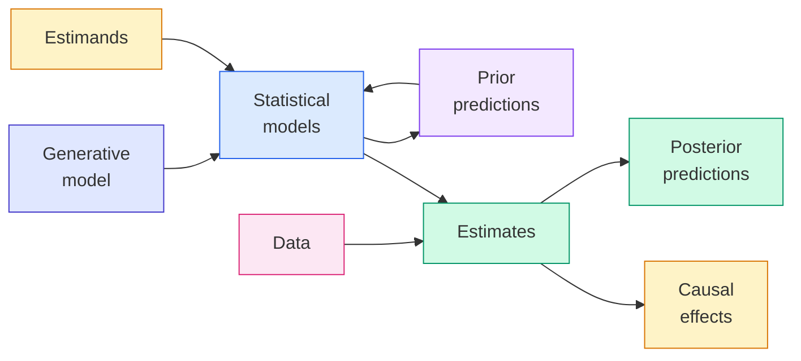
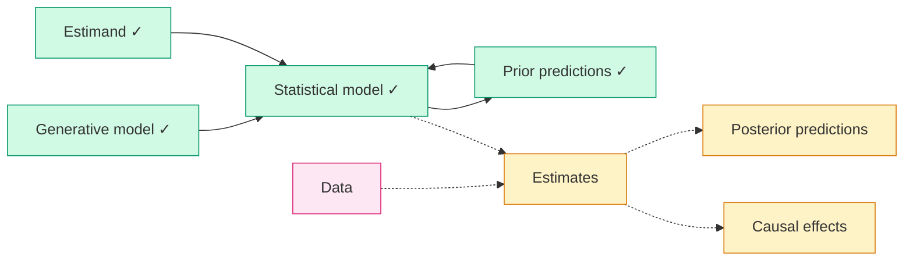
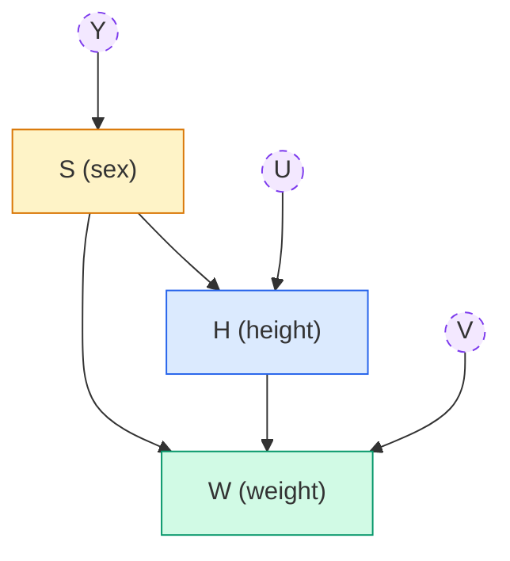

# Lecture A04: Categories and Causes

> **Prerequisite:** [[Lecture A03 - Geocentric Models_revised|Lecture A03: Geocentric Models]]. This lecture picks up from where A03 left off: we had a linear regression model with priors, a prior predictive distribution, and a quadratic approximation method ready. Now we fit the model to data, push out posterior predictions, and then extend the framework to handle categorical variables.

---

## The Bayesian Workflow (Burn This In)

> **"Burn this into your brains."** -- Richard McElreath



The workflow flows left to right with two feedback loops:

1. **Generative model** and **Estimands** both feed into **Statistical models** (they jointly determine model form)
2. **Statistical models** produce **Prior predictions**, which loop back to refine the model before data arrives
3. **Data** and **Statistical models** jointly produce **Estimates**
4. **Estimates** branch into two outputs: **Posterior predictions** (what the model expects to observe) and **Causal effects** (the estimand answered)

The prior prediction loop is the quality gate: it catches bad priors before data enters the picture. The two outputs from estimates serve different purposes: posterior predictions validate model fit against observed data, causal effects answer the scientific question posed by the estimand.

### Three questions this lecture addresses

1. How to derive statistical models from estimands?
2. How to engineer discrete (categorical) data in linear models?
3. How to compute causal effects that correspond to estimands?

---

## Where We Left Off

In [[Lecture A03 - Geocentric Models_revised|Lecture A03]], we built a simple additive generative model for adults where the height-weight relationship is plausibly linear:

$$W_i \sim \text{Normal}(\mu_i, \sigma)$$
$$\mu_i = \alpha + \beta H_i$$

We declared our interest in the influence of height on weight (the estimand), constructed a Bayesian linear regression (the statistical model), chose weakly informative priors, and generated a prior predictive distribution to verify the priors made scientific sense.

The workflow position at the end of A03:



Green nodes are complete. The remaining steps: feed data into the statistical model to get estimates, then push out posterior predictions and extract causal effects. Once this workflow is complete for the continuous height-weight case, we extend it by engineering categorical features into the linear model.

---

## Part 1: Completing the Height-Weight Workflow

### Quadratic approximation

We fit the model from [[Lecture A03 - Geocentric Models_revised|A03]] using the quadratic (Laplace) approximation. The statistical model:

$$W_i \sim \text{Normal}(\mu_i, \sigma)$$
$$\mu_i = \alpha + \beta H_i$$
$$\alpha \sim \text{Normal}(0, 10)$$
$$\beta \sim \text{Uniform}(0, 1)$$
$$\sigma \sim \text{Uniform}(0, 10)$$

```python
import numpy as np
from scipy import optimize, stats

def quap_height_weight(
    heights: np.ndarray,
    weights: np.ndarray,
) -> dict:
    """Fit the height-weight model via quadratic approximation.

    Finds the posterior mode (MAP) and estimates the covariance matrix
    from the numerical Hessian, producing a multivariate Gaussian
    approximation to the posterior.

    Args:
        heights: Observed heights (cm).
        weights: Observed weights (kg).

    Returns:
        Dictionary with 'mean' (posterior mode) and 'std' (marginal SDs)
        for each parameter.
    """
    def neg_log_posterior(params: np.ndarray) -> float:
        alpha, beta, log_sigma = params
        sigma = np.exp(log_sigma)
        mu = alpha + beta * heights
        ll = np.sum(stats.norm.logpdf(weights, loc=mu, scale=sigma))
        lp = (
            stats.norm.logpdf(alpha, 0, 10)
            + stats.uniform.logpdf(beta, 0, 1)
            + stats.uniform.logpdf(sigma, 0, 10)
            + log_sigma  # Jacobian for log transform
        )
        return -(ll + lp)

    x0 = np.array([0.0, 0.5, np.log(5.0)])
    result = optimize.minimize(neg_log_posterior, x0, method="Nelder-Mead")

    # Numerical Hessian for covariance
    from scipy.optimize import approx_fprime
    eps = 1e-5
    hess = np.zeros((3, 3))
    for i in range(3):
        def grad_i(x):
            return approx_fprime(x, neg_log_posterior, eps)[i]
        hess[i] = approx_fprime(result.x, grad_i, eps)
    cov = np.linalg.inv(hess)
    se = np.sqrt(np.diag(cov))

    mode = result.x.copy()
    mode[2] = np.exp(mode[2])

    return {
        "alpha": {"mean": mode[0], "sd": se[0]},
        "beta": {"mean": mode[1], "sd": se[1]},
        "sigma": {"mean": mode[2], "sd": se[2]},
        "vcov": cov,
    }


# Simulated Howell1-like data
rng = np.random.default_rng(42)
n = 200
heights = rng.uniform(130, 170, size=n)
weights = -10 + 0.5 * heights + rng.normal(0, 5, size=n)

fit = quap_height_weight(heights, weights)
for param in ["alpha", "beta", "sigma"]:
    v = fit[param]
    print(f"{param:>5s}: {v['mean']:7.3f} +/- {v['sd']:.3f}")
```

### Understanding the posterior output

What the quadratic approximation returns is the posterior distribution over three variables: $\alpha$, $\beta$, and $\sigma$. For every possible combination of these three parameters (and there are infinitely many), we want a relative ranking of plausibility. The quadratic approximation handles this infinity by assuming the posterior is a multivariate Gaussian. This assumption works well for linear regression because the log-posterior is approximately quadratic (parabolic) near its peak.

The posterior is the same kind of object as the prior: a distribution over parameter combinations. The difference is that the posterior has been updated on data. The prior says "before seeing any heights and weights, here is how plausible each $(\alpha, \beta, \sigma)$ combination is." The posterior says "after seeing 200 height-weight pairs, here is the updated ranking."

The summary table (analogous to McElreath's `precis()`) shows marginal means and standard deviations for each parameter. But this table is a lossy summary. It shows each parameter independently, hiding the correlations between them.

### Interpreting parameters: push out predictions, not tables

The marginal posterior summaries ($\alpha = ..., \beta = ..., \sigma = ...$) are useful for checking that the model converged to sensible values, but they should not be interpreted independently. The parameters are correlated: a higher intercept $\alpha$ can be partially compensated by a lower slope $\beta$. The covariance matrix captures this, but reading a covariance matrix is not intuitive.

The correct approach: **push out posterior predictions and interpret those.** Instead of saying "$\beta = 0.50$, so each cm of height adds 0.50 kg," generate the full posterior predictive distribution and describe what the model expects for specific heights.

```python
import numpy as np
import matplotlib.pyplot as plt
from scipy import stats

def plot_posterior_predictions(
    heights: np.ndarray,
    weights: np.ndarray,
    n_samples: int = 1_000,
    seed: int = 42,
) -> None:
    """Plot posterior predictions with epistemic and aleatoric uncertainty.

    Two panels:
    - Left: 89% interval for the mean (where is the regression line?)
    - Right: 89% prediction interval (where will new observations fall?)

    Args:
        heights: Observed heights (cm).
        weights: Observed weights (kg).
        n_samples: Number of posterior samples.
        seed: Random seed.
    """
    rng = np.random.default_rng(seed)

    # OLS fit for posterior sampling
    coeffs = np.polyfit(heights, weights, 1)
    beta_hat, alpha_hat = coeffs
    residuals = weights - (alpha_hat + beta_hat * heights)
    sigma_hat = np.std(residuals, ddof=2)
    n = len(heights)
    h_mean = heights.mean()
    ss_h = np.sum((heights - h_mean) ** 2)

    h_seq = np.linspace(130, 170, 50)
    mu_samples = np.zeros((n_samples, len(h_seq)))
    w_samples = np.zeros((n_samples, len(h_seq)))

    for i in range(n_samples):
        s2 = sigma_hat**2 * (n - 2) / rng.chisquare(n - 2)
        s = np.sqrt(s2)
        b = rng.normal(beta_hat, s / np.sqrt(ss_h))
        a = rng.normal(alpha_hat, s * np.sqrt(1/n + h_mean**2 / ss_h))
        mu = a + b * h_seq
        mu_samples[i] = mu
        w_samples[i] = rng.normal(mu, s)

    fig, axes = plt.subplots(1, 2, figsize=(14, 5), facecolor="white")

    # Left: epistemic uncertainty (mean)
    ax = axes[0]
    ax.scatter(heights, weights, alpha=0.2, s=10, color="gray")
    mu_mean = mu_samples.mean(axis=0)
    mu_lo = np.percentile(mu_samples, 5.5, axis=0)
    mu_hi = np.percentile(mu_samples, 94.5, axis=0)
    ax.plot(h_seq, mu_mean, color="#2563eb", linewidth=2)
    ax.fill_between(h_seq, mu_lo, mu_hi, alpha=0.3, color="#2563eb")
    ax.set_xlabel("Height (cm)")
    ax.set_ylabel("Weight (kg)")
    ax.set_title("89% interval for the mean (epistemic uncertainty)")

    # Right: full prediction interval (epistemic + aleatoric)
    ax = axes[1]
    ax.scatter(heights, weights, alpha=0.2, s=10, color="gray")
    w_lo = np.percentile(w_samples, 5.5, axis=0)
    w_hi = np.percentile(w_samples, 94.5, axis=0)
    ax.plot(h_seq, mu_mean, color="#2563eb", linewidth=2)
    ax.fill_between(h_seq, w_lo, w_hi, alpha=0.15, color="#2563eb")
    ax.fill_between(h_seq, mu_lo, mu_hi, alpha=0.3, color="#2563eb")
    ax.set_xlabel("Height (cm)")
    ax.set_ylabel("Weight (kg)")
    ax.set_title("89% prediction interval (epistemic + aleatoric)")

    plt.suptitle("Posterior predictions: height-weight model", fontsize=13)
    plt.tight_layout()
    plt.savefig("posterior_predictions_hw.png", dpi=150, facecolor="white")
    plt.show()

plot_posterior_predictions(heights, weights)
```

Two types of uncertainty:

- **Epistemic uncertainty** (narrow band): uncertainty about the regression line. Where is the true expected weight at a given height? This shrinks as you add more data.
- **Aleatoric uncertainty** (wide band): irreducible variation around the line. Individual weights scatter even at the same height because of unobserved factors (body composition, diet, genetics). This does not shrink with more data.

> **Revisit note:** In PyMC, `pm.sample_posterior_predictive()` produces both. The `posterior` group gives you $\mu$ samples (epistemic). The `posterior_predictive` group gives you simulated observations (epistemic + aleatoric). You use the same machinery here, just manually.

> **Applied example (real estate / Causaris):** The narrow band is the uncertainty about the average price per m$^2$ in a municipality. The wide band is the prediction interval for the next transaction. OTP Bank cares about the narrow band when setting collateral benchmarks. A buyer deciding whether a specific asking price is reasonable needs the wide band.

> **Applied example (forensic audio):** When modeling baseline anomaly rates across recordings, the narrow band represents uncertainty about the true anomaly rate. The wide band represents the range of anomaly counts you would observe in any single recording. A recording whose anomaly count falls outside the wide band is forensically suspicious. One that falls outside only the narrow band is unusual but not necessarily evidence of tampering.

---

## Part 2: Categorical Variables

### Generative model with sex

The height-weight model extends to include sex as a categorical variable. The DAG has a richer structure than the simple $H \rightarrow W$ from [[Lecture A03 - Geocentric Models_revised|A03]]:



The functional relationships:

$$H = f_H(S, U)$$
$$W = f_W(H, S, V)$$
$$S = f_S(Y)$$

### Unobserved causes: U, V, Y

Each observed variable has its own unobserved cause (shown in dashed circles, the DAG convention for latent variables). These represent the fact that the relationships are not purely deterministic:

- **$U$** (unobserved causes of height): genetics, nutrition during development, childhood illness. These produce variation in height that is not explained by sex alone.
- **$V$** (unobserved causes of weight): body composition, diet, activity level, metabolism. These produce variation in weight beyond what height and sex explain.
- **$Y$** (unobserved causes of sex): chromosomal determination and development. In the Howell1 data, sex is simply recorded as a binary variable.

In a generative simulation, the unobserved causes are implemented as random noise terms. When you use a normal distribution with a standard deviation, that standard deviation *is* the unobserved cause. This is exactly the $U$ term from the [[Lecture A03 - Geocentric Models_revised|A03]] generative model ($W = \beta H + U$, where $U \sim \text{Normal}(0, \sigma)$).

Are these the same as latent variables? Yes, they are latent. But with a nuance: "latent" sometimes implies "unmeasurable in principle" (like extraversion in psychology). Some of these unobserved causes *could* be measured (diet, body composition) but simply were not in this dataset. The distinction matters when deciding whether to extend the model: if $V$ could be measured and is important, you should measure it and add it to the model.

### Simulation

```python
import numpy as np
import matplotlib.pyplot as plt

def sim_height_weight_sex(
    n: int = 200,
    seed: int = 42,
) -> dict:
    """Simulate height-weight data with sex as a categorical cause.

    Generative model:
        S ~ Bernoulli(0.5), coded as 1 (female) or 2 (male)
        H | S=1 ~ Normal(150, 5)
        H | S=2 ~ Normal(160, 5)
        W = alpha[S] + beta[S] * H + Normal(0, 5)

    True parameters:
        alpha = [-20, -25]
        beta  = [0.5, 0.6]

    Note: sex influences both height (directly) and weight (directly
    and indirectly through height). This is the DAG structure above.

    Args:
        n: Number of individuals.
        seed: Random seed.

    Returns:
        Dictionary with arrays for sex, height, weight.
    """
    rng = np.random.default_rng(seed)

    true_alpha = np.array([-20.0, -25.0])  # index 0 = female, 1 = male
    true_beta = np.array([0.5, 0.6])

    sex = rng.choice([1, 2], size=n)  # 1 = female, 2 = male
    sex_idx = sex - 1  # 0-indexed for array lookup

    # Height depends on sex + unobserved U
    h_mean = np.where(sex == 1, 150, 160)
    height = h_mean + rng.normal(0, 5, size=n)  # U ~ Normal(0, 5)

    # Weight depends on height, sex, and unobserved V
    mu_w = true_alpha[sex_idx] + true_beta[sex_idx] * height
    weight = mu_w + rng.normal(0, 5, size=n)  # V ~ Normal(0, 5)

    return {"sex": sex, "height": height, "weight": weight}


data = sim_height_weight_sex()

fig, ax = plt.subplots(figsize=(8, 5), facecolor="white")
for s, color, label in [(1, "#dc2626", "Female"), (2, "#2563eb", "Male")]:
    mask = data["sex"] == s
    ax.scatter(
        data["height"][mask], data["weight"][mask],
        alpha=0.4, s=15, color=color, label=label,
    )
ax.set_xlabel("Height (cm)")
ax.set_ylabel("Weight (kg)")
ax.set_title("Simulated height-weight data by sex")
ax.legend()
plt.tight_layout()
plt.savefig("height_weight_by_sex.png", dpi=150, facecolor="white")
plt.show()
```

---

## Part 3: Think Scientifically First

Different causal questions require different statistical models, even with the same DAG. The DAG above supports at least three distinct estimands:

### Question 1: Causal effect of H on W

$$P(W \mid \text{do}(H))$$

Read as: "the distribution of weight when we *intervene* on height." The $\text{do}()$ operator means we physically set height to a value, breaking any arrows pointing *into* $H$. The causal effect is the contrast:

$$\text{causal effect} = P(W \mid \text{do}(H = h)) - P(W \mid \text{do}(H = h'))$$

This asks: if we could magically make someone 10 cm taller (without changing anything else), how much heavier would they be? The $\text{do}()$ notation distinguishes this from merely observing that taller people weigh more (which could be confounded).

### Question 2: Total causal effect of S on W

$$P(W \mid \text{do}(S))$$

The *total* effect of sex on weight includes both the direct path ($S \rightarrow W$) and the indirect path through height ($S \rightarrow H \rightarrow W$). Males weigh more both because of direct sex-related differences (muscle mass, bone density) *and* because males are taller on average, and taller people are heavier.

### Question 3: Direct causal effect of S on W

$$P(W \mid \text{do}(S), H = h)$$

The *direct* effect of sex on weight, blocking the indirect path through height by fixing height at a constant value. This asks: among people of the same height, how much does sex affect weight? This is a **mediation analysis** question. We are decomposing the total effect into a direct effect and an indirect effect (mediated through height).

To estimate the direct effect, we condition on height in the statistical model. To estimate the total effect, we do not condition on height. The DAG tells you which variables to include in the model; the estimand tells you which causal effect you are after.

> **Applied example (real estate / Causaris):** The same three questions arise in property valuation:
> - **Total effect of location on price**: compare prices across municipalities without controlling for property characteristics. This includes direct location effects (desirability, amenities) and indirect effects (locations with better amenities tend to attract newer, larger properties).
> - **Direct effect of location on price**: compare prices across municipalities *holding property characteristics constant* (same floor area, same age, same condition). This isolates the location premium.
> - **Mediation**: how much of the location effect operates *through* property quality? If desirable locations attract better-maintained properties, part of the "location premium" is actually a "quality premium." Decomposing this matters for CRR3 index construction: the bank needs to know whether price differences reflect location value or building quality.

> **Applied example (forensic audio):** Causal questions in speaker verification:
> - **Total effect of speaker identity on acoustic features**: do the overall feature distributions differ between speakers? (Used for discrimination.)
> - **Direct effect of speaker identity on formants, controlling for recording device**: among recordings made on the same device, how much do formant frequencies differ between speakers? (Isolates speaker effect from device effect.)
> - **Mediation**: how much of the observed acoustic difference operates through the channel (device, compression, environment) rather than through the speaker's physiology? This decomposition is directly relevant to the score-to-LR framework described in [[2026-04-14_score-to-lr-conversion-forensic-calibration|score-to-LR conversion]]: the calibration step must account for the channel effect to avoid attributing device differences to speaker identity.

> **Applied example (policy analysis):** Policy evaluation as mediation:
> - **Total effect of a housing subsidy on household wealth**: compare treated and control municipalities without adjusting for intermediary outcomes.
> - **Direct effect on wealth, controlling for housing ownership**: among households with the same ownership status, does the subsidy still affect wealth? If so, the subsidy works through channels other than homeownership (e.g., savings behavior).
> - **Mediation**: does the subsidy increase wealth *because* it increases homeownership ($S \rightarrow \text{Ownership} \rightarrow \text{Wealth}$), or through other channels? The policy implication differs: if the effect is entirely mediated through ownership, alternative policies that increase ownership without subsidies would work equally well.

---

## Part 4: For-and-Against Heuristics

Common heuristics for applied regression:

1. **Stratify by everything pre-treatment** (include pre-treatment variables as controls)
2. **Do not stratify by anything post-treatment** (do not include variables that are caused by the treatment)

These heuristics work much of the time, but they are not universal:

- They **forbid possible analyses**: some valid estimands require conditioning on post-treatment variables (mediation analysis requires exactly this).
- They **risk endogenous bias**: conditioning on a collider (a variable caused by both the treatment and the outcome) creates spurious associations, even if the collider is pre-treatment.

The deeper question: *why* do experiments work? Randomization breaks the arrows pointing *into* the treatment variable, eliminating confounding. But randomization does not tell you which post-treatment variables to condition on. For that, you need the DAG.

We will return to mediation analysis in later lectures, decomposing causal effects as they pass through different pathways in the DAG.

---

## Part 5: Drawing Categorical Owls

Two approaches to encoding categorical variables in linear models:

### Approach 1: Indicator (dummy) variables

Create binary 0/1 columns, one per category (one-hot encoding):

| Individual | Female | Male |
|-----------|--------|------|
| Person 1  | 1      | 0    |
| Person 2  | 0      | 1    |
| Person 3  | 1      | 0    |

The model: $\mu_i = \alpha + \beta \cdot \text{Female}_i$. Here $\alpha$ is the male mean (the reference category) and $\alpha + \beta$ is the female mean. The slope $\beta$ is the difference between groups.

**Problems:**
- Asymmetric priors: the prior on $\alpha$ directly constrains the male mean, but the female mean is constrained by $\alpha + \beta$ jointly. Setting sensible priors is harder.
- Arbitrary reference: which category is the "baseline" is a coding choice, not a scientific one, yet it affects prior specification.
- Scales poorly: with $k$ categories, you have $k - 1$ contrasts relative to an arbitrary reference.

### Approach 2: Index variables (McElreath's recommendation)

Use an integer index $S[i] \in \{1, 2\}$ to look up category-specific parameters:

$$\mu_i = \alpha_{S[i]}$$

Each category gets its own parameter. No reference category. Symmetric priors.

```python
import numpy as np
from scipy import optimize, stats

def quap_categorical(
    heights: np.ndarray,
    weights: np.ndarray,
    sex: np.ndarray,
) -> dict:
    """Fit height-weight model with sex as an index variable.

    Model:
        W_i ~ Normal(mu_i, sigma)
        mu_i = alpha[S_i] + beta * H_i
        alpha[1] ~ Normal(0, 10)
        alpha[2] ~ Normal(0, 10)
        beta ~ Uniform(0, 1)
        sigma ~ Uniform(0, 10)

    Args:
        heights: Observed heights (cm).
        weights: Observed weights (kg).
        sex: Sex index (1 or 2) for each individual.

    Returns:
        Dictionary with posterior mode for each parameter.
    """
    sex_idx = sex - 1  # 0-indexed

    def neg_log_posterior(params: np.ndarray) -> float:
        a1, a2, beta, log_sigma = params
        sigma = np.exp(log_sigma)
        alpha = np.array([a1, a2])
        mu = alpha[sex_idx] + beta * heights
        ll = np.sum(stats.norm.logpdf(weights, loc=mu, scale=sigma))
        lp = (
            stats.norm.logpdf(a1, 0, 10)
            + stats.norm.logpdf(a2, 0, 10)
            + stats.uniform.logpdf(beta, 0, 1)
            + stats.uniform.logpdf(sigma, 0, 10)
            + log_sigma
        )
        return -(ll + lp)

    x0 = np.array([0.0, 0.0, 0.5, np.log(5.0)])
    result = optimize.minimize(neg_log_posterior, x0, method="Nelder-Mead")

    mode = result.x.copy()
    mode[3] = np.exp(mode[3])

    return {
        "alpha_1": mode[0],
        "alpha_2": mode[1],
        "beta": mode[2],
        "sigma": mode[3],
    }


# Fit on simulated data
data = sim_height_weight_sex()
fit = quap_categorical(data["height"], data["weight"], data["sex"])
for param, val in fit.items():
    print(f"{param:>8s}: {val:.3f}")
```

### Computing causal contrasts

The causal effect of sex on weight (at a given height) is the contrast between category parameters:

$$\delta = \alpha_1 - \alpha_2$$

This is a distribution, not a single number. Compute it from joint posterior samples:

```python
import numpy as np

def compute_contrast(
    alpha1_samples: np.ndarray,
    alpha2_samples: np.ndarray,
) -> dict:
    """Compute the posterior distribution of the contrast between categories.

    The contrast delta = alpha_1 - alpha_2 captures the direct causal
    effect of category membership, holding other variables constant.

    Args:
        alpha1_samples: Posterior samples for category 1 parameter.
        alpha2_samples: Posterior samples for category 2 parameter.

    Returns:
        Summary of the contrast distribution.
    """
    delta = alpha1_samples - alpha2_samples
    return {
        "mean": float(delta.mean()),
        "sd": float(delta.std()),
        "q5.5": float(np.percentile(delta, 5.5)),
        "q94.5": float(np.percentile(delta, 94.5)),
        "prob_negative": float((delta < 0).mean()),
    }
```

The contrast preserves all posterior uncertainty. Reporting just the mean difference without the interval is the "summarize too early" mistake from [[Lecture A02_revised|A02]].

> **Applied example (real estate / Causaris):** Index variables are natural for municipality types. Define categories: urban core (1), suburban (2), rural (3). Each gets its own intercept $\alpha_k$. The contrast $\delta_{\text{urban-rural}} = \alpha_1 - \alpha_3$ is the posterior distribution of the urban premium. For OTP Bank's CRR3 indices, this quantifies systematic price differences between municipality types after controlling for property characteristics.

> **Applied example (forensic audio):** Recording device type is a categorical variable: phone model A (1), phone model B (2), studio microphone (3). The contrast $\alpha_A - \alpha_B$ estimates how much the device shifts baseline acoustic features. This device effect must be separated from speaker identity effects before computing a likelihood ratio. The posterior on the contrast tells you how uncertain the device correction is.

---

## Key Takeaways

1. **The workflow is always the same.** Generative model, estimand, statistical model, prior predictions, estimates, posterior predictions, causal effects. This diagram should be automatic.

2. **Interpret predictions, not parameters.** Individual parameter estimates are correlated and cannot always be interpreted independently. Push out posterior predictions and interpret those. The predictions integrate over parameter uncertainty correctly.

3. **Different estimands require different statistical models from the same DAG.** Total effect of sex on weight (do not condition on height) vs. direct effect (condition on height) vs. effect of height on weight (condition on sex). The DAG is fixed; the estimand determines the model.

4. **Use index variables, not dummy variables.** Index coding gives each category its own parameter with symmetric, interpretable priors. Dummy coding creates asymmetric reference-category structures that complicate prior specification and scale poorly.

5. **Causal contrasts are distributions.** The causal effect of a categorical variable is the posterior distribution of the difference between category parameters. Compute from joint samples to preserve correlation structure. Summarize last.

6. **Unobserved causes are implemented as noise terms.** Every standard deviation in a generative model *is* an unobserved cause. The dashed circles in the DAG ($U$, $V$, $Y$) become `rng.normal(0, sigma)` in the simulation code.

7. **Heuristics are starting points, not rules.** "Stratify by pre-treatment, not post-treatment" works often but not always. The DAG tells you exactly which variables to condition on for each estimand. When the heuristic conflicts with the DAG, follow the DAG.
