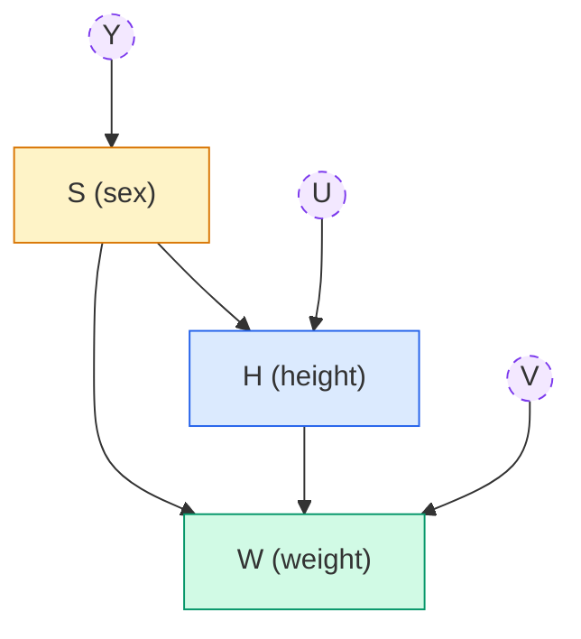
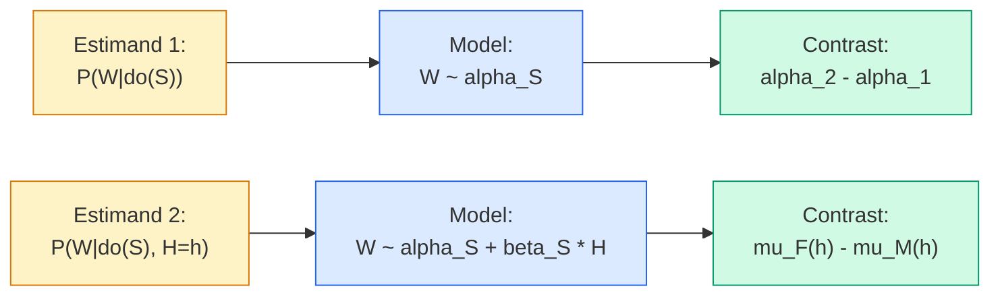

# Lecture A05: Estimands and Estimators

> **Prerequisite:** [[Lecture A04 - Categories and Causes_revised|Lecture A04: Categories and Causes]]. This lecture picks up where A04 ended: we had a DAG with sex, height, and weight, three distinct causal questions ($\text{do}()$ notation), and the index variable machinery. Now we walk through the full estimand-to-estimate pipeline twice: first for the total causal effect of sex on weight, then for the direct effect. The contrast distribution takes center stage.

---

## Estimands, Estimators, and Estimates

Three terms that sound alike but mean different things:

| Term | Definition | Analogy |
|------|-----------|---------|
| **Estimand** | The formal scientific question. What do we want to know? | A wooden model of a cake: the target shape. |
| **Estimator** | The recipe: how to construct the answer from data. The statistical model + its fitting procedure. | The recipe with ingredients and directions. |
| **Estimate** | The result of applying the estimator to data. A posterior distribution, a contrast, a prediction. | The cake that comes out of the oven. |

The workflow is iterative: bake the cake, compare it to the wooden model, adjust the recipe. The ingredients are the data. The generative model (DAG + process) tells you which ingredients are needed and which would spoil the cake. The estimand tells you what shape the cake should be.

We must be precise about the estimand before touching data. A vague question ("does sex affect weight?") is not an estimand. An estimand specifies the causal quantity formally: $P(W \mid \text{do}(S))$ or $P(W \mid \text{do}(S), H = h)$. Different estimands lead to different estimators, even from the same DAG.

> **Revisit note:** In the Bayesian framework, constructing the estimator is straightforward: build a generative model, combine it with the estimand using the DAG to determine which variables to condition on, and the statistical model follows. Other frameworks require more ingenuity. The Bayesian approach trades cleverness for structure: the same workflow applies every time.

---

## The DAG (Revisited)

The generative model is a DAG that encodes the scientific understanding of how the world works: the causal relationships between variables. This is not a statistical assumption. It is a claim about the world.



Two causal paths from $S$ to $W$:
- **Indirect path** ($S \rightarrow H \rightarrow W$): sex affects height (stature at adulthood), and height affects weight. This is the effect *through* differences in stature.
- **Direct path** ($S \rightarrow W$): sex affects weight through body composition (muscle mass, fat distribution, bone density) independent of height.

Statistical models do not have assumptions. *People* have assumptions. The DAG makes those assumptions explicit and testable. When someone says "I'm not making assumptions, I'm just running a regression," they are making assumptions: they are just not documenting them.

---

## Estimand 1: Total Causal Effect of Sex on Weight

### The question

$$P(W \mid \text{do}(S))$$

What is the total causal effect of sex on weight? This includes both paths: the indirect effect through height and the direct effect through body composition. The $\text{do}(S)$ operator means we intervene on sex, breaking any arrows pointing into $S$.

### Testing with a generative simulation

Before fitting the model to real data, test it on simulated data where you know the truth. Simulate a female sample and a male sample from the generative model, then compute the true causal effect:

```python
import numpy as np

def sim_hw(
    sex: np.ndarray,
    beta: np.ndarray,
    alpha: np.ndarray,
    seed: int = 42,
) -> dict:
    """Simulate height and weight from the generative model.

    Args:
        sex: Array of sex indices (1 = female, 2 = male).
        beta: Slopes for each sex, shape (2,).
        alpha: Intercepts for each sex, shape (2,).
        seed: Random seed.

    Returns:
        Dictionary with S, H, W arrays.
    """
    rng = np.random.default_rng(seed)
    n = len(sex)
    sex_idx = sex - 1

    # Height depends on sex
    h_mean = np.where(sex == 1, 150, 160)
    h = h_mean + rng.normal(0, 5, size=n)

    # Weight depends on sex and height
    w = alpha[sex_idx] + beta[sex_idx] * h + rng.normal(0, 5, size=n)

    return {"S": sex, "H": h, "W": w}


# True causal effect of sex: simulate interventions
rng = np.random.default_rng(42)
beta = np.array([0.5, 0.6])
alpha = np.array([0.0, 0.0])

# Intervene: set all individuals to female
sim_f = sim_hw(np.ones(100, dtype=int), beta, alpha, seed=1)

# Intervene: set all individuals to male
sim_m = sim_hw(np.full(100, 2, dtype=int), beta, alpha, seed=1)

# True total causal effect (male - female)
true_effect = np.mean(sim_m["W"]) - np.mean(sim_f["W"])
print(f"True total causal effect of sex on weight: {true_effect:.2f} kg")
```

### Statistical model (total effect)

To estimate the total effect, we do *not* condition on height. Including height in the model would block the indirect path ($S \rightarrow H \rightarrow W$), and we want both paths.

$$W_i \sim \text{Normal}(\mu_i, \sigma)$$
$$\mu_i = \alpha_{S[i]}$$
$$\alpha_j \sim \text{Normal}(60, 10)$$
$$\sigma \sim \text{Uniform}(0, 10)$$

Each sex gets its own mean $\alpha_{S[i]}$. No height term. The model estimates the average weight of women ($\alpha_1$) and men ($\alpha_2$) separately.

### Fitting on synthetic data

```python
import numpy as np
from scipy import optimize, stats

def quap_total_effect(
    weights: np.ndarray,
    sex: np.ndarray,
) -> dict:
    """Fit the total effect model: W ~ Normal(alpha[S], sigma).

    No height term. This captures the total causal effect of sex,
    including the indirect path through height.

    Args:
        weights: Observed weights (kg).
        sex: Sex index (1 or 2).

    Returns:
        Dictionary with posterior mode and samples.
    """
    sex_idx = sex - 1

    def neg_log_posterior(params: np.ndarray) -> float:
        a1, a2, log_sigma = params
        sigma = np.exp(log_sigma)
        alpha = np.array([a1, a2])
        mu = alpha[sex_idx]
        ll = np.sum(stats.norm.logpdf(weights, loc=mu, scale=sigma))
        lp = (
            stats.norm.logpdf(a1, 60, 10)
            + stats.norm.logpdf(a2, 60, 10)
            + stats.uniform.logpdf(sigma, 0, 10)
            + log_sigma
        )
        return -(ll + lp)

    x0 = np.array([60.0, 60.0, np.log(5.0)])
    result = optimize.minimize(neg_log_posterior, x0, method="Nelder-Mead")

    # Hessian for covariance
    from scipy.optimize import approx_fprime
    eps = 1e-5
    hess = np.zeros((3, 3))
    for i in range(3):
        def grad_i(x):
            return approx_fprime(x, neg_log_posterior, eps)[i]
        hess[i] = approx_fprime(result.x, grad_i, eps)
    cov = np.linalg.inv(hess)

    # Sample from approximate posterior
    rng = np.random.default_rng(42)
    samples = rng.multivariate_normal(result.x, cov, size=10_000)
    samples[:, 2] = np.exp(samples[:, 2])  # transform log_sigma

    mode = result.x.copy()
    mode[2] = np.exp(mode[2])

    return {
        "mode": {"alpha_1": mode[0], "alpha_2": mode[1], "sigma": mode[2]},
        "samples": {
            "alpha_1": samples[:, 0],
            "alpha_2": samples[:, 1],
            "sigma": samples[:, 2],
        },
    }


# Fit on synthetic data
rng = np.random.default_rng(42)
sex_syn = rng.choice([1, 2], size=100) + 0  # need int, not bool
dat_syn = sim_hw(sex_syn, beta=np.array([0.5, 0.6]), alpha=np.array([0.0, 0.0]))

fit = quap_total_effect(dat_syn["W"], dat_syn["S"])
for param, val in fit["mode"].items():
    print(f"{param:>8s}: {val:.2f}")
```

### Fitting on real data (Howell1)

The same model applies to the real Howell1 dataset (adults, age $\geq$ 18):

```python
# Pseudocode for loading Howell1
# In practice, load from CSV or McElreath's rethinking package data
# d = pd.read_csv("Howell1.csv")
# d = d[d["age"] >= 18]
# dat = {"W": d["weight"].values, "S": d["male"].values + 1}  # S=1 female, S=2 male
# fit_real = quap_total_effect(dat["W"], dat["S"])
```

The posterior gives three parameters: $\alpha_1$ (mean weight, women), $\alpha_2$ (mean weight, men), and $\sigma$ (residual spread). With ~200 adults, the posterior is narrow: the model is confident about the group means.

---

## Posterior Means vs. Posterior Predictions

### The two marginal posteriors

The posterior distributions of $\alpha_1$ and $\alpha_2$ show the uncertainty about the *average* weight of women and men respectively. These are narrow distributions because the model has seen enough data to pin down the means.

Imagine the joint posterior of $(\alpha_1, \alpha_2)$ as a hill in two-dimensional space. If you stand on the $\alpha_1$ axis and look at the hill, you see only the silhouette from one side: this is the marginal distribution of $\alpha_1$. Walk around to the $\alpha_2$ axis and look at the hill from there: you see the marginal distribution of $\alpha_2$. Each marginal distribution is a "shadow" of the full two-dimensional posterior projected onto one axis.

The marginal distributions may overlap. In the Howell1 data, $\alpha_1 \approx 42$ kg and $\alpha_2 \approx 49$ kg, with standard deviations around 0.9 kg. The distributions are clearly separated. But even if they overlapped substantially, that would not mean the sexes are "not significantly different." Overlap of marginals is not a valid way to assess differences.

### Why you must compute the contrast

Comparing two marginal distributions by eyeballing their overlap is a mistake that appears frequently in published research. The reason it fails: the marginals do not capture the *correlation* between $\alpha_1$ and $\alpha_2$. The correct approach is to compute the contrast distribution directly.

```python
import numpy as np
import matplotlib.pyplot as plt

def plot_posteriors_and_contrast(
    alpha1_samples: np.ndarray,
    alpha2_samples: np.ndarray,
    sigma_samples: np.ndarray,
    seed: int = 42,
) -> None:
    """Plot three distributions: marginal posteriors, mean contrast,
    and weight contrast.

    Three panels showing three different quantities:
    1. Marginal posteriors of alpha_1 and alpha_2 (uncertainty in means)
    2. Contrast in means: alpha_2 - alpha_1 (causal effect on average)
    3. Contrast in weights: simulated individual weights (predictive)

    Args:
        alpha1_samples: Posterior samples for female mean.
        alpha2_samples: Posterior samples for male mean.
        sigma_samples: Posterior samples for residual SD.
        seed: Random seed.
    """
    rng = np.random.default_rng(seed)

    fig, axes = plt.subplots(1, 3, figsize=(16, 4), facecolor="white")

    # Panel 1: Marginal posteriors
    ax = axes[0]
    ax.hist(alpha1_samples, bins=50, density=True, alpha=0.5,
            color="#dc2626", label=r"$\alpha_1$ (women)")
    ax.hist(alpha2_samples, bins=50, density=True, alpha=0.5,
            color="#2563eb", label=r"$\alpha_2$ (men)")
    ax.set_xlabel("Posterior mean weight (kg)")
    ax.set_ylabel("Density")
    ax.set_title("Marginal posteriors (means only)")
    ax.legend()

    # Panel 2: Contrast in means
    mu_contrast = alpha2_samples - alpha1_samples
    ax = axes[1]
    ax.hist(mu_contrast, bins=50, density=True, alpha=0.7, color="gray")
    ax.axvline(0, color="black", linestyle="--", linewidth=1)
    ax.set_xlabel("Posterior mean weight contrast (kg)")
    ax.set_ylabel("Density")
    ax.set_title("Causal contrast (in means)")

    # Panel 3: Weight contrast (predictive)
    w1 = rng.normal(alpha1_samples, sigma_samples)
    w2 = rng.normal(alpha2_samples, sigma_samples)
    w_contrast = w2 - w1
    ax = axes[2]
    ax.hist(w_contrast, bins=50, density=True, alpha=0.7, color="#7c3aed")
    ax.axvline(0, color="black", linestyle="--", linewidth=1)
    ax.set_xlabel("Posterior weight contrast (kg)")
    ax.set_ylabel("Density")
    ax.set_title("Weight contrast (predictive)")

    # Annotate proportion
    prop_positive = (w_contrast > 0).mean()
    ax.text(0.95, 0.95,
            f"P(man heavier) = {prop_positive:.0%}\nP(woman heavier) = {1-prop_positive:.0%}",
            transform=ax.transAxes, ha="right", va="top", fontsize=9,
            bbox=dict(boxstyle="round", facecolor="white", alpha=0.8))

    plt.tight_layout()
    plt.savefig("contrasts_three_types.png", dpi=150, facecolor="white")
    plt.show()
```

### Three different questions, three different distributions

The three panels show three distributions that answer three different questions:

| Panel | Distribution | Question |
|-------|-------------|----------|
| 1. Marginal posteriors | $P(\alpha_1), P(\alpha_2)$ | What is the average weight of women? Of men? |
| 2. Mean contrast | $P(\alpha_2 - \alpha_1)$ | How much heavier is the average man than the average woman? |
| 3. Weight contrast | $P(W_2 - W_1)$ | If I randomly pick a man and a woman, how much heavier is the man likely to be? |

The mean contrast (panel 2) is narrow because it concerns averages. The weight contrast (panel 3) is wide because it includes $\sigma$: the individual-level variation. In the Howell1 data, a randomly sampled man is heavier about 82% of the time, and a randomly sampled woman is heavier about 18% of the time. You cannot get this from eyeballing the overlap of the marginal posteriors. You must compute the contrast.

> **McElreath's sermon:** "What do you do? You compute the contrast. If your question is about a difference, then you compute that difference. And you think about exactly how it's defined."

> **Applied example (real estate / Causaris):** The same three distributions arise when comparing municipality types. The marginal posteriors of $\alpha_{\text{urban}}$ and $\alpha_{\text{rural}}$ show uncertainty about average prices in each category. The mean contrast shows the expected premium. The price contrast (including $\sigma$) shows the probability that a random urban transaction exceeds a random rural transaction. For OTP Bank, the mean contrast informs collateral benchmarks; the price contrast informs risk assessment.

> **Applied example (forensic audio):** When comparing two recording conditions (e.g., studio vs. phone), the mean contrast gives the expected shift in a spectral feature. The predictive contrast gives the probability that a randomly selected phone recording has a higher anomaly rate than a randomly selected studio recording. The predictive contrast is what matters for casework: it tells you whether the observed difference between two recordings is within the expected range or forensically suspicious.

---

## Estimand 2: Direct Causal Effect of Sex on Weight

### The question

$$P(W \mid \text{do}(S), H = h)$$

What is the direct effect of sex on weight, holding height constant? This blocks the indirect path ($S \rightarrow H \rightarrow W$) by conditioning on height. What remains is the effect of body composition: at the same height, how much does sex affect weight?

To estimate this, we must stratify by height: for each height value, compare the expected weight of women and men.

### Centering the predictor

When height appears in the model, the intercept $\alpha$ represents the expected weight when height equals zero. For adults, height is never zero. The intercept is off the graph, making its prior hard to specify.

**Centering** solves this. Replace $H_i$ with $(H_i - \bar{H})$, where $\bar{H}$ is the sample mean height:

$$\mu_i = \alpha_{S[i]} + \beta_{S[i]} (H_i - \bar{H})$$

Now, for a person of average height, $(H_i - \bar{H}) = 0$, the $\beta$ term vanishes, and the predicted weight is just $\alpha_{S[i]}$. The intercept becomes the expected weight of a person with average height. This is a much easier quantity to set a prior on: you know roughly what an average-height person weighs.

Centering does not change the model's predictions. It changes the *meaning* of the intercept, making priors easier to specify and convergence more stable.

> **Revisit note:** Centering is standard practice in PyMC models. You will see `H_centered = H - H.mean()` in virtually every regression. The reason is exactly this: it makes the intercept interpretable and the prior specification straightforward. For hierarchical models with many group intercepts, centering is almost mandatory for MCMC convergence.

### Statistical model (direct effect)

Stratify both intercept and slope by sex:

$$W_i \sim \text{Normal}(\mu_i, \sigma)$$
$$\mu_i = \alpha_{S[i]} + \beta_{S[i]} (H_i - \bar{H})$$
$$\alpha_j \sim \text{Normal}(60, 10)$$
$$\beta_j \sim \text{Uniform}(0, 1)$$
$$\sigma \sim \text{Uniform}(0, 10)$$

Each sex gets its own intercept *and* its own slope. This allows the height-weight relationship to differ between sexes (different slopes mean different body proportions).

```python
import numpy as np
from scipy import optimize, stats

def quap_direct_effect(
    weights: np.ndarray,
    heights: np.ndarray,
    sex: np.ndarray,
) -> dict:
    """Fit the direct effect model with centered height, stratified by sex.

    Model:
        W_i ~ Normal(mu_i, sigma)
        mu_i = alpha[S_i] + beta[S_i] * (H_i - H_bar)
        alpha[j] ~ Normal(60, 10)
        beta[j] ~ Uniform(0, 1)
        sigma ~ Uniform(0, 10)

    Args:
        weights: Observed weights (kg).
        heights: Observed heights (cm).
        sex: Sex index (1 or 2).

    Returns:
        Dictionary with posterior mode and samples.
    """
    sex_idx = sex - 1
    h_bar = heights.mean()
    h_centered = heights - h_bar

    def neg_log_posterior(params: np.ndarray) -> float:
        a1, a2, b1, b2, log_sigma = params
        sigma = np.exp(log_sigma)
        alpha = np.array([a1, a2])
        beta = np.array([b1, b2])
        mu = alpha[sex_idx] + beta[sex_idx] * h_centered
        ll = np.sum(stats.norm.logpdf(weights, loc=mu, scale=sigma))
        lp = (
            stats.norm.logpdf(a1, 60, 10) + stats.norm.logpdf(a2, 60, 10)
            + stats.uniform.logpdf(b1, 0, 1) + stats.uniform.logpdf(b2, 0, 1)
            + stats.uniform.logpdf(sigma, 0, 10)
            + log_sigma
        )
        return -(ll + lp)

    x0 = np.array([60.0, 60.0, 0.5, 0.5, np.log(5.0)])
    result = optimize.minimize(neg_log_posterior, x0, method="Nelder-Mead")

    # Hessian for covariance
    from scipy.optimize import approx_fprime
    eps = 1e-5
    hess = np.zeros((5, 5))
    for i in range(5):
        def grad_i(x):
            return approx_fprime(x, neg_log_posterior, eps)[i]
        hess[i] = approx_fprime(result.x, grad_i, eps)
    cov = np.linalg.inv(hess)

    # Posterior samples
    rng = np.random.default_rng(42)
    samples = rng.multivariate_normal(result.x, cov, size=10_000)
    samples[:, 4] = np.exp(samples[:, 4])

    mode = result.x.copy()
    mode[4] = np.exp(mode[4])

    return {
        "mode": {
            "alpha_1": mode[0], "alpha_2": mode[1],
            "beta_1": mode[2], "beta_2": mode[3],
            "sigma": mode[4],
        },
        "samples": samples,
        "h_bar": h_bar,
    }
```

### The contrast as a function of height (the "bowtie" plot)

The direct effect of sex is not a single number. It varies with height. At each height, compute the posterior predictive for women and men, then subtract:

$$\delta(h) = \mu_F(h) - \mu_M(h) = [\alpha_1 + \beta_1(h - \bar{H})] - [\alpha_2 + \beta_2(h - \bar{H})]$$

```python
import numpy as np
import matplotlib.pyplot as plt

def plot_direct_effect_contrast(
    samples: np.ndarray,
    h_bar: float,
    h_range: tuple[float, float] = (130, 190),
    n_points: int = 50,
) -> None:
    """Plot the direct causal effect of sex on weight as a function of height.

    Produces the 'bowtie' plot: the contrast between female and male
    expected weight at each height, with nested credible intervals.

    The bowtie shape arises because uncertainty is smallest near the
    mean height (where centering anchors the intercept) and grows
    toward the extremes.

    Args:
        samples: Posterior samples, columns: [a1, a2, b1, b2, log_sigma].
        h_bar: Mean height used for centering.
        h_range: Range of heights to plot.
        n_points: Number of height values.
    """
    h_seq = np.linspace(h_range[0], h_range[1], n_points)
    h_centered = h_seq - h_bar

    # Posterior predictive for each sex
    # samples columns: a1, a2, b1, b2, sigma
    mu_f = samples[:, 0:1] + samples[:, 2:3] * h_centered[np.newaxis, :]
    mu_m = samples[:, 1:2] + samples[:, 3:4] * h_centered[np.newaxis, :]

    # Contrast: female - male
    mu_contrast = mu_f - mu_m

    fig, ax = plt.subplots(figsize=(10, 5), facecolor="white")

    # Nested credible intervals
    for prob, alpha_val in [(0.99, 0.1), (0.9, 0.15), (0.8, 0.2),
                             (0.7, 0.25), (0.6, 0.3), (0.5, 0.4)]:
        lo = np.percentile(mu_contrast, (1 - prob) / 2 * 100, axis=0)
        hi = np.percentile(mu_contrast, (1 + prob) / 2 * 100, axis=0)
        ax.fill_between(h_seq, lo, hi, alpha=alpha_val, color="#2563eb")

    ax.axhline(0, linestyle="--", color="black", linewidth=1)
    ax.set_xlabel("Height (cm)")
    ax.set_ylabel("Weight contrast, F - M (kg)")
    ax.set_title("Direct causal effect of sex on weight (controlling for height)")

    # Annotations
    ax.text(h_range[0] + 2, -3, "Men heavier", fontsize=9, color="gray")
    ax.text(h_range[0] + 2, 3, "Women heavier", fontsize=9, color="gray")

    plt.tight_layout()
    plt.savefig("direct_effect_bowtie.png", dpi=150, facecolor="white")
    plt.show()
```

### Interpreting the bowtie

The bowtie plot shows the contrast (female minus male expected weight) at each height, with nested credible intervals. Key features:

- **The intervals are narrowest near the mean height** ($\bar{H}$), where centering anchors the intercept. This is where the model has the most data and the least extrapolation.
- **The intervals widen toward the extremes** (very short and very tall individuals), where the model extrapolates and uncertainty grows.
- **The dashed zero line** separates regions where men are heavier (below) from regions where women are heavier (above).
- **A slight tilt** indicates that the direct effect of sex changes with height: the body composition difference between sexes may vary with stature.

In the Howell1 data, the bowtie is slightly tilted but centered well below zero across the full height range. This means: at every height, men are heavier than women on average. The tilt is slight, suggesting that the vast majority of the sex difference in weight is due to the indirect path through height (stature differences), with a smaller direct effect from body composition.

> **Applied example (real estate / Causaris):** The bowtie plot translates directly to property valuation. Replace sex with municipality type (urban/rural), height with floor area, and weight with price. The contrast at each floor area shows the urban premium, controlling for size. If the bowtie is flat, the premium is constant across property sizes. If it tilts, large properties command a different premium than small ones. This matters for CRR3 index segmentation: if the premium varies with size, the index needs size-specific adjustments.

> **Applied example (forensic audio):** Replace sex with recording condition (known-authentic vs. questioned), height with recording duration, and weight with anomaly count. The contrast at each duration shows whether the questioned recording has more anomalies than expected for authentic recordings of the same length. A flat bowtie near zero suggests the questioned recording is consistent with the authentic baseline. A bowtie shifted below zero (more anomalies in the questioned recording) is evidence of tampering, with the width of the interval quantifying how certain the conclusion is.

> **Applied example (policy analysis):** Replace sex with treatment group (subsidy vs. control), height with pre-treatment household income, and weight with post-treatment wealth. The contrast at each income level shows who benefits most from the subsidy. If the bowtie tilts, the subsidy has heterogeneous effects: it might benefit low-income households more (the contrast is larger for lower incomes) or less. This informs targeting: should the subsidy be universal or means-tested?

---

## The Full Pipeline: From Estimand to Estimate

Stepping back, the two estimands followed the same pipeline with different model specifications:



- **Estimand 1** (total effect): do not condition on height. Model has only $\alpha_{S[i]}$. Contrast is a single distribution.
- **Estimand 2** (direct effect): condition on height. Model has $\alpha_{S[i]} + \beta_{S[i]}(H_i - \bar{H})$. Contrast is a function of height.

The DAG is the same. The estimand determines which variables enter the model. This is the core lesson: the statistical model is derived from the estimand, not chosen by convention.

---

## Key Takeaways

1. **Estimand, estimator, estimate.** Three distinct concepts. The estimand is the question. The estimator is the recipe. The estimate is the result. Confusing them leads to answering the wrong question precisely.

2. **Always compute the contrast.** Never compare distributions by eyeballing overlap. If your question is about a difference, compute that difference directly from joint posterior samples. This is not optional; it is the only correct way to answer questions about differences.

3. **The mean contrast and the weight contrast answer different questions.** The mean contrast ($\alpha_2 - \alpha_1$) tells you about average differences. The weight contrast (including $\sigma$) tells you about individual-level differences. In the Howell1 data, a random man is heavier 82% of the time. You cannot get this from the mean contrast alone.

4. **Centering makes priors interpretable.** Subtracting the mean of a predictor changes the intercept from "expected outcome at zero" (often nonsensical) to "expected outcome at the average predictor value" (interpretable). It does not change the model's predictions, only the parameterization.

5. **The same DAG supports multiple estimands.** The total effect of sex on weight uses a different model than the direct effect, but both are derived from the same DAG. The estimand tells you which variables to condition on. This is the fundamental insight of causal inference.

6. **The bowtie plot reveals heterogeneity.** The direct effect of sex on weight is not a single number; it varies with height. Plotting the contrast as a function of a continuous variable (with nested credible intervals) shows where the effect is strong, where it is weak, and where the model is uncertain.

7. **Statistical models do not have assumptions. People have assumptions.** The DAG makes those assumptions explicit. When you draw the DAG, you are stating what you believe about the world. When you derive the statistical model from the DAG, you are translating those beliefs into a formal estimator. The transparency is the point.
