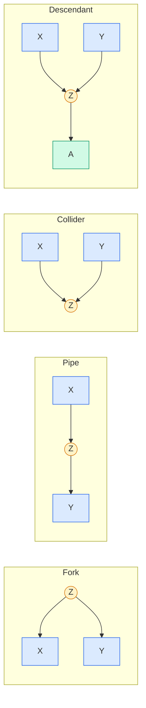
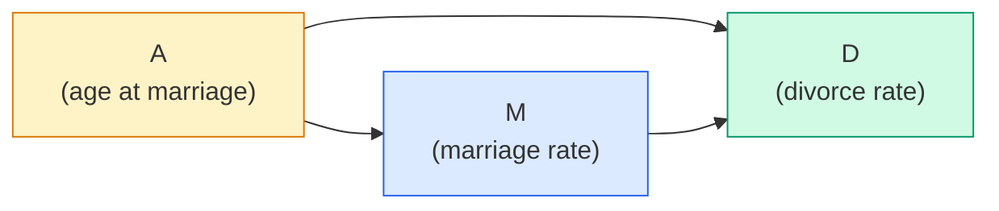
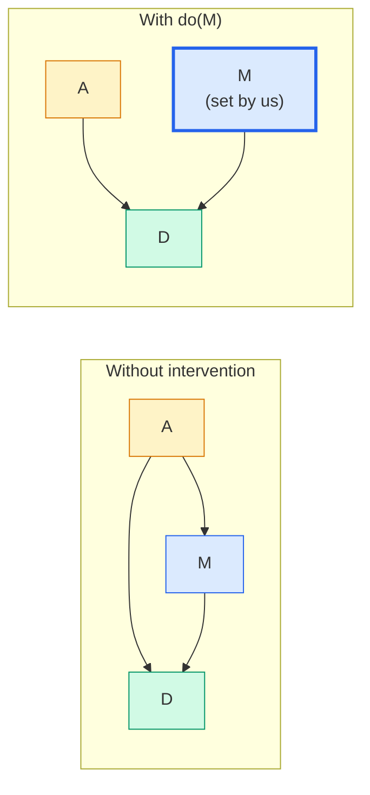

# Lecture A06: Elemental Confounds I

> **Prerequisite:** [[Lecture A05 - Estimands & Estiplans_revised|Lecture A05: Estimands and Estimators]]. The statistical mechanics (posteriors, sampling, quadratic approximation) are now in place. From this lecture onwards, the focus shifts to scientific models: the DAGs that encode causal relationships. This material is layered. McElreath compares it to Ulysses: multiple passes yield deeper understanding. The first pass establishes the rules; later passes reveal their consequences.

---

## Association Is Not Causation (But You Knew That)

Before introducing the formal machinery, two examples of why correlations mislead:

**Metal bands and happiness.** Nordic countries have many metal bands per capita. They also score high on happiness indices. The correlation is strong. Does metal music cause happiness? No. Both variables share common causes (GDP, social trust, long winters that drive people indoors to make music and fill out surveys).

**Waffle Houses and divorce.** US states with more Waffle House restaurants per capita have higher divorce rates. The correlation is real. The cause is geography: Waffle Houses are concentrated in the American South, where marriage and divorce rates are both higher for demographic and cultural reasons.

These are not edge cases. Strong correlations between causally unrelated variables are the norm in observational data. The website tylervigen.com catalogs hundreds of spurious correlations (e.g., per-capita cheese consumption and deaths by bedsheet entanglement). The point is not that correlation is useless. The point is that correlation alone is not evidence of causation, and statistical recipes must defend against the mechanisms that produce spurious associations.

---

## Confounds: The Central Problem

**Confounds** are features of the sample and how we use it that mislead us about causal relationships. The critical insight: confounding is not just about *omitted* variables. It is also about *included* variables. Adding a variable to a regression can create confounding where none existed.

This violates a common intuition: "more variables = more control = better model." In causal inference, that intuition is wrong. Some variables should be included. Some should be excluded. The rules for deciding which are the subject of this lecture.

---

## Heuristics and Their Limits

Most researchers build statistical models using heuristics rather than formal causal reasoning.

### Bad heuristics

- **Compare $R^2$**: add variables if they increase $R^2$. This selects for predictive power, not causal identification. A confounding variable can increase $R^2$ while biasing the causal estimate.
- **Drop "non-significant" variables**: remove predictors with large p-values. This conflates statistical significance with causal relevance. A confounder with a small coefficient may still be essential for identification.
- **Causal-free decision trees**: variable selection algorithms (stepwise regression, LASSO) that ignore causal structure. These can select colliders, exclude confounders, and produce precisely wrong estimates.
- **Conformity**: "everyone in my field includes these variables." This propagates mistakes across an entire literature.

### A published example of unjustified covariates

> "We selected covariates a priori based on clinical knowledge and previous studies of BMI and mortality. These included demographics (age, gender, race/ethnicity), socio-behavioral factors (education, marital status, physical activity, smoking status, alcohol consumption, insurance coverage, region of residence, citizenship status), comorbidities (...), and healthcare utilization factors (...)"

This passage lists 15+ covariates with no justification for *why* each is included. "Clinical knowledge" and "previous studies" are appeals to authority, not causal reasoning. Missing is a transparent description of the causal relationships between these variables. Which are confounders (common causes)? Which are mediators (on the causal path)? Which are colliders (caused by both treatment and outcome)? Without a DAG, the reader has no way to evaluate whether the covariate set identifies the causal effect or introduces bias.

### OK heuristics

- **Include pre-treatment variables**: variables determined before the treatment was assigned. These cannot be caused by the treatment.
- **Exclude post-treatment variables**: variables that might be caused by the treatment. Conditioning on these can block causal paths or open collider paths.
- **Compare to alternative treatment, not baseline**: the causal effect is the contrast between treated and control, not the change from baseline.

These heuristics work in many cases but are not universal. They can forbid valid analyses (mediation requires conditioning on a post-treatment variable) and do not protect against all forms of bias (pre-treatment colliders exist). The formal rules, introduced next, explain *why* these heuristics work and *when* they fail.

---

## Causal Reasoning: The Formal Tools

To move beyond heuristics, we need formal tools for causal reasoning:

| Tool | What it does |
|------|-------------|
| **DAGs** (Directed Acyclic Graphs) | Encode causal structure. No distributional assumptions. Allow deriving what can be identified *before* choosing a statistical model. |
| **do-calculus** | Rules for computing causal effects from observational data, given a DAG. |
| **SEMs** (Structural Equation Models) | DAGs with functional relationships specified. |
| **DiD, IV** (Difference-in-Differences, Instrumental Variables) | Specific estimation strategies for specific DAG structures. |
| **ODEs** (Ordinary Differential Equations) | Dynamic causal models where time matters. |

This lecture focuses on DAGs and **d-separation** (directional separation): rules for determining which variables are independent given which other variables are conditioned on. D-separation tells you which statistical independencies a DAG implies, and therefore which conditioning strategies identify the causal effect.

---

## The Four Elemental Confounds

Every complex DAG is built from combinations of four elemental structures. Understanding these four is sufficient to reason about any DAG.



| Structure | DAG | Association? | After conditioning on Z? |
|-----------|-----|-------------|--------------------------|
| **Fork** | $X \leftarrow Z \rightarrow Y$ | Yes ($X$ and $Y$ share cause $Z$) | No (stratifying by $Z$ removes the association) |
| **Pipe** | $X \rightarrow Z \rightarrow Y$ | Yes ($X$ affects $Y$ through $Z$) | No (conditioning on $Z$ blocks the path) |
| **Collider** | $X \rightarrow Z \leftarrow Y$ | No ($X$ and $Y$ are independent) | Yes (conditioning on $Z$ *creates* association) |
| **Descendant** | $X \rightarrow Z \leftarrow Y$, $Z \rightarrow A$ | No | Conditioning on $A$ partially opens the collider |

The first two (fork, pipe) are intuitive: conditioning removes association. The collider is the dangerous one: conditioning *creates* association where none existed. The descendant is a weakened version of the collider.

---

## The Fork: $X \leftarrow Z \rightarrow Y$

### Structure

$Z$ is a common cause of both $X$ and $Y$. Information from $Z$ flows into both, creating an association between $X$ and $Y$ even though neither causes the other.

**Stratification removes the association.** When we condition on $Z$ (divide the population into subpopulations defined by $Z$), within each subpopulation $Z$ is constant, so it can no longer produce association between $X$ and $Y$. Any remaining association within strata must come from other paths. If the fork is the only path, the association vanishes.

### Simulation

```python
import numpy as np
import matplotlib.pyplot as plt

def simulate_fork(
    n: int = 1000,
    seed: int = 42,
) -> dict:
    """Simulate data from a fork: X <- Z -> Y.

    Z is a binary common cause. X and Y are correlated marginally
    but independent conditional on Z.

    Args:
        n: Sample size.
        seed: Random seed.

    Returns:
        Dictionary with X, Y, Z arrays.
    """
    rng = np.random.default_rng(seed)
    z = rng.binomial(1, 0.5, size=n)
    x = rng.binomial(1, (1 - z) * 0.1 + z * 0.9)
    y = rng.binomial(1, (1 - z) * 0.1 + z * 0.9)
    return {"X": x, "Y": y, "Z": z}


data = simulate_fork()

# Marginal correlation (confounded)
print(f"Overall correlation: {np.corrcoef(data['X'], data['Y'])[0,1]:.3f}")

# Stratified correlations (deconfounded)
for z_val in [0, 1]:
    mask = data["Z"] == z_val
    r = np.corrcoef(data["X"][mask], data["Y"][mask])[0, 1]
    print(f"Correlation given Z={z_val}: {r:.3f}")
```

The overall correlation is strong (around 0.6). The stratified correlations are near zero. The fork creates the illusion of association between $X$ and $Y$ through their shared cause $Z$.

### Continuous fork visualization

```python
import numpy as np
import matplotlib.pyplot as plt

def plot_fork_continuous(
    n: int = 300,
    seed: int = 42,
) -> None:
    """Visualize Simpson's paradox with a continuous fork.

    The marginal regression of Y on X shows a positive slope.
    The within-group regressions (stratified by Z) show near-zero slopes.

    Args:
        n: Sample size.
        seed: Random seed.
    """
    rng = np.random.default_rng(seed)
    z = rng.binomial(1, 0.5, size=n)
    x = rng.normal(2 * z - 1, 1)
    y = rng.normal(2 * z - 1, 1)

    fig, ax = plt.subplots(figsize=(8, 6), facecolor="white")
    colors = {0: "#2563eb", 1: "#dc2626"}

    for z_val in [0, 1]:
        mask = z == z_val
        ax.scatter(x[mask], y[mask], color=colors[z_val], alpha=0.4,
                   s=15, label=f"Z={z_val}")
        # Within-group regression
        coeffs = np.polyfit(x[mask], y[mask], 1)
        x_line = np.linspace(x[mask].min(), x[mask].max(), 50)
        ax.plot(x_line, np.polyval(coeffs, x_line), color=colors[z_val],
                linewidth=2)

    # Marginal regression (ignoring Z)
    coeffs_all = np.polyfit(x, y, 1)
    x_line = np.linspace(x.min(), x.max(), 50)
    ax.plot(x_line, np.polyval(coeffs_all, x_line), color="black",
            linewidth=2, label="Marginal (ignoring Z)")

    ax.set_xlabel("X")
    ax.set_ylabel("Y")
    ax.set_title("Fork: marginal association vanishes after stratification")
    ax.legend()
    plt.tight_layout()
    plt.savefig("fork_continuous.png", dpi=150, facecolor="white")
    plt.show()

plot_fork_continuous()
```

The black line (marginal regression) shows a positive relationship. The blue and red lines (within-group regressions) are flat. This is Simpson's paradox: the aggregate trend reverses (or vanishes) when you account for the common cause.

> **Applied example (real estate / Causaris):** The fork structure explains many spurious correlations in housing data. "Municipalities with more schools have higher property prices." The fork: affluence ($Z$) causes both more schools ($X$) and higher prices ($Y$). Stratifying by affluence (income level, tax base) would show that schools per se do not drive prices. For the OTP Bank CRR3 index, failing to identify fork confounders would attribute price variation to the wrong causes, producing biased risk estimates.

> **Applied example (forensic audio):** "Recordings with higher sample rates have fewer detected anomalies." The fork: recording quality ($Z$) affects both sample rate ($X$) and anomaly detection sensitivity ($Y$). Professional studios use high sample rates *and* clean recording environments. Stratifying by recording environment shows that sample rate alone does not predict anomaly counts. Failing to account for this fork would bias the calibration of a forensic detection system.

---

## Fork Example: Marriage and Divorce Rates

Why do US regions with higher marriage rates also have higher divorce rates? The naive interpretation: more marriages cause more divorces. But a third variable explains both.

**Age at marriage** ($A$) is a common cause:
- Later marriage $\rightarrow$ fewer divorces (more maturity, better partner selection)
- Later marriage $\rightarrow$ lower marriage rate (fewer years of exposure to marriage)



The fork is $M \leftarrow A \rightarrow D$. To estimate the causal effect of $M$ on $D$, we must break the fork by stratifying by $A$.

### Stratifying by a continuous variable

With discrete $Z$ (binary sex, municipality type), stratification means subsetting the data. With continuous $A$ (median age at marriage), stratification means including $A$ as a predictor in the regression. This is **parametric stratification**: we define a functional relationship connecting $A$ to the outcome.

$$D = f(A, M)$$

In linear regression:

$$D_i \sim \text{Normal}(\mu_i, \sigma)$$
$$\mu_i = \alpha + \beta_M M_i + \beta_A A_i$$

The term $\alpha + \beta_A A_i$ acts as a height-specific intercept (by analogy with [[Lecture A05 - Estimands & Estiplans_revised|A05]]). For every value of $A$, the model produces a different relationship between $D$ and $M$, effectively stratifying by age at marriage. Including $A$ in the linear model is the continuous equivalent of subsetting by $A$.

---

## Standardizing the Owl

### Why standardize

When variables are on different scales (divorce rate in %, age in years, marriage rate per 1000), the raw coefficients are hard to interpret and priors are hard to specify. Standardization solves both problems.

**Standardize**: subtract the mean and divide by the standard deviation.

$$x_{\text{std}} = \frac{x - \bar{x}}{\text{sd}(x)}$$

After standardization:
- Every variable has mean 0 and standard deviation 1
- A coefficient of 1 means "a one-SD change in the predictor produces a one-SD change in the outcome"
- Priors are easy to specify: a slope of $\pm 2$ would mean an implausibly strong effect (a two-SD change in the predictor shifts the outcome by two SDs)

Without standardization, the units make priors unintuitive. A slope of 0.1 might be large or small depending on whether the predictor is measured in years, decades, or standard deviations. Standardization removes this ambiguity.

### The statistical model (standardized)

$$D_i \sim \text{Normal}(\mu_i, \sigma)$$
$$\mu_i = \alpha + \beta_M M_i + \beta_A A_i$$
$$\alpha \sim \text{Normal}(0, 0.2)$$
$$\beta_M \sim \text{Normal}(0, 0.5)$$
$$\beta_A \sim \text{Normal}(0, 0.5)$$
$$\sigma \sim \text{Exponential}(1)$$

All variables are standardized. The priors:
- $\alpha \sim \text{Normal}(0, 0.2)$: the intercept is the expected divorce rate for average marriage rate and average age at marriage. On the standardized scale, this should be near zero (the mean of the standardized outcome is zero by construction). The tight SD of 0.2 reflects this.
- $\beta_M, \beta_A \sim \text{Normal}(0, 0.5)$: slopes centered on zero (no prior expectation of direction). An SD of 0.5 means effects larger than $\pm 1$ SD are implausible but not impossible.
- $\sigma \sim \text{Exponential}(1)$: residual variation must be positive. The exponential prior concentrates mass near 1 (plausible for standardized data) while allowing larger values.

### Prior predictive simulation

```python
import numpy as np
import matplotlib.pyplot as plt

def prior_predictive_divorce(
    n_lines: int = 20,
    seed: int = 42,
) -> None:
    """Simulate regression lines from the prior to check plausibility.

    With standardized data, a slope of 2 would mean a 1-SD change in
    marriage rate shifts divorce by 2 SDs. This is implausibly strong.

    Args:
        n_lines: Number of prior lines to draw.
        seed: Random seed.
    """
    rng = np.random.default_rng(seed)
    x_range = np.array([-2, 2])

    fig, axes = plt.subplots(1, 2, figsize=(12, 5), facecolor="white")

    # Panel 1: Wide priors (beta ~ Normal(0, 1))
    ax = axes[0]
    for _ in range(n_lines):
        a = rng.normal(0, 0.2)
        b = rng.normal(0, 1.0)  # too wide
        ax.plot(x_range, a + b * x_range, alpha=0.3, color="#dc2626")
    ax.set_xlim(-2, 2)
    ax.set_ylim(-3, 3)
    ax.set_xlabel("Marriage rate (std)")
    ax.set_ylabel("Divorce rate (std)")
    ax.set_title(r"Wide prior: $\beta \sim N(0, 1)$ (too strong)")
    ax.axhline(0, color="gray", linewidth=0.5, linestyle="--")

    # Panel 2: Tighter priors (beta ~ Normal(0, 0.5))
    ax = axes[1]
    for _ in range(n_lines):
        a = rng.normal(0, 0.2)
        b = rng.normal(0, 0.5)
        ax.plot(x_range, a + b * x_range, alpha=0.3, color="#2563eb")
    ax.set_xlim(-2, 2)
    ax.set_ylim(-3, 3)
    ax.set_xlabel("Marriage rate (std)")
    ax.set_ylabel("Divorce rate (std)")
    ax.set_title(r"Better prior: $\beta \sim N(0, 0.5)$ (plausible)")
    ax.axhline(0, color="gray", linewidth=0.5, linestyle="--")

    plt.suptitle("Prior predictive: divorce ~ marriage rate", fontsize=13)
    plt.tight_layout()
    plt.savefig("prior_predictive_divorce.png", dpi=150, facecolor="white")
    plt.show()

prior_predictive_divorce()
```

The left panel shows what happens with $\beta \sim \text{Normal}(0, 1)$: many lines have slopes of $\pm 2$ or steeper, meaning a 1-SD change in marriage rate would shift divorce by 2 SDs. This is implausibly strong. The right panel with $\beta \sim \text{Normal}(0, 0.5)$ produces more reasonable slopes. The reasoning is gradual: start with a prior, simulate, evaluate plausibility, tighten if needed. This is the prior predictive workflow from [[Lecture A03 - Geocentric Models_revised|A03]].

### Fitting the model

```python
import numpy as np
from scipy import optimize, stats

def quap_divorce(
    divorce_std: np.ndarray,
    marriage_std: np.ndarray,
    age_std: np.ndarray,
) -> dict:
    """Fit the divorce model with both marriage rate and age at marriage.

    Model (all variables standardized):
        D_i ~ Normal(mu_i, sigma)
        mu_i = alpha + beta_M * M_i + beta_A * A_i
        alpha ~ Normal(0, 0.2)
        beta_M ~ Normal(0, 0.5)
        beta_A ~ Normal(0, 0.5)
        sigma ~ Exponential(1)

    Args:
        divorce_std: Standardized divorce rates.
        marriage_std: Standardized marriage rates.
        age_std: Standardized median age at marriage.

    Returns:
        Dictionary with posterior mode and samples.
    """
    def neg_log_posterior(params: np.ndarray) -> float:
        alpha, beta_m, beta_a, log_sigma = params
        sigma = np.exp(log_sigma)
        mu = alpha + beta_m * marriage_std + beta_a * age_std
        ll = np.sum(stats.norm.logpdf(divorce_std, loc=mu, scale=sigma))
        lp = (
            stats.norm.logpdf(alpha, 0, 0.2)
            + stats.norm.logpdf(beta_m, 0, 0.5)
            + stats.norm.logpdf(beta_a, 0, 0.5)
            + stats.expon.logpdf(sigma, scale=1)
            + log_sigma  # Jacobian
        )
        return -(ll + lp)

    x0 = np.array([0.0, 0.0, 0.0, np.log(1.0)])
    result = optimize.minimize(neg_log_posterior, x0, method="Nelder-Mead")

    # Posterior samples
    from scipy.optimize import approx_fprime
    eps = 1e-5
    hess = np.zeros((4, 4))
    for i in range(4):
        def grad_i(x):
            return approx_fprime(x, neg_log_posterior, eps)[i]
        hess[i] = approx_fprime(result.x, grad_i, eps)
    cov = np.linalg.inv(hess)

    rng = np.random.default_rng(42)
    samples = rng.multivariate_normal(result.x, cov, size=10_000)
    samples[:, 3] = np.exp(samples[:, 3])

    mode = result.x.copy()
    mode[3] = np.exp(mode[3])

    return {
        "mode": {
            "alpha": mode[0], "beta_M": mode[1],
            "beta_A": mode[2], "sigma": mode[3],
        },
        "samples": samples,
    }
```

### Interpreting the posterior

The posterior shows:
- $\beta_A$ is reliably negative: older age at marriage reduces divorce rates.
- $\beta_M$ is near zero once $A$ is included: marriage rate has little direct effect on divorce after accounting for age at marriage.

It is tempting to say "the causal effect of $M$ on $D$ is $\beta_M$." In an additive model, this is correct: because everything is additive, the contrast between different values of $M$ (holding $A$ constant) reduces to $\beta_M$. But this is a special property of linear models.

In nonlinear models (logistic regression, Poisson regression), the coefficient is *not* the causal effect. In logistic regression, the coefficient is a log-odds ratio, not a change on the outcome scale. Ceiling and floor effects mean that the same coefficient produces different outcome-scale effects at different baseline levels. This is why researchers using logistic regression talk about "odds ratios" rather than causal effects: the odds ratio is a property of the coefficient, not of the outcome. To get the causal effect on the outcome scale, you must compute the contrast: simulate the intervention, compute predicted outcomes under each treatment level, and subtract.

The additive linear model is the one case where the shortcut (reading the coefficient) happens to work. Building the habit of computing contrasts now means you will not be caught off guard when you move to nonlinear models.

---

## Simulating Interventions

A causal effect is a manipulation of the generative model. It is an *intervention*: physically setting a variable to a value and observing the consequences.

$$P(D \mid \text{do}(M))$$

means: the distribution of divorce rate when we intervene on marriage rate. "Intervening" means deleting all arrows pointing into $M$ in the DAG and then simulating $D$.



**Without intervention** (left): changing $A$ would affect both $M$ and $D$. The effects of $M$ on $D$ are entangled with the effects of $A$ on $D$. Two causal paths connect $A$ to $D$: the direct path ($A \rightarrow D$) and the indirect path ($A \rightarrow M \rightarrow D$).

**With $\text{do}(M)$** (right): we delete the arrow from $A$ to $M$. Now $M$ is set by us, not by $A$. The only path from $M$ to $D$ is the direct causal arrow $M \rightarrow D$. The confounding through $A$ is broken.

The essential idea: causal inference requires removing the systematic error that arises from common causes. The $\text{do}()$ operator achieves this conceptually; stratification achieves it statistically.

### Computing the causal effect of M via simulation

```python
import numpy as np

def simulate_intervention_m(
    samples: np.ndarray,
    age_std: np.ndarray,
    m_low: float = -1.0,
    m_high: float = 1.0,
    seed: int = 42,
) -> np.ndarray:
    """Simulate the causal effect of M on D by intervening on M.

    For each posterior sample (alpha, beta_M, beta_A, sigma):
    1. Sample A values from the data (preserving marginal distribution)
    2. Set M to m_low for all individuals, predict D
    3. Set M to m_high for all individuals, predict D
    4. Contrast = D(m_high) - D(m_low)

    In an additive model, this simplifies to beta_M * (m_high - m_low).
    We do the full simulation to build the habit for nonlinear models.

    Args:
        samples: Posterior samples, columns [alpha, beta_M, beta_A, log_sigma].
        age_std: Standardized age-at-marriage values from data.
        m_low: Intervention value for M (low).
        m_high: Intervention value for M (high).
        seed: Random seed.

    Returns:
        Array of causal effect samples.
    """
    rng = np.random.default_rng(seed)
    n_samples = len(samples)
    n_obs = 1000

    effects = np.zeros(n_samples)
    for i in range(n_samples):
        alpha, beta_m, beta_a = samples[i, 0], samples[i, 1], samples[i, 2]

        # Sample A from data distribution
        a_sim = rng.choice(age_std, size=n_obs, replace=True)

        # Predict D under M = m_low
        d_low = alpha + beta_m * m_low + beta_a * a_sim

        # Predict D under M = m_high
        d_high = alpha + beta_m * m_high + beta_a * a_sim

        # Average causal effect
        effects[i] = np.mean(d_high - d_low)

    return effects
```

In the additive model, the causal effect of increasing $M$ by one unit equals $\beta_M$. The simulation confirms this. The value of the simulation approach: it generalizes to nonlinear models where the coefficient is not the causal effect.

---

## The Pipe: $X \rightarrow Z \rightarrow Y$

### Causal effect of A on D

Now consider the causal effect of age at marriage on divorce: $P(D \mid \text{do}(A))$.

Looking at the DAG: there are no arrows into $A$ that we need to delete. The intervention $\text{do}(A)$ just means setting $A$ to a value. The causal effect flows through two paths:
- Direct: $A \rightarrow D$
- Indirect: $A \rightarrow M \rightarrow D$

Both paths are part of the total causal effect. To estimate the total effect, we should *not* condition on $M$, because $M$ is a **mediator**: it is on the causal path from $A$ to $D$. Conditioning on $M$ would block the indirect path, giving us only the direct effect.

The path $A \rightarrow M \rightarrow D$ is a **pipe**. In a pipe, $X$ affects $Y$ through $Z$. Before conditioning on $Z$, $X$ and $Y$ are associated (because $X$ causes $Z$ causes $Y$). After conditioning on $Z$, the association is blocked. This is the same behavior as a fork (conditioning removes association), but for a different reason: in a fork, the association is spurious (confounding); in a pipe, the association is causal (mediation).

### Why ignoring M works

To estimate the total causal effect of $A$ on $D$, fit a model that ignores $M$:

$$D_i \sim \text{Normal}(\mu_i, \sigma)$$
$$\mu_i = \alpha + \beta_A A_i$$

No $M$ term. This captures the total effect: both the direct path ($A \rightarrow D$) and the indirect path ($A \rightarrow M \rightarrow D$).

Including $M$ would block the pipe, giving only the direct effect of $A$ on $D$ (controlling for marriage rate). This is a different estimand. Both estimands are valid, but they answer different questions. The DAG tells you which variables to include for each estimand.

$M$ is a **post-treatment variable** in the context of the effect of $A$: it is caused by the treatment ($A$). This is why the heuristic "do not condition on post-treatment variables" works for total effects: post-treatment variables can be mediators, and conditioning on mediators blocks the causal path you want to estimate.

```python
import numpy as np
from scipy import optimize, stats

def quap_total_effect_a(
    divorce_std: np.ndarray,
    age_std: np.ndarray,
) -> dict:
    """Fit the total effect model for A -> D (ignoring M).

    Model:
        D_i ~ Normal(mu_i, sigma)
        mu_i = alpha + beta_A * A_i
        alpha ~ Normal(0, 0.2)
        beta_A ~ Normal(0, 0.5)
        sigma ~ Exponential(1)

    Args:
        divorce_std: Standardized divorce rates.
        age_std: Standardized median age at marriage.

    Returns:
        Dictionary with posterior mode.
    """
    def neg_log_posterior(params: np.ndarray) -> float:
        alpha, beta_a, log_sigma = params
        sigma = np.exp(log_sigma)
        mu = alpha + beta_a * age_std
        ll = np.sum(stats.norm.logpdf(divorce_std, loc=mu, scale=sigma))
        lp = (
            stats.norm.logpdf(alpha, 0, 0.2)
            + stats.norm.logpdf(beta_a, 0, 0.5)
            + stats.expon.logpdf(sigma, scale=1)
            + log_sigma
        )
        return -(ll + lp)

    x0 = np.array([0.0, 0.0, np.log(1.0)])
    result = optimize.minimize(neg_log_posterior, x0, method="Nelder-Mead")

    mode = result.x.copy()
    mode[2] = np.exp(mode[2])

    return {
        "alpha": mode[0],
        "beta_A": mode[1],
        "sigma": mode[2],
    }


# Then simulate any intervention on A:
# Set A to different values, predict D, compute contrast.
# No need to worry about M -- it is not in the model.
```

> **Applied example (real estate / Causaris):** The pipe appears in property price modeling. Interest rate ($A$) affects mortgage availability ($M$), which affects transaction volume ($D$). To estimate the total effect of interest rate changes on transaction volume, do not condition on mortgage availability. Conditioning on mortgages blocks the indirect path and underestimates the effect. For OTP Bank's stress testing, the total effect (including the mortgage channel) is what matters.

> **Applied example (forensic audio):** In speaker verification, training data quality ($A$) affects feature extraction accuracy ($M$), which affects LR calibration quality ($D$). To evaluate the total effect of training data quality on system performance, do not condition on feature extraction metrics. The full causal chain determines how much better training data improves courtroom reliability.

> **Applied example (policy analysis):** A job training program ($A$) affects employment ($M$), which affects income ($D$). The total effect of the program on income includes both the direct effect (skills leading to higher wages) and the indirect effect through employment (getting a job at all). Conditioning on employment gives only the direct effect, which misses the main mechanism for many participants.

---

## Key Takeaways

1. **Confounding is not just omitted variables.** Including the wrong variable in a regression can create confounding (colliders, opened paths) or destroy causal information (mediators, blocked pipes). The DAG tells you which variables to include and which to exclude.

2. **The four elemental confounds are the building blocks of all DAGs.** Fork ($X \leftarrow Z \rightarrow Y$), pipe ($X \rightarrow Z \rightarrow Y$), collider ($X \rightarrow Z \leftarrow Y$), and descendant. Master these four and you can reason about any DAG.

3. **Forks create spurious association. Stratification removes it.** A common cause produces correlation between its effects. Conditioning on the common cause breaks the spurious path. This is the standard confounding adjustment.

4. **Pipes carry causal information. Stratification destroys it.** A mediator is on the causal path. Conditioning on it blocks the path, giving you the direct effect but losing the indirect effect. Whether to condition depends on the estimand: total effect (do not condition) vs. direct effect (condition).

5. **Standardize for prior specification.** Subtracting the mean and dividing by the SD puts all variables on the same scale. Priors become interpretable: $\beta \sim \text{Normal}(0, 0.5)$ means "effects larger than 1 SD are unlikely." This is the continuous-variable version of the centering trick from [[Lecture A05 - Estimands & Estiplans_revised|A05]].

6. **The coefficient is the causal effect only in additive models.** In linear regression, reading $\beta_M$ as the causal effect happens to work because everything is additive. In logistic regression, Poisson regression, or any nonlinear model, the coefficient is on a transformed scale. Always compute the contrast (simulate intervention, predict outcomes, subtract) to get the causal effect on the outcome scale.

7. **Heuristics work until they don't.** "Include pre-treatment, exclude post-treatment" is correct for total effects in simple DAGs. It fails for mediation analysis, collider adjustment, and complex DAGs with multiple paths. The DAG is the authority; heuristics are shortcuts that sometimes coincide with the DAG's recommendations.
