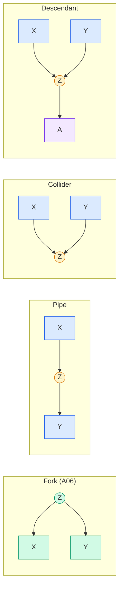
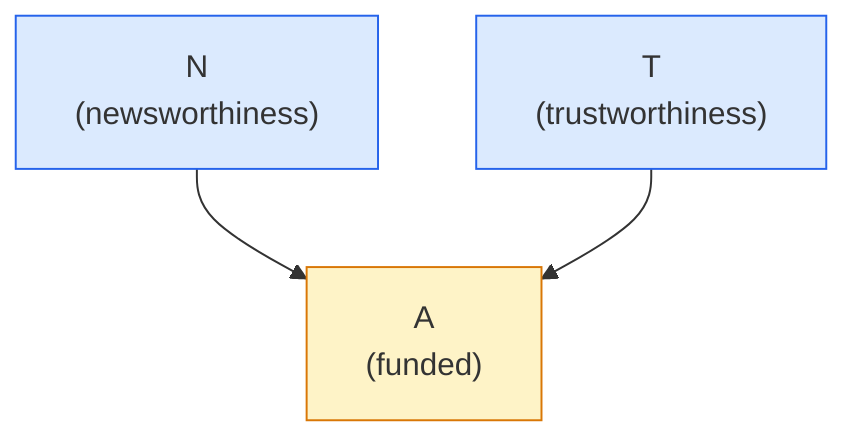
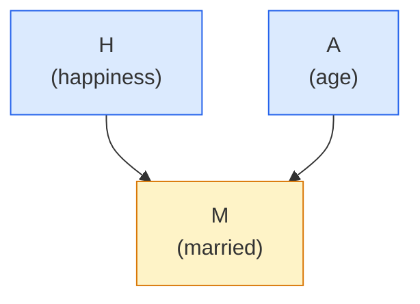
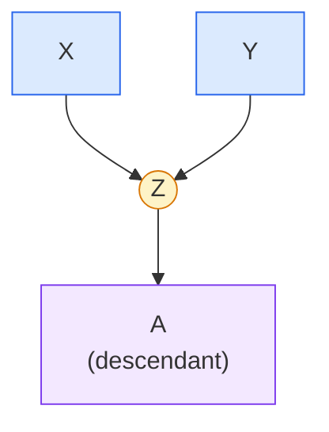
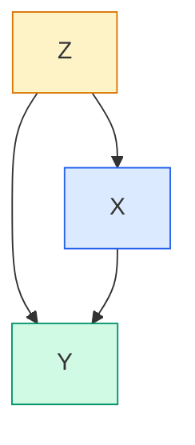
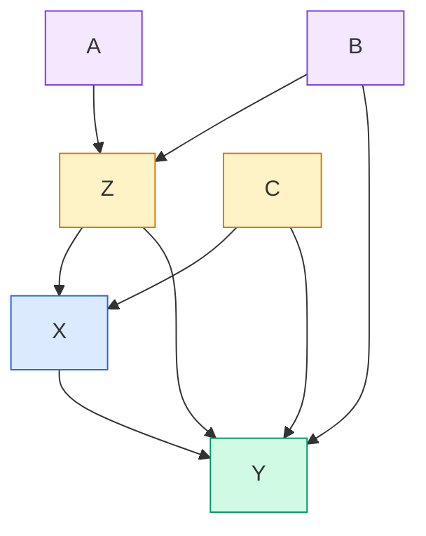

# Lecture A07: Good and Bad Controls

> **Prerequisite:** [[Lecture A06 - Elemental Confounds I_revised|Lecture A06: Elemental Confounds I]]. The previous lecture introduced the fork ($X \leftarrow Z \rightarrow Y$) and showed how stratification removes confounding. This lecture completes the four elemental confounds (pipe, collider, descendant), introduces the rules of d-separation, and provides the backdoor criterion: the algorithm for choosing which variables to condition on.

---

## Epistemological Framing

Knowledge is justified true belief. In causal inference, justification comes from transparent causal assumptions (DAGs) and logical derivation of their consequences (d-separation, backdoor criterion). Without justification, a statistical result is a number without meaning.

### Dangerous heuristics for choosing control variables

- **YOLO**: include anything in the spreadsheet. No justification.
- **Collinearity filter**: exclude only highly collinear variables. Collinearity is a numerical problem, not a causal one. A confounder can have low collinearity and still be essential.
- **Baseline measurements**: include any pre-treatment variable. This works often (pre-treatment variables cannot be caused by treatment) but fails when pre-treatment variables are colliders.

### The Table 2 Fallacy

Westreich and Greenland (2013) identified a widespread error in epidemiology. Many papers fit a single regression with multiple predictors and then interpret *every* coefficient in the results table (usually Table 2) as a causal effect. But a single model can only identify the causal effect of one variable at a time. The coefficient for each predictor has a different causal interpretation depending on which other variables are in the model and what role they play in the DAG (confounder, mediator, collider). Reading every row of the table as "the effect of X on Y" is wrong. Each coefficient answers a different question, and some of those questions are nonsensical.

---

## The Four Elemental Confounds (Continued)

[[Lecture A06 - Elemental Confounds I_revised|Lecture A06]] covered the fork in detail. This lecture covers the remaining three structures.



---

## The Pipe: $X \rightarrow Z \rightarrow Y$

$Z$ is a **mediator**. The influence of $X$ on $Y$ is transmitted through $Z$. $X$ and $Y$ are associated because $X$ causes $Z$ causes $Y$. Once you condition on $Z$, the association disappears: you have blocked the causal path.

The pipe has similar statistical behavior to the fork (conditioning removes association), but the causal interpretation is different. In a fork, the association is spurious (confounding). In a pipe, the association is causal (mediation). Conditioning on a fork variable is necessary to remove bias. Conditioning on a pipe variable blocks the causal effect you are trying to estimate.

### Simulation

```python
import numpy as np

def simulate_pipe(
    n: int = 1000,
    seed: int = 42,
) -> dict:
    """Simulate data from a pipe: X -> Z -> Y.

    X causes Z, Z causes Y. X and Y are associated marginally
    but independent conditional on Z.

    Args:
        n: Sample size.
        seed: Random seed.

    Returns:
        Dictionary with X, Y, Z arrays.
    """
    rng = np.random.default_rng(seed)
    x = rng.binomial(1, 0.5, size=n)
    z = rng.binomial(1, (1 - x) * 0.1 + x * 0.9)
    y = rng.binomial(1, (1 - z) * 0.1 + z * 0.9)
    return {"X": x, "Y": y, "Z": z}


data = simulate_pipe()

# Marginal: X and Y are associated
print(f"Overall correlation: {np.corrcoef(data['X'], data['Y'])[0,1]:.3f}")

# Stratified: association vanishes
for z_val in [0, 1]:
    mask = data["Z"] == z_val
    r = np.corrcoef(data["X"][mask], data["Y"][mask])[0, 1]
    print(f"Correlation given Z={z_val}: {r:.3f}")

# Contingency tables
for z_val in [None, 0, 1]:
    label = "Overall" if z_val is None else f"Z={z_val}"
    mask = np.ones(len(data["X"]), dtype=bool) if z_val is None else (data["Z"] == z_val)
    table = np.zeros((2, 2), dtype=int)
    for xi in [0, 1]:
        for yi in [0, 1]:
            table[xi, yi] = np.sum((data["X"][mask] == xi) & (data["Y"][mask] == yi))
    print(f"\n{label} contingency table:")
    print(f"       Y=0  Y=1")
    print(f"  X=0  {table[0,0]:>4d} {table[0,1]:>4d}")
    print(f"  X=1  {table[1,0]:>4d} {table[1,1]:>4d}")
```

The scatter plot of a pipe looks identical to the scatter plot of a fork. You cannot distinguish them from data alone. The difference is causal, not statistical: in a fork, conditioning on $Z$ removes a spurious association. In a pipe, conditioning on $Z$ removes a real causal association. The DAG tells you which one you are dealing with.

> **Applied example (real estate / Causaris):** Interest rate ($X$) affects mortgage accessibility ($Z$), which affects transaction volume ($Y$). This is a pipe. Conditioning on mortgage accessibility when estimating the effect of interest rates on volume blocks the causal mechanism. For OTP Bank stress testing, you want the total effect (do not condition on $Z$).

---

## The Collider: $X \rightarrow Z \leftarrow Y$

This is the dangerous one. $X$ and $Y$ are independent: they share no common cause and neither causes the other. But both cause $Z$. Before conditioning on $Z$, there is no association between $X$ and $Y$. After conditioning on $Z$, a **spurious association appears**.

### Why conditioning on a collider creates association

Think of it as a "finding out" effect. $Z$ is produced by specific combinations of $X$ and $Y$. Once you know $Z$, you learn something about what $X$ and $Y$ must have been.

Concrete analogy: a light is on in a room. For the light to be on, the bulb must work *and* the switch must be on *and* the power must be connected. If you learn the light is on (condition on $Z$), you know all three conditions are met. If you then learn the switch is broken ($X$ is low), you can infer the light must be off, which contradicts your conditioning. Learning about one cause tells you about the other cause, *given* the outcome. This creates association between causes that were originally independent.

In the height-weight example: if $Z$ requires either $X$ or $Y$ to be large (a threshold effect), then conditioning on $Z = 1$ means at least one input was large. If $X$ was the large one, $Y$ did not need to be, so $Y$ tends to be lower. If $Y$ was the large one, $X$ tends to be lower. This produces a **negative correlation** between $X$ and $Y$ within the $Z = 1$ stratum.

The collider effect can also produce positive correlations with different causal structures (e.g., when both inputs must be present, or when they compete).

### Simulation

```python
import numpy as np
import matplotlib.pyplot as plt
from scipy.special import expit  # logistic function

def simulate_collider(
    n: int = 1000,
    seed: int = 42,
) -> dict:
    """Simulate data from a collider: X -> Z <- Y.

    X and Y are independent. Z depends on both.
    Conditioning on Z creates spurious association.

    Args:
        n: Sample size.
        seed: Random seed.

    Returns:
        Dictionary with X, Y, Z arrays.
    """
    rng = np.random.default_rng(seed)
    x = rng.binomial(1, 0.5, size=n)
    y = rng.binomial(1, 0.5, size=n)
    # Z is likely 1 if either X or Y is 1
    z = rng.binomial(1, np.where(x + y > 0, 0.9, 0.2))
    return {"X": x, "Y": y, "Z": z}


data = simulate_collider()

# Marginal: X and Y are NOT associated
print(f"Overall correlation: {np.corrcoef(data['X'], data['Y'])[0,1]:.3f}")

# Stratified: association APPEARS
for z_val in [0, 1]:
    mask = data["Z"] == z_val
    if mask.sum() > 2:
        r = np.corrcoef(data["X"][mask], data["Y"][mask])[0, 1]
        print(f"Correlation given Z={z_val}: {r:.3f}")


def plot_collider_continuous(
    n: int = 300,
    seed: int = 42,
) -> None:
    """Visualize collider bias with continuous variables.

    The marginal regression is flat (X and Y independent).
    The within-group regressions show negative slopes
    (collider bias).

    Args:
        n: Sample size.
        seed: Random seed.
    """
    rng = np.random.default_rng(seed)
    x = rng.normal(0, 1, size=n)
    y = rng.normal(0, 1, size=n)
    z = rng.binomial(1, expit(2 * x + 2 * y - 2))

    fig, ax = plt.subplots(figsize=(8, 6), facecolor="white")
    colors = {0: "#2563eb", 1: "#dc2626"}

    for z_val in [0, 1]:
        mask = z == z_val
        ax.scatter(x[mask], y[mask], color=colors[z_val], alpha=0.4,
                   s=15, label=f"Z={z_val}")
        if mask.sum() > 2:
            coeffs = np.polyfit(x[mask], y[mask], 1)
            x_line = np.linspace(x[mask].min(), x[mask].max(), 50)
            ax.plot(x_line, np.polyval(coeffs, x_line),
                    color=colors[z_val], linewidth=2)

    # Marginal regression
    coeffs_all = np.polyfit(x, y, 1)
    x_line = np.linspace(x.min(), x.max(), 50)
    ax.plot(x_line, np.polyval(coeffs_all, x_line), color="black",
            linewidth=2, label="Marginal (flat)")

    ax.set_xlabel("X")
    ax.set_ylabel("Y")
    ax.set_title("Collider: conditioning on Z creates spurious association")
    ax.legend()
    plt.tight_layout()
    plt.savefig("collider_continuous.png", dpi=150, facecolor="white")
    plt.show()

plot_collider_continuous()
```

The black line (marginal) is flat: $X$ and $Y$ are independent. The red and blue lines (stratified by $Z$) have negative slopes: conditioning on the collider created a phantom association. This is the opposite of the fork, where conditioning *removes* association.

### Collider example: selection bias in grant funding

Suppose 200 grant applications are scored on two independent qualities: **newsworthiness** ($N$) and **trustworthiness** ($T$). In the population of proposals, $N$ and $T$ are uncorrelated. Proposals are funded if newsworthiness or trustworthiness is high enough.



Among funded proposals ($A = 1$), there is a strong **negative** association between newsworthiness and trustworthiness. The most newsworthy funded projects tend to be the least trustworthy (they got funded on novelty alone). The most trustworthy funded projects tend to be less newsworthy (they got funded on rigor alone). It is hard to be high on both.

This pattern appears everywhere:

| Domain | $X$ | $Y$ | Collider $Z$ | Spurious association |
|--------|-----|-----|-------------|---------------------|
| Restaurants | Good food | Good location | Survival | Worse food in better locations |
| Acting | Attractiveness | Skill | Success | Unattractive actors are more skilled |
| Academia | Newsworthiness | Trustworthiness | Publication | Flashy papers are less reliable |
| Real estate | Build quality | Location quality | High price | Expensive properties in bad locations have excellent build quality |

> **Applied example (real estate / Causaris):** Selection bias is pervasive in property data. You only observe *completed transactions* (the collider). Properties that sold are a selected subset: they had an acceptable combination of price, quality, and location. Conditioning on "sold" (which you do implicitly by using transaction data) can create spurious associations between property characteristics. A hedonic price model that does not account for this selection may confuse collider bias with genuine price determinants.

> **Applied example (forensic audio):** In forensic databases, you only have recordings that were *submitted as evidence* (the collider). Recordings are submitted because they are either clearly incriminating or clearly exculpatory. Recordings with ambiguous content are not submitted. Training a detection system on submitted recordings introduces selection bias: the system learns the characteristics of extreme cases, not the population of all recordings.

---

## Endogenous Colliders

Collider bias does not require physical selection (filtering observations). It can arise purely through **statistical conditioning**: including a collider as a predictor in a regression. This is **endogenous selection**: you create the bias by your modeling choice, not by the data collection process.

### Example: Age and Happiness

**Estimand:** Does age influence happiness?

**DAG:**



Suppose age has **zero** causal effect on happiness. But both age and happiness influence marital status: happy people are more likely to get married (attractiveness of a happy partner), and older people are more likely to be married (more years of exposure to the possibility of marriage).

Marital status ($M$) is a collider: $H \rightarrow M \leftarrow A$. If you stratify by marital status (include it as a covariate "to control for it"), you create a spurious negative association between age and happiness:

- **Among married people**: older married individuals are more likely to have married due to age (years of exposure) rather than happiness. The younger married people are more likely to have married because they are happy. Result: within the married stratum, older people appear less happy.
- **Among unmarried people**: younger unmarried people might simply not have had time to marry. Older unmarried people are more likely to be unmarried because they are less happy. Result: within the unmarried stratum, older people again appear less happy.

In both strata, a negative association between age and happiness appears, despite the true causal effect being zero. This is entirely an artifact of conditioning on the collider.

> **Applied example (policy analysis):** A government wants to know if age affects life satisfaction. A well-meaning analyst "controls for" employment status. But both age and life satisfaction affect employment (older people retire; satisfied people perform better at work). Employment is a collider. Conditioning on it produces a spurious negative association between age and satisfaction, leading the government to design unnecessary interventions for elderly well-being.

---

## The Descendant

The descendant is the fourth elemental confound. It occurs when a variable $A$ is caused by another variable $Z$, and $Z$ is involved in one of the other three structures (fork, pipe, or collider).



$A$ is a **proxy** for $Z$. It holds information about $Z$, but imperfectly. Conditioning on $A$ partially conditions on $Z$. The effect depends on the strength of the $Z \rightarrow A$ relationship:

- If $A$ perfectly reflects $Z$: conditioning on $A$ is identical to conditioning on $Z$.
- If $A$ weakly reflects $Z$: conditioning on $A$ partially conditions on $Z$.
- If $A$ is unrelated to $Z$: conditioning on $A$ does nothing.

The descendant acts as a **soft** version of whatever $Z$ is:
- If $Z$ is a collider: conditioning on $A$ partially opens the collider, creating a weakened spurious association.
- If $Z$ is a fork (confounder): conditioning on $A$ partially closes the fork, providing weakened deconfounding.
- If $Z$ is a pipe (mediator): conditioning on $A$ partially blocks the pipe.

This matters in practice because many variables cannot be measured directly. You measure proxies (descendants). Income is a proxy for socioeconomic status. Self-reported health is a proxy for true health. A detection score is a proxy for the true label. Understanding the descendant structure tells you how much bias your proxy introduces.

> **Applied example (forensic audio):** A forensic system's detection score ($A$) is a descendant of the true authenticity status ($Z$). The score is not the truth; it is a noisy proxy. Conditioning on the score partially conditions on the truth. The strength of the proxy relationship determines how much information the score carries. This is exactly the problem that C$_\text{llr}$ calibration addresses: measuring how well the score (descendant) reflects the true hypothesis (parent). See [[2026-04-13_cllr-forensic-lr-calibration-metric|C_llr: forensic LR calibration]].

---

## Rules of D-Separation

**D-separation** stands for **directional separation** (the "d" comes from "directed graph"). It provides a complete set of rules for determining which variables are statistically independent given which other variables are conditioned on, for any DAG.

The rules can be understood through a valve metaphor (inspired by Daphne Koller's presentation of Bayesian networks): information flows through paths in the DAG like water through pipes. Variables act as valves that can be open or closed.

### The three valve rules

| Structure | Default state | After conditioning on Z |
|-----------|--------------|------------------------|
| **Fork** ($X \leftarrow Z \rightarrow Y$) | Open (information flows from $Z$ to both $X$ and $Y$) | Closed (conditioning on $Z$ blocks the flow) |
| **Pipe** ($X \rightarrow Z \rightarrow Y$) | Open (information flows from $X$ through $Z$ to $Y$) | Closed (conditioning on $Z$ blocks the flow) |
| **Collider** ($X \rightarrow Z \leftarrow Y$) | Closed (information collides and stops at $Z$) | Open (conditioning on $Z$ lets information flow between $X$ and $Y$) |

Two key principles:
1. **Forks and pipes are open by default, closed when conditioned on.** Conditioning blocks the flow.
2. **Colliders are closed by default, opened when conditioned on.** Conditioning creates flow where none existed.

A path between $X$ and $Y$ is **d-separated** (blocked) if any variable along the path acts as a closed valve. A path is **d-connected** (open) if every variable along the path acts as an open valve.

Two variables are **d-separated** if *every* path between them is blocked. They are **d-connected** if *any* path between them is open.

```python
def is_path_blocked(
    path_structures: list[dict],
    conditioned_on: set[str],
) -> bool:
    """Check if a path is blocked (d-separated) given a conditioning set.

    Each element in path_structures describes a node on the path:
    - {"node": "Z", "type": "fork"} for X <- Z -> Y
    - {"node": "Z", "type": "pipe"} for X -> Z -> Y
    - {"node": "Z", "type": "collider"} for X -> Z <- Y

    Args:
        path_structures: List of node descriptions along the path.
        conditioned_on: Set of variable names being conditioned on.

    Returns:
        True if the path is blocked.
    """
    for node_info in path_structures:
        node = node_info["node"]
        structure = node_info["type"]

        if structure in ("fork", "pipe"):
            # Open by default, closed when conditioned on
            if node in conditioned_on:
                return True  # This valve is closed -> path blocked
        elif structure == "collider":
            # Closed by default, opened when conditioned on
            if node not in conditioned_on:
                return True  # This valve is closed -> path blocked

    return False  # All valves open -> path is open (d-connected)
```

---

## The Backdoor Criterion

The backdoor criterion is the algorithm for choosing which variables to condition on to identify a causal effect. It formalizes what we have been doing intuitively with the fork and pipe examples.

### The algorithm

To estimate the causal effect of $X$ on $Y$:

1. **List all paths** connecting $X$ to $Y$ in the DAG.
2. **Classify each path** as front-door (causal) or back-door (non-causal).
   - **Front-door paths** leave $X$ through an arrow *out of* $X$ (e.g., $X \rightarrow \ldots \rightarrow Y$). These are the causal paths. Do not block them.
   - **Back-door paths** enter $X$ through an arrow *into* $X$ (e.g., $X \leftarrow \ldots \rightarrow Y$). These are non-causal paths (confounding). Block them.
3. **Find an adjustment set** that closes all back-door paths without opening any new paths (i.e., without conditioning on colliders or descendants of colliders on the path).

When you intervene on $X$ ($\text{do}(X)$), changes propagate out the front door. Nothing happens to the paths entering $X$, because the intervention breaks those arrows. The back-door paths are the source of confounding: they create association between $X$ and $Y$ that is not causal.

### Simple example



Paths from $X$ to $Y$:
1. $X \rightarrow Y$ (front-door, causal). Do not block.
2. $X \leftarrow Z \rightarrow Y$ (back-door, fork). Must block.

Adjustment set: condition on $Z$. This closes the fork and identifies the causal effect of $X$ on $Y$.

### Complex example



Paths from $X$ to $Y$:
1. $X \rightarrow Y$ (front-door). Do not block.
2. $X \leftarrow C \rightarrow Y$ (back-door, fork through $C$). Must block.
3. $X \leftarrow Z \rightarrow Y$ (back-door, fork through $Z$). Must block.

**Step 1:** Condition on $C$ to close path 2. Done.

**Step 2:** Condition on $Z$ to close path 3. But $Z$ is a collider on the path $A \rightarrow Z \leftarrow B$. Conditioning on $Z$ *opens* the path $X \leftarrow A \rightarrow Z \leftarrow B \rightarrow Y$. We have introduced new confounding.

**Step 3:** To close the newly opened path, condition on $A$ or $B$ (or both).

Which is the better choice? **$B$ is preferable** to $A$. Conditioning on $B$ closes the opened path and also partially deconfounds the $B \rightarrow Y$ relationship. Conditioning on $A$ closes the path through $A$ but leaves $B \rightarrow Y$ unblocked if there are other paths through $B$. In general, condition on variables closer to the outcome when you have a choice.

**Final adjustment set:** $\{C, Z, B\}$ or $\{C, Z, A\}$ or $\{C, Z, A, B\}$. All are valid. $\{C, Z, B\}$ is the most efficient.

```python
# DAGitty (daggity.net) automates this analysis.
# You draw the DAG, specify treatment and outcome,
# and it returns all valid adjustment sets.
#
# For complex DAGs with many variables, manual path enumeration
# is error-prone. Use DAGitty or the dagitty R/Python package.
#
# Python equivalent:
# pip install causalgraphicalmodels
# from causalgraphicalmodels import CausalGraphicalModel
#
# dag = CausalGraphicalModel(
#     nodes=["A", "B", "C", "Z", "X", "Y"],
#     edges=[
#         ("A", "Z"), ("B", "Z"), ("C", "X"), ("C", "Y"),
#         ("Z", "X"), ("Z", "Y"), ("B", "Y"), ("X", "Y"),
#     ]
# )
# print(dag.get_all_backdoor_adjustment_sets("X", "Y"))
```

> **Applied example (real estate / Causaris):** In a hedonic price model, you want the causal effect of floor area ($X$) on price ($Y$). Municipality wealth ($C$) affects both floor area (wealthier areas have larger properties) and price (wealthier areas are more expensive): fork, condition on it. Construction year ($Z$) is affected by both regulation changes ($A$) and builder quality ($B$), and affects both floor area and price. $Z$ is a collider on one path. The backdoor criterion tells you exactly which variables to include. DAGitty makes this tractable for models with 10+ variables across 217 municipalities.

> **Applied example (forensic audio):** In evaluating a speaker verification system, you want the causal effect of speaker identity ($X$) on LR output ($Y$). Recording device ($C$) affects both the acoustic features (which carry identity information) and the LR (through channel effects): fork, condition on it. But recording quality ($Z$) is a collider between microphone sensitivity ($A$) and environmental noise ($B$). Including recording quality as a control opens a collider path. The backdoor criterion prevents this mistake. See [[2026-04-14_score-to-lr-conversion-forensic-calibration|score-to-LR conversion]] for how channel effects enter the calibration pipeline.

> **Applied example (policy analysis):** Evaluating a housing subsidy ($X$) on household wealth ($Y$). Pre-treatment income ($C$) is a confounder (fork): condition on it. But post-treatment employment status is a mediator (pipe): do not condition on it for the total effect. Household size ($Z$) may be a collider if both the subsidy and wealth affect fertility decisions. The backdoor criterion disambiguates these cases, preventing the analyst from "controlling for everything" and introducing bias.

---

## Summary: When to Condition

| Structure | Variable role | Condition on it? | What happens if you get it wrong? |
|-----------|-------------|-------------------|-----------------------------------|
| **Fork** ($X \leftarrow Z \rightarrow Y$) | Confounder | **Yes** | Bias from spurious association |
| **Pipe** ($X \rightarrow Z \rightarrow Y$) | Mediator | **No** (for total effect) | Blocks the causal path, underestimates effect |
| **Collider** ($X \rightarrow Z \leftarrow Y$) | Collider | **No** | Creates spurious association from nothing |
| **Descendant** ($Z \rightarrow A$) | Proxy | **Depends** on what $Z$ is | Partial version of conditioning on $Z$ |

---

## Key Takeaways

1. **The collider is the most dangerous confound.** Forks and pipes are intuitive: conditioning removes association. The collider is counterintuitive: conditioning *creates* association. Many published studies include colliders as "controls," producing phantom effects.

2. **The Table 2 Fallacy is widespread.** A single regression cannot identify the causal effect of every predictor simultaneously. Each coefficient has a different causal interpretation depending on the other variables in the model. One model, one estimand.

3. **D-separation provides complete rules.** Forks and pipes are open by default, closed when conditioned on. Colliders are closed by default, opened when conditioned on. These three rules, applied to every node on every path, determine all statistical independencies implied by a DAG.

4. **The backdoor criterion is the algorithm.** List all paths from treatment to outcome. Classify as front-door (causal) or back-door (non-causal). Find an adjustment set that closes all back-door paths without opening colliders. This replaces heuristics with logic.

5. **Selection bias is collider bias.** Restaurants that survive, grants that are funded, recordings that are submitted as evidence, properties that sell. Conditioning on survival/selection/inclusion creates spurious associations between the causes of selection.

6. **Descendants are proxy measurements.** When you cannot measure a variable directly, you measure its descendant. Conditioning on the descendant partially conditions on the parent. The strength of the proxy determines how much bias is introduced or removed. C$_\text{llr}$ calibration is fundamentally about measuring how well a descendant (detection score) reflects its parent (truth).

7. **Use DAGitty.** For any DAG with more than four variables, manual path enumeration is error-prone. The website daggity.net and the `causalgraphicalmodels` Python package automate the backdoor criterion and return all valid adjustment sets. Draw the DAG, specify treatment and outcome, let the algorithm work.
