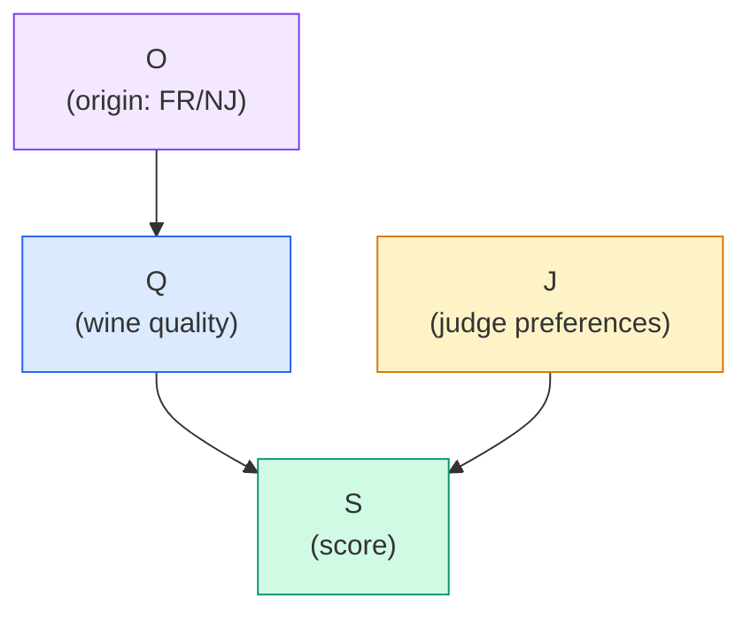
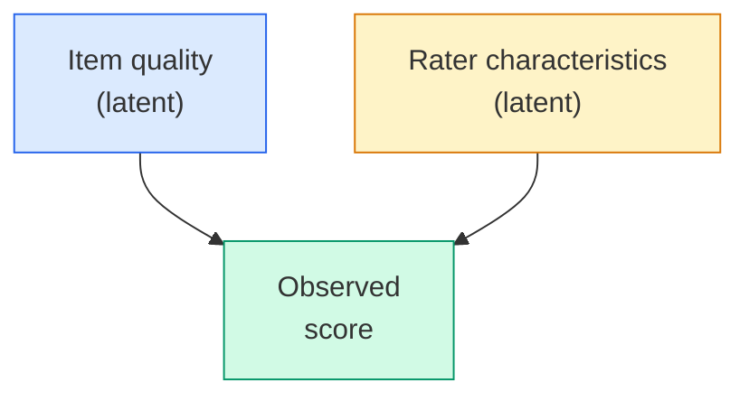

# Lecture A08: MCMC and Item Response Models

> **Prerequisite:** [[Lecture A07 - Good and Bad Controls_revised|Lecture A07: Good and Bad Controls]]. The previous lectures established the full causal inference toolkit: DAGs, d-separation, the backdoor criterion. All models so far used quadratic approximation (Laplace) for the posterior. This lecture introduces Markov Chain Monte Carlo (MCMC), the general-purpose posterior sampler that handles models where the quadratic approximation fails. The running example is an Item Response Model for wine judging, a model with many latent parameters that demands MCMC.

---

## From Quadratic Approximation to MCMC

Four methods for computing posterior distributions, ordered by generality:

| Method | When it works | Limitations |
|--------|-------------|-------------|
| **1. Exact (analytical)** | Conjugate models only (Beta-Binomial, Gamma-Poisson) | Almost never available for real models |
| **2. Grid approximation** | 1-2 parameters | Explodes combinatorially with dimension |
| **3. Quadratic approximation** | Posteriors that are approximately Gaussian | Fails for multimodal, skewed, funnel-shaped posteriors |
| **4. MCMC** | Any model with a computable log-posterior | Slower, requires diagnostics |

Globe tossing ([[Lecture A01 - Introduction to Bayesian Workflow_revised|A01]]) used the exact Beta-Binomial conjugacy. Linear regression ([[Lecture A03 - Geocentric Models_revised|A03]]-[[Lecture A05 - Estimands & Estiplans_revised|A05]]) used the quadratic approximation. Now we need something more general.

The quadratic approximation assumes the posterior is a multivariate Gaussian. This works well for linear models with moderate data. It breaks when:

- The posterior is **multimodal** (mixture models, some hierarchical models)
- The posterior has **funnel shapes** (hierarchical models with varying-effects)
- The posterior is **highly skewed** (small-sample models, models with bounded parameters)
- There are **many correlated latent parameters** (item response models, spatial models)

MCMC handles all of these. It is the workhorse of applied Bayesian statistics and what `pm.sample()` calls under the hood in PyMC.

---

## Markov Chains and Monte Carlo

### Andrei Andreyevich Markov (1856-1922)

Markov developed the theory of stochastic processes that bear his name. A **Markov chain** is a sequence of states where the probability of transitioning to the next state depends only on the current state, not on the history. This is the **memoryless property**: the chain does not remember where it has been, only where it is now.

Formally: $P(X_{t+1} \mid X_t, X_{t-1}, \ldots, X_0) = P(X_{t+1} \mid X_t)$

This property is what makes MCMC tractable. At each step, you only need the current parameter values to decide where to go next. You do not need to store or process the entire chain history.

### Monte Carlo: The Name

The "Monte Carlo" part refers to random simulation, named after the Monte Carlo Casino in Monaco. The story: Stanislaw Ulam, while recovering from illness in 1946, was playing solitaire and wondered about the probability of winning. Analytical calculation was intractable, but he realized he could estimate the probability by playing many random games and counting wins. He discussed this with John von Neumann, who recognized the broader principle: use random sampling to estimate quantities that are analytically intractable. They needed a code name for the classified work at Los Alamos. Nicholas Metropolis suggested "Monte Carlo" after the casino, because Ulam's uncle reportedly borrowed money from relatives to gamble there.

### The Beginnings of MCMC: Metropolis et al. (1953)

The foundational paper, "Equation of State Calculations by Fast Computing Machines," was authored by Nicholas Metropolis, Arianna Rosenbluth, Marshall Rosenbluth, Augusta Teller, and Edward Teller. The work was done at Los Alamos National Laboratory, originally in the context of simulating the behavior of molecules in a material to calculate its equation of state, relevant to nuclear weapons design.

The computations ran on **MANIAC** (Mathematical Analyzer, Numerical Integrator, and Computer), one of the first general-purpose electronic computers. MANIAC had roughly 5 KB of memory and could perform about 10,000 operations per second. For comparison, a modern laptop runs MCMC chains billions of times faster. The algorithm's efficiency was not in raw speed but in the mathematical insight: you do not need to visit every point in parameter space. You need only visit points proportional to their posterior probability.

The Metropolis algorithm was later generalized by W.K. Hastings (1970) to allow asymmetric proposal distributions, giving us the Metropolis-Hastings algorithm. Modern MCMC methods (Hamiltonian Monte Carlo, NUTS) are descendants of this lineage.

---

## The Metropolis Algorithm

The basic Metropolis algorithm (also called the Rosenbluth algorithm) is the simplest MCMC sampler. It is not a gradient-based method. It explores the posterior by random proposals.

### How it works

1. Start at a current position $\theta_{\text{current}}$ in parameter space
2. Propose a new position $\theta_{\text{proposal}} = \theta_{\text{current}} + \epsilon$, where $\epsilon$ is drawn from a symmetric proposal distribution (e.g., $\text{Normal}(0, \sigma_{\text{proposal}})$)
3. Compute the acceptance ratio: $r = \frac{P(\theta_{\text{proposal}} \mid \text{data})}{P(\theta_{\text{current}} \mid \text{data})}$
4. If $r \geq 1$: always accept (the proposal is more probable)
5. If $r < 1$: accept with probability $r$ (sometimes move to less probable regions)
6. If rejected: stay at $\theta_{\text{current}}$
7. Repeat

The key insight in step 5: occasionally accepting worse positions allows the chain to explore the full posterior, including the tails. If you only moved uphill (always rejecting worse positions), you would find the mode but never explore the shape of the posterior around it. That would be optimization, not sampling.

### Implementation

```python
import numpy as np
from scipy import stats

def metropolis(
    log_posterior_fn,
    initial: np.ndarray,
    n_samples: int = 10_000,
    proposal_sd: float = 0.1,
    seed: int = 42,
) -> np.ndarray:
    """Run the Metropolis algorithm.

    Args:
        log_posterior_fn: Function that returns the log posterior
            density at a given parameter vector.
        initial: Starting parameter values.
        n_samples: Number of MCMC samples to draw.
        proposal_sd: Standard deviation of the Gaussian proposal.
        seed: Random seed for reproducibility.

    Returns:
        Array of shape (n_samples, n_params) with posterior samples.
    """
    rng = np.random.default_rng(seed)
    n_params = len(initial)
    samples = np.zeros((n_samples, n_params))
    current = initial.copy()
    current_lp = log_posterior_fn(current)
    n_accepted = 0

    for i in range(n_samples):
        # Propose
        proposal = current + rng.normal(0, proposal_sd, size=n_params)
        proposal_lp = log_posterior_fn(proposal)

        # Accept/reject
        log_ratio = proposal_lp - current_lp
        if np.log(rng.random()) < log_ratio:
            current = proposal
            current_lp = proposal_lp
            n_accepted += 1

        samples[i] = current

    acceptance_rate = n_accepted / n_samples
    print(f"Acceptance rate: {acceptance_rate:.2%}")
    return samples
```

The acceptance rate is a key diagnostic. Too high (>0.9): proposals are too small, the chain barely moves (random walk). Too low (<0.1): proposals are too large, most are rejected (stuck). The sweet spot for the basic Metropolis algorithm is around 23% for high-dimensional problems (Roberts et al., 1997).

> **Revisit note:** You never use the basic Metropolis algorithm in practice. PyMC defaults to NUTS (No-U-Turn Sampler), a variant of Hamiltonian Monte Carlo. But understanding Metropolis is essential because it reveals the core mechanism: propose, evaluate, accept/reject. Every MCMC algorithm is a variation on this theme.

---

## Hamiltonian Monte Carlo (HMC)

HMC is the modern workhorse. It uses **gradients** of the log posterior to make informed proposals, rather than the random walk of the Metropolis algorithm.

### The physical analogy

Imagine a ball rolling on a surface shaped like the negative log posterior. Valleys correspond to high-probability regions. The ball's position is the current parameter value. HMC:

1. Gives the ball a random kick (random momentum)
2. Simulates the ball rolling along the surface for $L$ steps (leapfrog integration)
3. The ball ends up in a new position, typically far from where it started but still in a high-probability region
4. Accepts or rejects the new position based on the Hamiltonian (total energy)

The gradient tells the ball which way is downhill. This allows HMC to take large, informed steps instead of the small random steps of Metropolis. The result: far fewer samples are needed for the same effective information.

### Implementation (simplified)

```python
import numpy as np

def hmc(
    log_posterior_fn,
    grad_log_posterior_fn,
    initial: np.ndarray,
    n_samples: int = 1_000,
    step_size: float = 0.01,
    n_leapfrog: int = 20,
    seed: int = 42,
) -> np.ndarray:
    """Simplified Hamiltonian Monte Carlo sampler.

    Args:
        log_posterior_fn: Function returning log posterior at theta.
        grad_log_posterior_fn: Function returning gradient of log posterior.
        initial: Starting parameter values.
        n_samples: Number of samples.
        step_size: Leapfrog step size (epsilon).
        n_leapfrog: Number of leapfrog steps per proposal.
        seed: Random seed.

    Returns:
        Array of shape (n_samples, n_params) with posterior samples.
    """
    rng = np.random.default_rng(seed)
    n_params = len(initial)
    samples = np.zeros((n_samples, n_params))
    current = initial.copy()
    n_accepted = 0

    for i in range(n_samples):
        # Random momentum
        momentum = rng.normal(0, 1, size=n_params)
        current_momentum = momentum.copy()

        # Leapfrog integration
        proposal = current.copy()
        p = momentum.copy()

        # Half step for momentum
        p += 0.5 * step_size * grad_log_posterior_fn(proposal)

        for _ in range(n_leapfrog - 1):
            proposal += step_size * p
            p += step_size * grad_log_posterior_fn(proposal)

        proposal += step_size * p
        p += 0.5 * step_size * grad_log_posterior_fn(proposal)

        # Hamiltonian = -log_posterior + 0.5 * momentum^2
        current_H = -log_posterior_fn(current) + 0.5 * np.sum(current_momentum**2)
        proposal_H = -log_posterior_fn(proposal) + 0.5 * np.sum(p**2)

        # Metropolis acceptance
        if np.log(rng.random()) < current_H - proposal_H:
            current = proposal
            n_accepted += 1

        samples[i] = current

    print(f"HMC acceptance rate: {n_accepted / n_samples:.2%}")
    return samples
```

In practice, PyMC's NUTS sampler automatically tunes the step size and number of leapfrog steps during warmup. You rarely set these manually.

> **Revisit note:** When you call `pm.sample()`, PyMC runs NUTS, which is HMC with automatic tuning of both `step_size` and `n_leapfrog`. The NUTS paper (Hoffman and Gelman, 2014) introduced the "No-U-Turn" criterion: stop the leapfrog trajectory when it starts turning back toward where it came from. This eliminates the need to choose $L$ (the number of leapfrog steps), which was the main tuning difficulty with vanilla HMC.

---

## Example: The Judgment at Princeton

### The experiment

In 2012, a blind wine tasting was held in Princeton, New Jersey, inspired by the famous 1976 Judgment of Paris. Nine professional wine judges (a mix of French and American) evaluated wines from both France and New Jersey. The judges did not know which wines were from which country. The results: the judges could not reliably distinguish French from New Jersey wines. This is the forensic science parallel: expert evaluators, blinded to ground truth, producing scores that reflect a mixture of true quality and evaluator bias.

The key design feature is **blinding**. Because the judges did not know the origin of each wine, there is no direct path from wine origin to the score through judge expectations. This breaks the potential confound where a judge's knowledge of origin biases the score.

### DAG (blinded test)



$$O \rightarrow Q \rightarrow S \leftarrow J$$

Wine origin ($O$) affects wine quality ($Q$) through terroir, grape varieties, and winemaking tradition. Quality affects the score ($S$). Judge preferences ($J$) also affect the score. The score is a collider of quality and judge effects, but we are not conditioning on the score; we are modeling it. The judge is not a confounder because there is no backdoor path through $J$.

### Why not an unblinded test?

Without blinding, the DAG would have an additional arrow: $O \rightarrow S$ (judges who know the origin adjust their scores based on expectations). This creates a direct path from origin to score that bypasses quality. A positive association between French origin and high scores could reflect genuine quality *or* judge bias. Blinding eliminates this path.

Is total blinding plausible? In wine tasting, the judges cannot see labels, but they might recognize a wine's region from its flavor profile. In forensic speaker verification, an examiner who recognizes a suspect's voice is not truly blinded. In clinical trials, patients may guess their treatment from side effects. Perfect blinding is an ideal; the question is always how close you get. The Judgment at Princeton used standardized serving conditions (same glasses, same temperature, same room) to minimize cues beyond taste.

> **Applied example (forensic audio):** Blinding is critical in forensic evaluation. If a voice examiner knows which sample is from the suspect, their likelihood ratio may be biased toward the prosecution hypothesis. The ENFSI (European Network of Forensic Science Institutes) guidelines require blinding in validation studies. The wine tasting DAG maps directly: replace Q with "true speaker identity match," J with "examiner expertise and bias," S with "reported likelihood ratio," and O with "ground truth."

---

## Item Response Models (IRT)

The wine tasting is an instance of a broader class of models: **Item Response Models** (IRT). In IRT, a set of *items* (wines, test questions, recordings) are evaluated by a set of *raters* (judges, students, examiners). The observed score depends on both the item's quality and the rater's characteristics.

### The general structure



IRT decomposes the observed score into contributions from the item and the rater. Both are latent variables: you do not directly observe wine quality or judge bias. You infer them from the pattern of scores across all items and raters.

### Examples across domains

| Domain | Items | Raters | Score | Item quality | Rater characteristic |
|--------|-------|--------|-------|-------------|---------------------|
| Wine tasting | Wines | Judges | Taste score | Latent wine quality | Harshness, discrimination |
| Exam scoring | Questions | Students | Correct/incorrect | Question difficulty | Student ability |
| Grant review | Proposals | Reviewers | Funding score | Proposal merit | Reviewer standards |
| Real estate appraisal | Properties | Appraisers | Appraised value | True market value | Appraiser bias |
| Forensic evaluation | Comparisons | Examiners | LR | True evidential strength | Examiner calibration |

### Why IRT matters: the test design problem

A good exam measures broad knowledge and differentiates students. If all questions are easy, the best students cannot distinguish themselves (ceiling effect). If all questions are hard, differences among students are compressed by the difficulty floor. The ideal test has questions spanning a range of difficulties, calibrated to the ability distribution of the student population.

IRT formalizes this: each question has a **difficulty** parameter (how good a student needs to be to answer correctly) and a **discrimination** parameter (how sharply the question separates students of different ability levels). These are the same as the judge parameters in the wine model: **harshness** (how good a wine needs to be to earn a high score) and **discrimination** (how well the judge differentiates wines of different quality).

The connection to McElreath's lecture: wine judges *are* questions on a test. They have biases (harshness) and varying ability to discriminate (discrimination). A judge with low discrimination assigns similar scores regardless of wine quality, like an exam question that every student gets right.

> **Applied example (real estate / Causaris):** Property appraisal is an IRT problem. Multiple appraisers evaluate properties. The appraised value reflects both the property's true market value (item quality) and the appraiser's tendencies (bias, precision). In the OTP Bank CRR3 context, if collateral valuations come from different appraisers, an IRT model can decompose the variance into property-level and appraiser-level components, identifying appraisers who are systematically harsh or lenient. This matters for regulatory compliance: CRR3 requires that valuation uncertainty be quantified, and the appraiser component is a major source.

> **Applied example (forensic audio):** Forensic speaker verification systems are raters in an IRT framework. Each system evaluates a set of comparisons (items) and produces a likelihood ratio (score). Different systems have different discrimination power and different calibration biases. The $C_\text{llr}$ decomposition from [[2026-04-13_cllr-forensic-lr-calibration-metric|C_llr calibration]] is essentially an IRT diagnostic: $C_{\text{llr,min}}$ measures the system's discrimination (item parameter recovery), and $C_{\text{llr,cal}}$ measures its calibration (rater bias). An IRT model applied to a multi-system evaluation can identify which systems are well-calibrated and which need recalibration, analogous to identifying which judges discriminate well.

> **Applied example (policy analysis):** Expert panels evaluating policy proposals are IRT settings. Multiple reviewers score each proposal. An IRT model separates proposal quality from reviewer idiosyncrasies, producing better-calibrated rankings than raw average scores. When advising government on which policy interventions to fund, the IRT-adjusted ranking accounts for the fact that some reviewers are consistently harsh and others are generous.

---

## The Estimand for the Wine Model

**Estimand:** Association between wine quality and wine origin. Is French wine genuinely better, or is the perceived quality difference driven by judge variation?

**Strategy:** Stratify by judge for efficiency. The judge is *not* a confounder (no backdoor path through judge to the treatment-outcome path). But judge preferences add noise. By including judge effects in the model, we reduce residual variance and get tighter estimates of wine quality. This is the same logic as including a pre-treatment covariate that is not a confounder but improves precision (variance reduction through partial pooling).

In this specific experiment, the judges were blinded, so there is no direct arrow from origin to score. The only path from origin to score goes through quality: $O \rightarrow Q \rightarrow S$.

---

## Building the Wine IRT Model

The model must be built incrementally, adding complexity one component at a time. This is the "start simpler than you need" principle from [[Lecture A01 - Introduction to Bayesian Workflow_revised|A01]].

### Step 1: Simple model (no judge effects)

$$S_i \sim \text{Normal}(\mu_i, \sigma)$$
$$\mu_i = Q_{W[i]}$$
$$Q_j \sim \text{Normal}(0, 1) \quad \text{for each wine } j$$
$$\sigma \sim \text{Exponential}(1)$$

Each wine has a latent quality $Q_j$. The score for tasting $i$ (of wine $W[i]$) is normally distributed around that quality. No judge effects yet.

### Step 2: Add judge harshness

Judges vary in how generous they are. A harsh judge gives low scores to all wines; a lenient judge gives high scores.

$$\mu_i = Q_{W[i]} - H_{J[i]}$$

where $H_{J[i]}$ is the harshness of judge $J[i]$. The subtraction means: a more harsh judge ($H > 0$) produces lower scores. The minus sign is a convention; it makes harshness interpretable as a threshold.

$$H_k \sim \text{Normal}(0, 1) \quad \text{for each judge } k$$

### Step 3: Add judge discrimination

Judges vary in how well they differentiate wines of different quality. A discriminating judge gives high scores to good wines and low scores to bad wines. A non-discriminating judge gives similar scores regardless of quality.

$$\mu_i = (D_{J[i]} \cdot Q_{W[i]}) - H_{J[i]}$$

where $D_{J[i]}$ is the discrimination parameter of judge $J[i]$. Discrimination multiplies quality: when $D > 1$, the judge amplifies quality differences. When $D < 1$, the judge compresses them. When $D = 0$, the judge ignores quality entirely.

$$D_k \sim \text{LogNormal}(0, 0.5) \quad \text{for each judge } k$$

The LogNormal prior constrains discrimination to be positive (a judge cannot invert quality rankings) and centers around 1 (average discrimination).

### Full model

$$S_i \sim \text{Normal}(\mu_i, \sigma)$$
$$\mu_i = (D_{J[i]} \cdot Q_{W[i]}) - H_{J[i]}$$
$$Q_j \sim \text{Normal}(0, 1) \quad \text{for each wine } j$$
$$H_k \sim \text{Normal}(0, 1) \quad \text{for each judge } k$$
$$D_k \sim \text{LogNormal}(0, 0.5) \quad \text{for each judge } k$$
$$\sigma \sim \text{Exponential}(1)$$

This is a model with $J + 2K + 1$ parameters (one quality per wine, one harshness and one discrimination per judge, plus $\sigma$). With 20 wines and 9 judges, that is $20 + 18 + 1 = 39$ parameters. The quadratic approximation would struggle with 39 correlated latent variables. MCMC handles it naturally.

```python
import numpy as np
import pymc as pm

def wine_irt_model(
    scores: np.ndarray,
    wine_idx: np.ndarray,
    judge_idx: np.ndarray,
    n_wines: int,
    n_judges: int,
) -> pm.Model:
    """Build the wine IRT model in PyMC.

    Args:
        scores: Observed scores, shape (n_tastings,).
        wine_idx: Wine index for each tasting, 0-based.
        judge_idx: Judge index for each tasting, 0-based.
        n_wines: Number of unique wines.
        n_judges: Number of unique judges.

    Returns:
        PyMC model (call pm.sample() to fit).
    """
    with pm.Model() as model:
        # Latent wine quality
        Q = pm.Normal("Q", mu=0, sigma=1, shape=n_wines)

        # Judge harshness
        H = pm.Normal("H", mu=0, sigma=1, shape=n_judges)

        # Judge discrimination (positive, centered on 1)
        D = pm.LogNormal("D", mu=0, sigma=0.5, shape=n_judges)

        # Residual SD
        sigma = pm.Exponential("sigma", lam=1)

        # Expected score
        mu = D[judge_idx] * Q[wine_idx] - H[judge_idx]

        # Likelihood
        S = pm.Normal("S", mu=mu, sigma=sigma, observed=scores)

    return model

# Usage:
# model = wine_irt_model(scores, wine_idx, judge_idx, n_wines=20, n_judges=9)
# with model:
#     trace = pm.sample(1000, tune=1000, random_seed=42)
```

> **Revisit note:** This is a standard PyMC model. The `shape` parameter creates vectorized parameters (one per wine or judge). The indexing `Q[wine_idx]` selects the quality parameter for each tasting. This is the same index variable approach from [[Lecture A04 - Categories and Causes_revised|A04]], extended to latent variables.

---

## MCMC Diagnostics

Running MCMC produces samples, but those samples are only useful if the chain has converged to the correct posterior. Diagnostics are the basic due diligence.

### Diagnostic summary table

After fitting a model with `pm.sample()`, the summary table shows six columns for each parameter:

| Column | Meaning |
|--------|---------|
| `mean` | Posterior mean |
| `sd` | Posterior standard deviation |
| `hdi_5.5%` | Lower bound of 89% highest density interval |
| `hdi_94.5%` | Upper bound of 89% HDI |
| `r_hat` | Convergence diagnostic ($\hat{R}$) |
| `ess_bulk` | Effective sample size (bulk of the distribution) |
| `ess_tail` | Effective sample size (tails) |

The last three columns are the diagnostics. Always check them.

### Trace plots

A trace plot shows the value of each parameter across MCMC iterations. A good trace plot looks like a **hairy caterpillar**: stationary, well-mixed, with rapid oscillations around a stable mean.

```python
import numpy as np
import matplotlib.pyplot as plt

def plot_trace(
    samples: np.ndarray,
    param_name: str = "theta",
    n_chains: int = 4,
    seed: int = 42,
) -> None:
    """Plot trace of MCMC samples for multiple chains.

    A good trace looks like a 'hairy caterpillar': stable mean,
    rapid mixing, no trends or plateaus.

    Args:
        samples: Array of shape (n_chains, n_samples).
        param_name: Name for plot title.
        n_chains: Number of chains.
        seed: Random seed.
    """
    fig, axes = plt.subplots(1, 2, figsize=(12, 4), facecolor="white")
    colors = ["#2563eb", "#dc2626", "#059669", "#d97706"]

    # Trace
    for c in range(n_chains):
        axes[0].plot(samples[c], alpha=0.7, linewidth=0.5, color=colors[c % 4])
    axes[0].set_xlabel("Iteration")
    axes[0].set_ylabel(param_name)
    axes[0].set_title(f"Trace plot: {param_name}")

    # Density
    for c in range(n_chains):
        axes[1].hist(samples[c], bins=40, density=True, alpha=0.4,
                     color=colors[c % 4], edgecolor="white", label=f"Chain {c+1}")
    axes[1].set_xlabel(param_name)
    axes[1].set_ylabel("Density")
    axes[1].set_title(f"Posterior density: {param_name}")
    axes[1].legend(fontsize=8)

    plt.tight_layout()
    plt.savefig(f"trace_{param_name}.png", dpi=150, facecolor="white")
    plt.show()
```

**Warmup** (burn-in): the first portion of each chain where the sampler adapts its tuning parameters (step size, mass matrix). Warmup samples are discarded. In PyMC, `tune=1000` means 1000 warmup iterations before collecting samples.

### What good chains look like

- All chains oscillate around the same mean
- No trends, no plateaus, no periodic patterns
- Rapid mixing: the chain moves quickly between values
- The density plots from different chains overlap completely

### What bad chains look like

- Chains that drift or trend upward/downward (not stationary)
- Chains that get stuck at a value for many iterations (poor mixing)
- Different chains settling at different values (multimodality or non-convergence)
- One chain exploring a different region than the others

### $\hat{R}$ (R-hat): Convergence Diagnostic

$\hat{R}$ compares the variance *within* each chain to the variance *between* chains. If all chains are exploring the same distribution, within-chain variance and between-chain variance should be similar.

$$\hat{R} = \sqrt{\frac{\text{Var}_{\text{between}} + \text{Var}_{\text{within}}}{\text{Var}_{\text{within}}}}$$

- $\hat{R} \approx 1.0$: chains have converged (within and between variances are equal)
- $\hat{R} > 1.01$: potential convergence problem. The chains disagree.
- $\hat{R} > 1.1$: serious convergence problem. Do not trust the results.

The intuition: as chains run longer, if they are exploring the same distribution, the between-chain variance shrinks toward zero and $\hat{R}$ shrinks toward 1. If they are stuck in different modes, the between-chain variance remains large and $\hat{R}$ stays elevated.

McElreath's rule: $\hat{R}$ must be below 1.01 for every parameter. If any parameter has $\hat{R} > 1.01$, increase the number of warmup iterations, reparameterize the model, or investigate the posterior geometry.

### Effective Sample Size (ESS)

MCMC samples are not independent. Each sample is correlated with the previous one (autocorrelation). The **effective sample size** (ESS) estimates how many independent samples the chain is equivalent to.

If you draw 4000 MCMC samples but the autocorrelation is high, you might have only 200 effective samples. Conversely, a well-tuned HMC sampler can produce 4000 samples with ESS close to 4000 (nearly independent).

Two variants:
- **ESS bulk**: effective samples for estimating the center of the distribution (mean, median)
- **ESS tail**: effective samples for estimating the tails (credible interval endpoints)

Rules of thumb:
- ESS bulk > 400: adequate for estimating means and standard deviations
- ESS tail > 400: adequate for estimating credible intervals
- ESS < 100: the chain has not explored enough. Run longer or improve the sampler.

The ESS directly determines the precision of your posterior summaries. With ESS = 100, the Monte Carlo standard error on the posterior mean is $\sigma / \sqrt{100} = \sigma / 10$. With ESS = 10,000, it is $\sigma / 100$.

> **Applied example (forensic audio):** When using MCMC to fit a forensic evaluation model (e.g., estimating speaker-specific parameters from a set of comparisons), low ESS means the posterior on the likelihood ratio is noisy. If ESS = 50 for a speaker parameter, the derived LR has high Monte Carlo error on top of the genuine posterior uncertainty. For courtroom applications, where a specific LR value matters, running the sampler longer (or reparameterizing) until ESS > 1000 is worth the compute cost.

---

## Interpreting the Wine Model Results

### Judge harshness

The harshness parameter $H_k$ for each judge indicates how generous or harsh they are. A judge with $H > 0$ is harsh (requires higher quality for the same score). A judge with $H < 0$ is lenient.

The posterior distribution of $H_k$ tells you the uncertainty about each judge's harshness. Judges who tasted many wines have narrow posteriors (well-estimated harshness). Judges with fewer tastings have wider posteriors.

### Judge discrimination

The discrimination parameter $D_k$ indicates how well each judge differentiates wines of different quality. The link between quality and score is:

$$\mu = D \cdot Q - H$$

The discrimination $D$ acts as a multiplier on quality. Visually, if you plot $\mu$ (expected score) against $Q$ (latent quality) for each judge:

- **High $D$ (steep curve):** the judge sharply differentiates quality levels. A small change in $Q$ produces a large change in score. This is a *discriminating* judge.
- **Low $D$ (flat curve):** the judge gives similar scores regardless of quality. The curve is nearly horizontal. This is a *non-discriminating* judge.
- **$D = 1$ (reference):** average discrimination. The score moves 1:1 with quality.

This is exactly the same structure as the Item Characteristic Curve (ICC) in educational testing: the probability of answering correctly as a function of student ability. Steep ICC = discriminating question. Flat ICC = non-discriminating question.

### Wine quality estimates

The latent quality $Q_j$ for each wine is estimated jointly with judge parameters. This is the power of the IRT approach: by modeling judge effects, the quality estimates are deconfounded from judge bias. A wine that received high scores from a harsh judge is estimated as higher quality than a wine that received the same scores from a lenient judge.

The quality estimates can then be compared across origins (French vs. New Jersey) to answer the original estimand. If the 89% credible intervals for French and New Jersey quality distributions overlap substantially, the data do not support a quality difference, consistent with the experimental finding.

> **Applied example (real estate / Causaris):** The IRT interpretation maps to property appraisal. Replace judge discrimination curves with appraiser characteristic curves. An appraiser with high discrimination produces valuations that closely track true market value. An appraiser with low discrimination produces noisy valuations that do not differentiate property quality well. For OTP Bank, identifying low-discrimination appraisers means flagging valuations that carry more uncertainty and should receive wider collateral haircuts.

> **Applied example (forensic audio):** Replace judges with forensic systems and discrimination with $C_{\text{llr,min}}$ (from [[2026-04-13_cllr-forensic-lr-calibration-metric|C_llr]]). A system with low $C_{\text{llr,min}}$ has high discrimination: its scores separate same-source from different-source comparisons effectively. The IRT model connects to the score-to-LR pipeline described in [[2026-04-14_score-to-lr-conversion-forensic-calibration|score-to-LR conversion]]: each system's discrimination and calibration parameters determine how its raw scores should be converted to likelihood ratios. The IRT framework provides a principled way to evaluate and compare multiple forensic systems on the same dataset.

---

## Key Takeaways

1. **MCMC is the general-purpose posterior sampler.** When the quadratic approximation fails (multimodal posteriors, many latent variables, funnel geometries), MCMC provides samples from the correct posterior. Every Bayesian model in PyMC uses MCMC (specifically NUTS, a variant of Hamiltonian Monte Carlo).

2. **The Metropolis algorithm is the foundation.** Propose, evaluate, accept/reject. The acceptance rate is the key diagnostic (~23% optimal for high dimensions). You never use it in practice (HMC is better), but understanding it clarifies what all MCMC algorithms do.

3. **HMC uses gradients for efficient exploration.** Instead of random walks, HMC simulates a physical system rolling on the posterior surface. This produces distant but high-probability proposals, requiring far fewer iterations than Metropolis. NUTS automates the tuning.

4. **Always check diagnostics.** $\hat{R} < 1.01$ for convergence. ESS > 400 for reliable summaries. Trace plots should look like hairy caterpillars. These are non-negotiable. A pretty posterior from a non-converged chain is fiction.

5. **Item Response Models decompose scores into items and raters.** The wine model separates quality (item) from judge harshness and discrimination (rater). The same structure applies to property appraisal, forensic evaluation, exam scoring, and grant review. IRT deconfounds the estimate of item quality from rater idiosyncrasies.

6. **Judge discrimination is the ICC.** A steep curve means the judge (or system, or question) sharply differentiates quality levels. A flat curve means it does not. In forensics, this maps to $C_{\text{llr,min}}$: the system's raw discriminative power.

7. **Blinding breaks confounding paths.** The wine experiment works because judges are blinded to origin. Without blinding, origin directly affects the score, confounding quality with expectation bias. The same principle applies to forensic validation studies: examiners must not know ground truth during evaluation.

8. **Build models incrementally.** Start with a simple model (no judge effects), add harshness, add discrimination. Check at each step that the model improves and that diagnostics are acceptable. This is the scaffolding principle from [[Lecture A01 - Introduction to Bayesian Workflow_revised|A01]].
