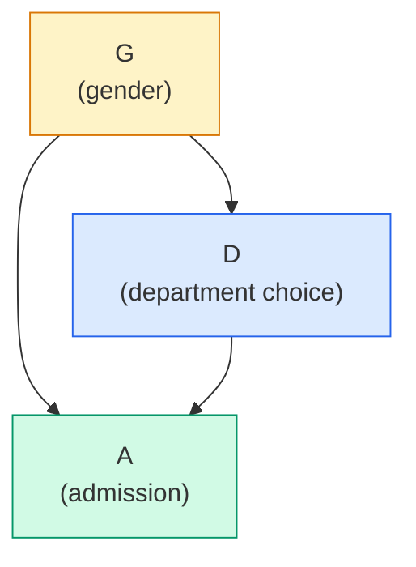
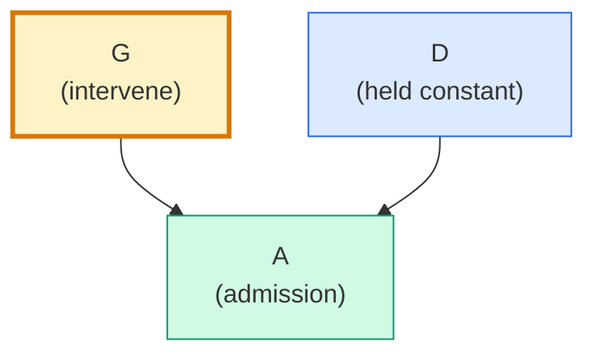
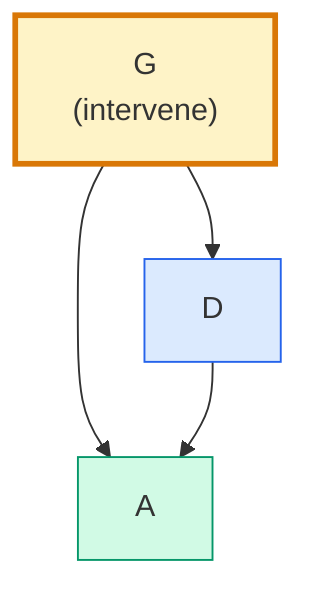
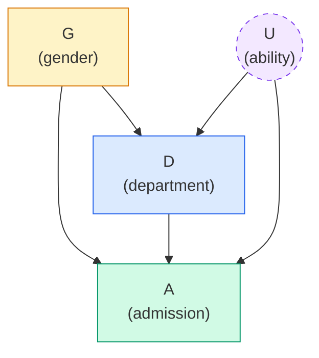

# Lecture A09: Modeling Events

> **Prerequisite:** [[Lecture A08 - MCMC and Item Response Models_revised|Lecture A08: MCMC and Item Response Models]]. The previous lecture introduced MCMC and Item Response Models. We now shift from continuous outcomes (weight, price, scores) to **discrete outcomes**: counts, binary events, categorical choices. The statistical machinery changes (logistic regression, binomial models), but the Bayesian workflow remains identical.

---

## Events: Discrete, Unordered Outcomes

Everything so far assumed continuous, normally distributed outcomes. But many phenomena produce **counts** or **binary events**:

- How many applicants were admitted? (count out of total)
- Was this recording authentic or manipulated? (binary: 0/1)
- How many transactions occurred in a municipality this quarter? (count)
- How many days did a black cat wait before adoption? (count)

The key distinction from continuous outcomes: you cannot observe a probability directly. You observe counts. Probabilities are latent quantities inferred from the counts. As McElreath puts it: "You can't observe probabilities. They are fiction." You can only observe the events they generate.

The difference from the globe-tossing model in [[Lecture A01 - Introduction to Bayesian Workflow_revised|A01]]: there, we estimated a single proportion $p$. Now we estimate probabilities that are *stratified by other variables* (gender, department, device type). The globe model becomes a building block inside a larger model.

Another important distinction: "you can't kill the salamander twice." Each event is a single discrete outcome. A salamander either survives or does not. An applicant is either admitted or not. This is fundamentally different from continuous measurements where you observe a value on a scale. Events are unordered categories (admitted/rejected) or bounded counts (0 to N admitted out of N applicants).

---

## Fundamental Distributions for Count Data

| Distribution | Outcome | Parameters | Use case |
|---|---|---|---|
| **Bernoulli** | Binary: 0 or 1 | $p$ (probability of 1) | Single trial: admitted/rejected |
| **Binomial** | Count: 0 to $N$ | $N$ (trials), $p$ (probability) | $k$ admitted out of $N$ applicants |
| **Poisson** | Count: 0 to $\infty$ | $\lambda$ (rate) | Crime counts, transaction counts per month |
| **Multinomial** | $k$ categories | $\mathbf{p}$ (probability vector) | Department choice among $k$ options |
| **Exponential** | Positive continuous | $\lambda$ (rate) | Time between events (waiting time) |
| **Geometric** | Count: 1 to $\infty$ | $p$ (probability of success) | Number of trials until first success |

These distributions arise from maximum entropy reasoning: given a set of constraints (mean, variance, boundedness), each is the distribution that makes the fewest additional assumptions. The Gaussian is maximum entropy for a given mean and variance on an unbounded continuous scale. The Binomial is maximum entropy for a given mean on a bounded count scale. The Poisson is maximum entropy for a given mean on an unbounded count scale.

> **Revisit note:** In PyMC, each of these is available as a likelihood: `pm.Bernoulli`, `pm.Binomial`, `pm.Poisson`. The choice of likelihood is determined by the outcome type, not by taste. Continuous unbounded → Normal. Binary → Bernoulli. Bounded count → Binomial. Unbounded count → Poisson. The generative model tells you which to use.

---

## The UC Berkeley Admissions Dataset

### Simpson's Paradox

**Simpson's paradox** occurs when a trend that appears in aggregate data reverses or disappears when the data are split into subgroups. The UC Berkeley admissions data (1973) is the canonical example.

Aggregate finding: women had a lower overall admission rate than men. Disaggregated finding: within most individual departments, women had *equal or higher* admission rates than men. The aggregate trend is misleading because women applied disproportionately to the most competitive departments (which rejected most applicants regardless of gender), while men applied more to less competitive departments.

This is not a statistical curiosity. It is a direct consequence of the causal structure: department choice mediates the relationship between gender and admission. The aggregate analysis confounds direct discrimination (within-department bias) with structural discrimination (differential application patterns).

### The Causal Salad Problem

McElreath highlights two papers published in 2022 that analyzed the same data (National Academy of Sciences membership) about the same question (gender discrimination) and reached nearly opposite conclusions. Neither paper included a DAG. Neither specified an estimand. Without a causal framework, the results are uninterpretable:

> "They've got no DAGs. They've got no estimands even. I challenge you to read those papers and figure out what they were thinking they were estimating."

The problem is not unique to these papers. It pervades the discrimination literature. Researchers with legitimate concerns about gender discrimination apply statistical methods to cross-sectional datasets without recognizing that "there's a hundred years of statisticians talking about how hard it is to do this."

McElreath's position: he is convinced discrimination exists in these domains, but not because of cross-sectional data analysis. The evidence comes from "the testimonies of individuals who have suffered it." Personal accounts, ethnographic evidence, and experimental studies with random assignment provide stronger evidence than observational correlations. Cross-sectional analysis *can* contribute, but only with transparent causal assumptions. The goal: "transparently laying out the assumptions that would be required to reach different conclusions."

---

## DAG: Gender and Admissions

### The vague estimand

"Was there gender discrimination in graduate admissions?" This is not precise enough to be an estimand. What *kind* of discrimination? Through what mechanism?

### Basic DAG



$$G \rightarrow D \rightarrow A \quad \text{(indirect path: structural)}$$
$$G \rightarrow A \quad \text{(direct path: within-department)}$$

Two paths from gender to admission:
- **Direct path** ($G \rightarrow A$): within a department, does gender affect admission probability? This is direct discrimination.
- **Indirect path** ($G \rightarrow D \rightarrow A$): gender affects department choice, and departments have different admission rates. This is structural discrimination.

### Three types of discrimination

The same causal structure appears across domains:

| Domain | $G$ (category) | $D$ (mediator) | $A$ (outcome) | Structural discrimination |
|--------|---|---|---|---|
| Admissions | Gender | Department | Admission | Women apply to harder departments |
| Wages | Gender | Occupation/Industry | Salary | Women enter lower-paying fields |
| Policing | Race | Neighborhood | Stop/search | Minorities live in more-policed areas |
| Real estate | Ethnicity | Municipality | Mortgage approval | Minorities apply in stricter districts |

### Direct discrimination

$$P(A \mid \text{do}(G), D = d)$$

The effect of gender on admission *within a specific department*. Condition on department. This isolates within-department bias.



### Structural (indirect) discrimination

$$P(A \mid \text{do}(G)) - P(A \mid \text{do}(G), D)$$

The portion of the gender effect that operates *through* department choice. Even without direct bias, if women systematically apply to harder departments, they face lower admission rates.

### Total discrimination

$$P(A \mid \text{do}(G))$$

All paths combined: both direct and structural. The lived experience of an applicant.



### The confound problem



**Ability** ($U$) is a common cause of both department choice and admission probability. Higher-ability students apply to more competitive departments (they have a comparative advantage) and are more likely to be admitted (they are stronger candidates). This creates a fork: $D \leftarrow U \rightarrow A$.

When we stratify by department to estimate direct discrimination, we need to worry about $U$ opening a backdoor path. If ability is unobserved (which it typically is in admissions datasets), we cannot fully close this path. The ability confound can *mask* discrimination: departments might appear non-discriminatory because admitted women are higher-ability on average (they had to be to overcome bias), creating the illusion of equal treatment.

Can ability be measured? Perhaps partially: GPA, test scores, recommendation letters capture aspects of it. But these measures are themselves potentially biased (letters may describe male and female candidates differently). The fundamental problem remains: observational cross-sectional data alone cannot fully identify discrimination without strong assumptions about unmeasured confounders.

> **Applied example (real estate / Causaris):** The same structure governs mortgage approval discrimination. Gender ($G$) may affect which bank or product applicants choose ($D$), and different products have different approval rates. Ability/creditworthiness ($U$) is a common cause of product choice and approval. Even with complete application data, unmeasured aspects of creditworthiness confound the direct discrimination estimate. For OTP Bank regulatory compliance, demonstrating fair lending requires explicit causal assumptions about what constitutes a "comparable applicant."

> **Applied example (forensic audio):** In speaker verification system evaluation, if systems are validated on datasets where certain speaker demographics are underrepresented, the structural discrimination pattern applies. The system ($D$ analogous to department) may have different error rates for different demographic groups ($G$), and if difficult speakers (analogous to high-ability students) are unevenly distributed across demographics, the confound masks true system bias.

---

## From Linear to Generalized Linear Models

### The problem with linear regression for events

Linear regression predicts $\mu_i = \alpha + \beta x_i$ on the real line $(-\infty, +\infty)$. But:

- Probabilities are bounded to $[0, 1]$
- Counts are bounded to $[0, N]$ or $[0, \infty)$

A linear model can predict probabilities outside $[0, 1]$ or negative counts. This is physically impossible.

### The solution: link functions

A **Generalized Linear Model (GLM)** maps the linear predictor to the appropriate scale using a **link function**:

| Outcome | Distribution | Link function | Maps from | Maps to |
|---------|-------------|---------------|-----------|---------|
| Continuous | Normal | Identity | $(-\infty, \infty)$ | $(-\infty, \infty)$ |
| Binary/proportion | Bernoulli/Binomial | **Logit** | $(-\infty, \infty)$ | $(0, 1)$ |
| Count | Poisson | **Log** | $(-\infty, \infty)$ | $(0, \infty)$ |

The linear regression from [[Lecture A03 - Geocentric Models_revised|A03]] is a GLM with an identity link. Now we introduce the logit link.

### The logit and logistic functions

The **logit** function maps probabilities to the real line (log-odds scale):

$$\text{logit}(p) = \log\frac{p}{1-p}$$

Its inverse, the **logistic** (sigmoid) function, maps real numbers back to probabilities:

$$\text{logistic}(x) = \frac{1}{1 + e^{-x}} = \frac{e^x}{1 + e^x}$$

Key values:

| Log-odds | Probability | Interpretation |
|----------|------------|----------------|
| $-\infty$ | 0 | Impossible |
| $-2$ | 0.12 | Very unlikely |
| $-1$ | 0.27 | Unlikely |
| $0$ | 0.50 | Even odds |
| $+1$ | 0.73 | Likely |
| $+2$ | 0.88 | Very likely |
| $+\infty$ | 1.0 | Certain |

The logistic function arises naturally from many generative processes. Population growth models, the spread of epidemics, and cumulative probability distributions all produce logistic curves. It is not an arbitrary choice but a consequence of the exponential growth-with-saturation pattern.

```python
import numpy as np
import matplotlib.pyplot as plt

def plot_logistic(seed: int = 42) -> None:
    """Plot the logistic function and key reference values.

    Args:
        seed: Random seed (unused, for consistency).
    """
    x = np.linspace(-6, 6, 200)
    y = 1 / (1 + np.exp(-x))

    fig, ax = plt.subplots(figsize=(8, 5), facecolor="white")
    ax.plot(x, y, color="#2563eb", linewidth=2)
    ax.axhline(0.5, color="gray", linestyle="--", linewidth=0.8)
    ax.axvline(0, color="gray", linestyle="--", linewidth=0.8)

    # Key reference points
    for log_odds, label in [(-2, "0.12"), (-1, "0.27"), (0, "0.50"), (1, "0.73"), (2, "0.88")]:
        p = 1 / (1 + np.exp(-log_odds))
        ax.plot(log_odds, p, "o", color="#dc2626", markersize=6)
        ax.annotate(label, (log_odds, p), textcoords="offset points",
                    xytext=(8, 5), fontsize=9)

    ax.set_xlabel("Log-odds (linear predictor)")
    ax.set_ylabel("Probability")
    ax.set_title("The logistic function: maps log-odds to probability")
    ax.set_xlim(-6, 6)
    ax.set_ylim(-0.05, 1.05)
    plt.tight_layout()
    plt.savefig("logistic_function.png", dpi=150, facecolor="white")
    plt.show()

plot_logistic()
```

### The Bernoulli and Binomial models

**Bernoulli** (single trial):

$$Y_i \sim \text{Bernoulli}(p_i)$$
$$\text{logit}(p_i) = \alpha + \beta x_i$$

**Binomial** (aggregated trials):

$$A_i \sim \text{Binomial}(N_i, p_i)$$
$$\text{logit}(p_i) = \alpha + \beta x_i$$

The Binomial is the sum of $N_i$ independent Bernoulli trials. When data are aggregated (e.g., 35 admitted out of 100 applicants), use Binomial. When data are individual-level (each row is one applicant), use Bernoulli. They are mathematically equivalent.

> **Revisit note:** In PyMC, this is `pm.Bernoulli("y", p=pm.math.invlogit(linear_predictor))` or `pm.Binomial("y", n=N, p=pm.math.invlogit(linear_predictor))`. The `invlogit` is the logistic function. Everything inside the `invlogit()` is on the log-odds scale, which is where priors are specified and coefficients are interpreted.

---

## The Berkeley Admissions Model

### Data structure

The UC Berkeley data has admissions counts by gender and department:

| Department | Gender | Applications | Admissions |
|---|---|---|---|
| A | Male | 825 | 512 |
| A | Female | 108 | 89 |
| B | Male | 560 | 353 |
| B | Female | 25 | 17 |
| ... | ... | ... | ... |

The outcome is a count (admissions) bounded by the number of applications: a Binomial model.

### Total effect model

To estimate the total causal effect of gender on admission, do NOT condition on department:

$$A_i \sim \text{Binomial}(N_i, p_i)$$
$$\text{logit}(p_i) = \alpha_{G[i]}$$

Each gender gets its own intercept (index variable from [[Lecture A04 - Categories and Causes_revised|A04]]). No department term. The parameters $\alpha_1$ (female) and $\alpha_2$ (male) are on the log-odds scale.

```python
import numpy as np
from scipy import optimize, stats

def quap_total_effect_admissions(
    admitted: np.ndarray,
    applied: np.ndarray,
    gender: np.ndarray,
) -> dict:
    """Fit total effect model: A ~ Binomial(N, logistic(alpha[G])).

    Args:
        admitted: Number admitted per group.
        applied: Number of applications per group.
        gender: Gender index (0 or 1) per group.

    Returns:
        Dictionary with posterior mode and samples.
    """
    def neg_lp(params):
        a0, a1 = params
        alpha = np.array([a0, a1])
        p = 1 / (1 + np.exp(-alpha[gender]))
        ll = np.sum(stats.binom.logpmf(admitted, applied, p))
        lp = stats.norm.logpdf(a0, 0, 1.5) + stats.norm.logpdf(a1, 0, 1.5)
        return -(ll + lp)

    x0 = np.array([0.0, 0.0])
    result = optimize.minimize(neg_lp, x0, method="Nelder-Mead")

    eps = 1e-5
    hess = np.zeros((2, 2))
    for i in range(2):
        def gi(x, _i=i):
            return optimize.approx_fprime(x, neg_lp, eps)[_i]
        hess[i] = optimize.approx_fprime(result.x, gi, eps)
    cov = np.linalg.inv(hess)

    rng = np.random.default_rng(42)
    samples = rng.multivariate_normal(result.x, cov, size=10_000)

    return {"mode": result.x, "samples": samples, "cov": cov}
```

### Interpreting log-odds parameters

The output is on the log-odds scale. Key reference: $\alpha = 0$ corresponds to $p = 0.5$ (even odds). Both $\alpha_1$ and $\alpha_2$ are less than zero, meaning admission probability is below 50% for both genders. The contrast $\alpha_2 - \alpha_1$ (male minus female) indicates how much higher the male log-odds of admission are. To get the probability-scale contrast, transform each posterior sample through the logistic function and then subtract.

### Direct effect model

To estimate the direct causal effect of gender (within-department discrimination), stratify by department:

$$A_i \sim \text{Binomial}(N_i, p_i)$$
$$\text{logit}(p_i) = \alpha_{G[i], D[i]}$$

Each gender-department combination gets its own intercept. This is a two-dimensional index variable.

```python
def quap_direct_effect_admissions(
    admitted: np.ndarray,
    applied: np.ndarray,
    gender: np.ndarray,
    department: np.ndarray,
    n_depts: int,
) -> dict:
    """Fit direct effect model: A ~ Binomial(N, logistic(alpha[G, D])).

    Args:
        admitted: Admissions per group.
        applied: Applications per group.
        gender: Gender index (0 or 1).
        department: Department index (0 to n_depts-1).
        n_depts: Number of departments.

    Returns:
        Dictionary with posterior mode and samples.
    """
    n_params = 2 * n_depts  # alpha[g, d] for each gender x department

    def neg_lp(params):
        alpha = params.reshape(2, n_depts)
        p = 1 / (1 + np.exp(-alpha[gender, department]))
        ll = np.sum(stats.binom.logpmf(admitted, applied, p))
        lp = np.sum(stats.norm.logpdf(params, 0, 1.5))
        return -(ll + lp)

    x0 = np.zeros(n_params)
    result = optimize.minimize(neg_lp, x0, method="Nelder-Mead",
                               options={"maxiter": 50_000})

    eps = 1e-5
    hess = np.zeros((n_params, n_params))
    for i in range(n_params):
        def gi(x, _i=i):
            return optimize.approx_fprime(x, neg_lp, eps)[_i]
        hess[i] = optimize.approx_fprime(result.x, gi, eps)

    try:
        cov = np.linalg.inv(hess)
    except np.linalg.LinAlgError:
        cov = np.eye(n_params) * 0.01

    rng = np.random.default_rng(42)
    samples = rng.multivariate_normal(result.x, cov, size=10_000)

    return {"mode": result.x.reshape(2, n_depts), "samples": samples,
            "cov": cov, "n_depts": n_depts}
```

---

## Post-Stratification

### What is post-stratification?

Post-stratification adjusts model estimates to a target population that differs from the sample. It is essential when:

1. The sample is not representative of the target population
2. You want to transport causal estimates to a new context
3. You want to compute an average causal effect weighted by a specific application distribution

### The general idea

1. Estimate effects for each subgroup (stratum) from your model
2. Weight each stratum's estimate by its proportion in the *target* population
3. The weighted average is the post-stratified estimate

### Application to Berkeley admissions

The "average direct effect of gender across departments" depends on the distribution of applications. Different universities have different department sizes and application patterns. To predict discrimination at a *different* university, post-stratify: use the admission model's department-specific gender effects, but weight them by the target university's application distribution.

### Election polling (the classic application)

Post-stratification is fundamental to election forecasting. A telephone poll oversamples old people and undersamples young people. To predict the election outcome:

1. Estimate voting preference for each demographic group (age × gender × education × location) from the poll
2. Weight each group by its proportion in the actual electorate (from census data)
3. The post-stratified estimate accounts for the sampling bias

This is called **MRP** (Multilevel Regression and Post-stratification). The "multilevel regression" produces estimates for each demographic cell (even cells with few respondents, through partial pooling). The "post-stratification" reweights to the target population.

```python
import numpy as np

def post_stratify(
    effects: np.ndarray,
    target_weights: np.ndarray,
) -> np.ndarray:
    """Compute post-stratified causal effect.

    Args:
        effects: Posterior samples of stratum-specific effects,
            shape (n_samples, n_strata).
        target_weights: Proportion of each stratum in target population,
            shape (n_strata,). Must sum to 1.

    Returns:
        Posterior samples of the post-stratified average effect,
            shape (n_samples,).
    """
    # Weighted average across strata for each posterior sample
    return effects @ target_weights
```

> **Applied example (real estate / Causaris):** Post-stratification is directly relevant to the OTP Bank CRR3 index. The ETN transaction dataset overrepresents Ljubljana (many transactions) and underrepresents small municipalities (few transactions). To compute a national price index, post-stratify: estimate municipality-specific price trends, then weight by each municipality's housing stock (from GURS). The national index should reflect where people live, not where transactions happen to occur.

> **Applied example (forensic audio):** When validating a forensic system on a test set, the demographics of the test set (speaker age, gender, language) may not match the deployment population. Post-stratification adjusts performance metrics (C_llr, AUC) to the expected case distribution. A system validated on mostly male speakers may have different performance when deployed on a population with 50/50 gender balance.

> **Applied example (policy analysis):** When projecting a policy's effect from a pilot region to the national population, post-stratify by demographics. A housing subsidy piloted in Ljubljana (young, urban, high-income) will have different effects nationally (older, more rural, lower-income). The pilot estimates, post-stratified to national demographics, give realistic predictions.

---

## Results: What the Berkeley Data Show

The analysis reveals:

**Total effect:** Women have lower overall admission odds than men. The aggregate data show a clear gender gap.

**Direct effect (within-department):** In most departments, women have equal or higher admission odds. The reversal of the aggregate finding is Simpson's paradox in action.

**Structural effect:** The gap is driven by differential application patterns. Women applied disproportionately to the most competitive departments (those with the lowest acceptance rates for everyone).

**Caveats:**
- The ability confound ($U$) means the direct effect estimate may be biased. Within a department, admitted women may be higher-ability on average, making the admission rates appear equal even if bias exists.
- "Is there evidence for discrimination? I think there is of different sorts." The total causal effect is real: applications from women had lower odds of acceptance. Much arises because "different departments have radically different probabilities of accepting applications" and "women tend to apply more to the ones that are oversubscribed."
- The next lecture will address unmeasured confounding that "can mask discrimination."

---

## Maximum Entropy and the Choice of Likelihood

The **maximum entropy** principle: among all distributions consistent with known constraints, choose the one with the highest entropy (the one that makes the fewest additional assumptions).

| Constraint | Maximum entropy distribution |
|---|---|
| Fixed mean and variance, unbounded | **Gaussian** |
| Fixed mean, binary outcome | **Bernoulli** |
| Fixed mean, bounded count [0, N] | **Binomial** |
| Fixed mean, unbounded count [0, ∞) | **Poisson** |
| Fixed mean, positive continuous | **Exponential** |

This is not arbitrary model selection. It is principled: the maximum entropy distribution is the most conservative choice that respects the known constraints without smuggling in additional assumptions. Using a Gaussian for count data violates the boundedness constraint and smuggles in the assumption of symmetry. Using a Binomial respects the bounds and makes no additional assumptions.

> **Revisit note:** This connects to the choice of likelihood in PyMC models. When you write `pm.Binomial("A", n=N, p=p)` instead of `pm.Normal("A", mu=mu, sigma=sigma)`, you are choosing the maximum entropy distribution for bounded counts. It is not a matter of "which fits better" (that is the wrong question). It is a matter of "which respects the constraints of the data-generating process."

---

## Key Takeaways

1. **Events are counts, not continuous measurements.** The outcome is discrete (admitted/rejected, authentic/manipulated). The likelihood must respect this: Binomial for bounded counts, Poisson for unbounded counts. Never use Normal for count data.

2. **The logit link maps probabilities to the real line.** Parameters live on the log-odds scale. Priors are specified on this scale. $\alpha = 0$ means $p = 0.5$. The logistic function maps back to probability for interpretation. Always transform posterior samples before reporting substantive conclusions.

3. **Simpson's paradox is a consequence of causal structure.** The aggregate trend (women admitted less) reverses within departments because department mediates the gender-admission path. This is not a statistical paradox; it is a predictable consequence of the DAG.

4. **Three types of discrimination from one DAG.** Total (both paths), direct (within-department), structural (through department choice). Each is a legitimate estimand for different policy questions. The choice depends on what intervention you are considering.

5. **Post-stratification transports estimates to target populations.** Model estimates are specific to the sample. To predict for a different population (different university, different electorate, different market), reweight by the target population's stratum proportions. MRP is the standard tool for this.

6. **The ability confound is real and unresolvable with observational data alone.** Higher-ability applicants both choose harder departments and have higher admission probability. Without measuring ability, the direct discrimination estimate is biased. This motivates the McElreath position: discrimination is better evidenced by testimony and experiment than by cross-sectional regression.

7. **Maximum entropy justifies the likelihood.** Binomial is not chosen because "it fits well." It is the most conservative distribution consistent with the constraints (bounded count, fixed mean). This is principled model building, not curve fitting.

8. **"Causal salad" produces contradictory results.** Two papers, same data, opposite conclusions. Without DAGs and explicit estimands, regression coefficients are uninterpretable. The statistical framework (Binomial, logit, MCMC) is necessary but not sufficient. The causal framework (DAG, estimand, d-separation) determines what the numbers mean.
